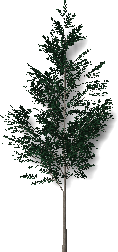
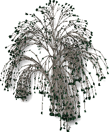

<!-- TODO: This could use an update. But the material is a start.  Let's localize what is here.  We can fill in the details later.-->

#  {{page.title}}
{: #tree-editor}

### 檔案功能表

#### 新增
從範本建立一個新植物。

 |  |  |  |
 |:-------------------------------------------:|:-----------------------------------------:|:-------------------------------------:|
 | **標準**                                |   **針葉**                             | **闊葉**                       |
 |          |  |  |
 | **棕櫚**                                    |  **地被**                          | **混合**                                  
{: .plant-table}

#### 開啟
開啟已存在的植物定義。

#### 儲存
儲存目前的植物定義。

#### 另存
以不同名稱儲存目前的植物定義。

### 光線追蹤功能表
彩現植物的預覽影像。

*預設值 (左) 與使用光線追蹤 (右)。*

#### 開始
開始彩現預覽影像。

#### 停止
停止彩現預覽影像。

### 檢視功能表
以滑鼠左鍵拖曳可以將視圖攝影機環繞目標點旋轉。
以滑鼠右鍵拖曳可以將目標點環繞視圖攝影機旋轉。
滑鼠滾輪可以用來縮放視圖。

#### 還原預設值
還原為預設的視圖。

#### 顯示葉子
在植物的預覽影像裡顯示葉子。

*沒有葉子 (左) 與有葉子 (右) 的預覽影像。*

### 設定功能表
設定植物編輯器使用的單位。
