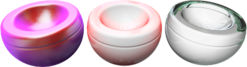
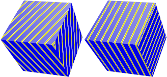
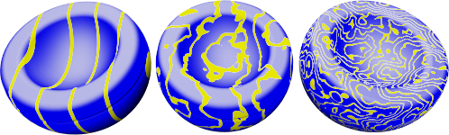
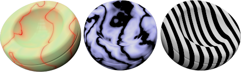

#  {: .inline} {{page.title}}
材質程序可用不同的方式混合數個材質，讓材質有更多變化，您可以在一個材質程序的樹狀分支加入其它材質，標準材質在此通常只有一個**底色**元件。

每一種材質程序都有兩個元件 (子材質)，一個元件可以再由另一個材質程序的兩個元件組成，Flamingo nXt 的材質程序有以下幾種：

* [底色](#base)
* [角度混合](#angular-blend)
* [混合](#blend)
* [大理石](#marble)
* [花崗岩](#granite)
* [拼貼](#tile)
* [木紋](#wood)

##### 加入程序
1. 在程序面板的元件按滑鼠右鍵。
1. 在彈出的清單選擇一種程序。

##### 移除程序
 1. 在程序面板的程序名稱上按滑鼠右鍵。
 2. 在彈出的功能表選擇**移除**。

## 底色
{: #base}
未使用任何程序的基本材質。

## 角度混合
{: #angular-blend}
許多材質會因檢視角度差異改變顏色、反射度、透明度，角度混合程序以視角與曲面法線的角度來混合兩種材質。

角度混合程序使用**內側材質**與**外側材質**兩個元件產生特殊的材質效果。

#### 內側材質
物件正對視圖的部分 (0 度) 至**起始角度**之間是以純**內側材質**顯示，可將它視為物件的底色材質。

#### 外側材質
**終止角度**至偏離視圖 90 度之間的部分是以純**外側材質**顯示，可將它視為類似亮光漆的塗層。

#### 起始角度
**外側材質**開始淡入的角度。

#### 終止角度
**內側材質**完全淡出的角度。
**起始角度**與**終止角度**之間是**內側材質**與**外側材質**漸變的部分。

下圖中的起始角度 {: .inline} 是 30 度 (綠色圓圈)，終止角度 {: .inline} 是 60 度 (紅色圓圈)。

綠色圓圈之內以純內側材質 (白色) 彩現，紅色圓圈之外以純外側材質 (黑色) 彩現。

 

* 0 至 30 度之間完全是白色。
* 30 至 60 度之間是白色漸變至黑色的漸層範圍。
* 60 至 90 度之間完全是黑色。

## 混合
{: #blend}
混合程序由兩個基本材質組成，可控制兩個材質的混合比例。Flamingo nXt 內建的材質庫裡的木紋材質有很多都是從混合程序建立的，以混合數值控制木紋材質的反射度 (材質二具反射性質)。

混合程序可以用混合值做整體的混合控制，或以一張圖片來控制混合度。

#### 混合
調整兩個材質的混合量，以下圖的例子而言，當混合滑桿在最左邊時，材質以紅色紋理的第一個材質顯示。當混合滑桿在最右邊時，材質以綠色紋理的第二個材質顯示。當混合滑桿在正中間時，紅色與綠色紋理各以 50% 混合顯示。

#### 使用圖片
以一張圖片來控制兩個材質的混合量，圖片像素的灰階值決定兩個材質的混合比例，黑色的像素顯示**材質一**，白色的像素顯示**材質二**，灰色的像素混合兩個材質。

下圖中的物件使用的混合程序的兩個材質完全一樣，但兩個材質的混合以三張不同的圖片控制。

控制材質混合的圖片 (遮罩) 的解析度會影響材質的品質，使用高解析度的圖片會有比較好的效果，但也會使用較多的記憶體。

#### 使用 Alpha 通道
如果使用的圖片內含 Alpha 通道，可以使用 Alpha 通道來混合兩種材質，不使用圖片的灰階值。

#### 反轉
對調兩種材質在物件上顯示的部分。

#### 拼貼
圖片顯示在物件上的大小是以模型單位計算，與圖片的像素多少無關，例如您想讓一張圖片在一個 100 x 100 模型單位的平面上顯示 5 x 10 的拼貼數，可以將圖片拼貼的寬度設為 20，高度設為 10。

#### 寬度
圖片在物件上顯示的模型單位寬度。

#### 高度
圖片在物件上顯示的模型單位高度。

## 花崗岩
{: #granite}
建立模擬花崗岩紋路的 3D 程序，它是由**底色**與**雜點**兩個材質組成，雜點是以亂數產生隨機分布在底色上，有不規則紋路的材質都以使用這個程序。

#### 底色/雜點
**底色**與**雜點**兩個材質的設定與一般材質完全一樣。



#### 雜點密度
設定雜點占材質面積的比例，數值越大雜點就越大。



## 大理石
{: #marble}
模擬大理石紋路的程序，由**底色**與**脈絡**兩種顏色組成。

材質如何對應到物件上由物件的[貼圖軸](properties-object.html#mapping)控制。

*沒有貼圖軸 (左) 與有貼圖軸 (右)。*

#### 底色/脈絡
**底色**與**脈絡**兩個材質的設定與一般材質完全一樣。


#### 脈絡寬度
這個設定是**底色**與**脈絡**的寬度比例，例如將**脈絡寬度**設為 0.9 時，**底色**的寬度為 0.1。將脈絡寬度設為 1 時完全沒有底色，設為 0 時完全沒有脈絡。




*使用 (左) 與未使用 (右) 飾片選項。*

## 拼貼
{: #tile}
拼貼是一種 2D 程序，使用[貼圖軸](properties-object.html#mapping)可以控制拼貼方格的走向，它由**底色**與**貼縫**兩個元件組成，這兩個元件可以是材質或程序。

寬度與高度使用不同的比例可以做出一些特殊的效果，例如細長的拼貼可以用來做為房至外牆的材質使用。

#### 拼貼
設定拼貼方格的大小，寬度與高度可以分開設定。

#### 寬度/高度
設定拼貼中一格的寬度與高度。


#### 貼縫
拼貼的貼縫設定。

#### 水平/垂直貼縫寬度
設定水平貼縫與垂直貼縫的寬度。

#### 鎖定
維持**水平貼縫**與**垂直貼縫**寬度的比例。

#### 偏移
將相鄰的拼貼方格錯開，設為 0.5 可以產生類似磚牆上磚塊的排列方式。將大理石程序代入底色元件可以產生大理石地磚的材質。

#### 拼貼變化
讓拼貼的每一格的花樣不規則變化，產生類似馬賽克磁磚的效果。

#### R/G/B
使拼貼的每一格的底色材質顏色隨機變化。

#### X/Y/Z
使拼貼的每一格的圖片隨機偏移。

## 木紋
{: #wood}
**底色**是木頭的原色，**環狀紋**是木頭的年輪，可以控制環狀紋的寬度與變化度及兩個材質如何混合。

如果木質物件不需要近距離彩現可使用此程序，需要近距離彩現請使用[貼圖材質](material-type-simple.html#textured)。物件距離很遠時，木紋會以單一顏色取代，這樣可以在不犧牲彩現品質的情形下加快彩現速度。木紋程序的優點是可以做出木紋橫剖面紋路 (年輪) 與縱剖面紋路 (平行紋) 對齊的效果。

#### 底色/環狀紋
**底色**與**環狀紋**兩個材質的設定與一般材質完全一樣。


#### 環狀紋寬度
這個設定是**底色**與**環狀紋**的寬度比例，將環狀紋寬度設為 1 時完全沒有底色，設為 0 時完全沒有環狀紋。




使用 (左) 與未使用 (右) 飾片選項。
