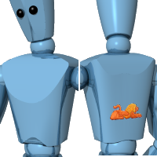

<!-- This is an old page, I am not sure it needs to be updated or translated,  The new Flamingo products used Rhino decals documented in Rhino help. -->

# {{page.title}}
印花是直接在物件上貼圖的方法，這種貼圖方法不需依靠材質，可以在物件上的局部貼圖。
一個印花只能使用一張圖片，而且該圖片不像[材質](materials-tab.html)裡的圖片可以重複拼貼。
印花的使用方法：

>牆上的海報。
>物件上的標籤或商標。
>模型上的標誌。
>彩繪玻璃。

 **附註：**框架模式作業視窗只有將**工具 > 選項 > 視圖 > 顯示模式 > 框架模式 > 其它設定 > 使用的顯示管線**下的**顯示管線**設為 **OpenGL**，編輯印花時才能看到貼圖。

## 放置印花
{: #decal-list}
{: #decal-placement}

###  **加入**
{: #add-decal}
1. 選取一個或以上的物件。
1. 從**編輯**功能表選擇**物件內容**。
1. 在**內容**對話框切換到**印花**頁面。@@@@@
1. 按**新增**按鈕。
1. 在**選擇貼圖**對話框新增一個貼圖，按**確定**。@@@@@
在**印花貼圖軸類型**對話框設定選項，按**確定**。
1. 依照指令提示在模型裡指定數個點決定印花的位置。
不同投影方式 ([平面](#decal-planarmapping)、[圓柱體](#decal-cylindricalmapping)、[UV](#decal-uvmapping)) 的印花放置的方式各不相同。

###  **編輯位置**
{: #decal-edit-placement}
1. 按**編輯位置**按鈕。
1. 移動印花的控制點調整印花的位置、大小、旋轉角度、長寬比。
1. 完成後按 **Enter**。

###  **內容**
{: #decal-properties}
1. 按**內容**按鈕。
1. **印花內容**對話框有許多印花的設定可以修改。

###  **刪除**
{: #decal-delete}

>按**刪除**按鈕。

###  **上移** / **下移**
{: #decal-movedown}
{: #decal-moveup}
當一個物件上有數個印花重疊時，會需要設定印花顯示的前後序順，清單裡最上面的印花在物件上會顯示在最前面。

>按**上移**或**下移**改變選取的印花在印花清單中的位置。

##### 放置平面印花
1. 依照提示指定印花的位置、**寬度**與**高度方向**。
1. 移動控制點調整印花貼圖的位置、大小與旋轉角度。****
或按 **Enter** 完成放置印花。

### 選項

#### 移動
移動印花的位置，就像 Rhino 的 Move 指令一樣指定移動的起點與移動的終點。

#### 使用圖片的寬高比
使用圖片的寬高比例設定印花，避免貼圖變形。

##### 放置圓柱體印花
1. 依照提示指定球體**中心點**的位置。
1. 移動控制點調整印花貼圖的位置、大小與旋轉角度。****
或按 **Enter** 完成放置印花。

## 設定或編輯印花的位置
附註：在有弧度的曲面上使用平面印花貼圖時，必需將整個貼圖軸置於曲面後方，因為貼圖軸突出於曲面前方的部分無法將貼圖投影至曲面上。

#### 同時調整印花的寬度與高度

>移動印花貼圖軸的角控制點。

#### 調整印花的高度

>移動印花貼圖軸上、下邊的控制點。

#### 調整印花的寬度

>移動印花貼圖軸左、右邊的控制點。

#### 移動印花

>移動印花貼圖軸中心的控制點。

#### 旋轉印花

>移動印花貼圖軸 X、Y、Z 三個軸向箭頭尖端的控制點。

## 印花內容
{: #dialogbox-editdecal}
以印花貼圖取代物件上某一部分材質的顏色是印花常用的方法。

## 投影
{: #projection}
決定如何將印花貼圖投影至物件上，在放置印花貼圖軸時可以事先建立一些建構線做輔助，再配合物件鎖點精確放置印花貼圖。

### 圓柱體
{: #decal-cylindricalmapping}
圓柱體印花貼圖軸適用於在瓶罐類的物件上貼上標籤。
圓柱體印花貼圖軸的一個方向是直的，另一個方向環繞物件。

### 平面
{: #decal-planarmapping}
平面印花貼圖軸是最常用的方式，適用於在平面或是弧度不大的曲面上貼上圖案。
平面印花貼圖軸的寬度與高度可以任意改變，但它的寬度與高度的比例與使用的圖片不一致時圖片會延展或擠壓變形。
在有弧度的曲面上使用平面印花貼圖時，必需將整個貼圖軸置於曲面後方，因為貼圖軸突出於曲面前方的部分無法將貼圖投影至曲面上。

### UV
{: #decal-uvmapping}
UV 印花貼圖軸適用於像是頭髮或是樹幹的貼圖。
它會將貼圖布滿整個曲面，無法控制貼圖位置。
UV 印花是以曲面 U、V 兩個方向的參數座標做貼圖的對應，這種方式的貼圖可能會有在曲面上的一部分擠壓變形，但在另一部分延展變形不平均的情形。

### 瀏覽
{: #file-browse}
變更圖片檔案。



## 強度
{: #decalmappingstrength}

### 顏色
{: #decal-color}
調整印花貼圖的透明度，可以讓物件材質的顏色透出印花。請參考：[材質貼圖內容 > 顏色強度](texture-properties-main.html#color)。

### 凹凸
{: #decalmappingbump}
以印花貼圖像素的灰階值在物件上產生視覺上的凹凸效果。請參考：[材質貼圖內容 > 凹凸強度](texture-properties-main.html#bump)。

## 反射度
{: #reflective-finish-and-highlight}
控制印花貼圖的反射度，可以用來讓印花與物件本身的材質有所區別，例如塑膠瓶上的鋁箔標籤，預設值是完全沒有反射。

### 強度
調整反射的強度，加大這個的數值會加大反光的大小與亮度。請參考：[進階材質內容 > 強度](advanced-material-properties-main.html#intensity)。

### 銳利度
設定物件表面反光的大小，數值越小，反光越大、越模糊。數值越大，反光越小、越銳利。請參考：[進階材質內容 > 銳利度](advanced-material-properties-main.html#sharpness)。

### 金屬
將材質的反光顏色設為與材質顏色相同。請參考：[進階材質內容 > 金屬](advanced-material-properties-main.html#metallic)。


## 進階
{: #advanced}

### 雙面
{: #double}
讓印花貼圖同時出現在曲面的正面與背面。

### 鏡射
{: #mirror}
鏡射印花貼圖。

## 投影方向
{: #projection-direction}

### 向後
從印花貼圖軸的背面投影至物件上。
前 (左)、後 (右)。

### 向前
從印花貼圖軸的正面投影至物件上。
前 (左)、後 (右)。

### 雙向
從印花貼圖軸的正面與背面投影至物件上。
前 (左)、後 (右)。

### 透明度
設定印花貼圖的透明度。請參考：[透明度](advanced-material-properties-transparency.html)。
折射率
設定透明的印花貼圖的折射率。請參考：[折射率](advanced-material-properties-transparency.html#index-of-refraction)。
