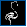
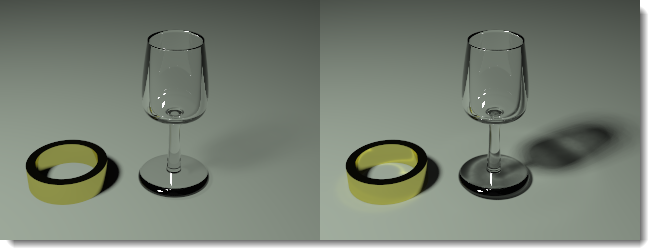

#   {{page.title}}
物件內容裡與 Flamingo nXt 相關的設定只有在以 Flamingo nXt 彩現時才有作用。

###  材質來源
{: #material-source}
材質可賦予給圖層、圖塊或物件，賦予材質的詳細說明請參考[賦予材質](material_assignment.html)主題。當材質是賦予給物件時，物件內容的材質頁面會顯示使用的材質與設定，編輯材質的詳細說明請參考[材質內容](material-type-simple.html)主題。

###  貼圖軸
{: #texture-mapping}
貼圖軸控制材質的紋理與貼圖如何對應到物件上，賦予給圖層或物件的材質都會受影響。材質沒有可辨識性的紋理時通常不需設定貼圖軸，需要控制貼圖的方向時才需要設定貼圖軸。物件移動、旋轉、縮放時它的貼圖軸也會跟著變動，所以可以維持材質的紋理與貼圖的位置，詳細說明請參考[貼圖軸](http://docs.mcneel.com/rhino/5/help/en-us/index.htm#properties/texturemapping.htm)主題。

 
*立方體使用不同的貼圖軸。*

###  印花
{: #decals}
印花是直接在物件上貼圖的方法，這種貼圖方法不需依靠材質，可以在物件的局部貼圖，詳細說明請參考 [Rhino 的印花](http://docs.mcneel.com/rhino/5/help/en-us/index.htm#properties/decal.htm)說明。

 
 
*四種不同投影方式的印花。*

###  自訂網格
{: #custom-meshes}
Rhino 有一些網格修改功能可以增加模型彩現的細節，包括：彩現圓角、彩現圓管、裝飾線、置換。

詳細說明請參考它們的說明主題：

>[彩現圓角](http://docs.mcneel.com/rhino/5/help/en-us/index.htm#commands/applyedgesoftening.htm)
>[彩現圓管](http://docs.mcneel.com/rhino/5/help/en-us/index.htm#commands/applycurvepiping.htm)
>[裝飾線](http://docs.mcneel.com/rhino/5/help/en-us/index.htm#commands/applyshutlining.htm)
>[置換](http://docs.mcneel.com/rhino/5/help/en-us/index.htm#commands/applydisplacement.htm)

###  Flamingo 內容
{: #flamingo-properties}

#### Alpha 通道
{: #alpha-channel}
使物件在彩現中不可見，但該物件仍然可以投射陰影與接受陰影投射，這樣彩現影像可以用來將陰影合成至其它圖片上。

這個例子是在模型中建立一些樹的模型與用來代替真實照片裡建築物的幾個平面，這些平面可以接受樹模型的陰影投射。在這些平面的物件內容開啟 Alpha 通道，讓他們不會出現在彩現影像裡，經過一些 Alpha 通道的應用處理後可以將樹與樹的陰影加到原來的照片上。

#### 焦散
{: #caustics}
光線經過有弧度的物件的反射或折射後，可能會聚焦在其它物件的表面，這種情形稱為焦散。只有[路徑追蹤](render-tab.html#path-tracer)與[混合式](render-tab.html#hybrid)兩種彩現引擎可以彩現焦散的效果，進一步的資訊請參考：[Wikipedia article: Caustic (optics)](http://en.wikipedia.org/wiki/Caustic_(optics)

*杯子與水產生的焦散效果。*

*沒有焦散 (左) 與有焦散 (右) 的彩現影像。*

#### 薄片
{: #thin}
實體物件賦予玻璃材質時通常會被當成實心的玻璃物件彩現，在物件的內容開啟薄片選項，彩現時曲面會被視為雙面的薄片物件，所以實體會被視為空心物件。在建築模型裡以單一平面做為窗戶玻璃時可開個這個選項。

 
*立方體未使用 (左) 與使用 (右) 薄片選項彩現時的差別。*

#### 日光入口
{: #daylight-portal}
日光入口可用在室內場景的採光開口，協助將室外的[太陽與天空](lighting-tab.html#interior-daylight)照明導入室內，使室內場景有充分的自然照明亮度，日光入口只有在[太陽](sun-and-sky-tabs.html#sun)開啟時才有作用。使用[室內日光](lighting-tab.html#interior-daylight)預設組時，所有透明的物件會自動被當做日光入口物件，使用攝影棚照明與戶外日光預設組時則不會，如果您仍想將太陽與天空的光線導入室內，可以開啟窗戶玻璃物件的日光入口選項。

*使用 (左) 與未使用 (右) 日光入口。*
