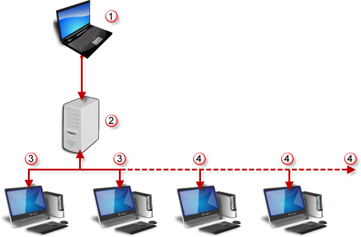

# {{page.title}}
Flamingo nXt 的**彩現農場**可聯合數部電腦的運算能力，合力彩現同一個模型、批次彩現或建立視圖動畫。彩現農場的客戶端只要安裝彩現農場，不需安裝 Rhino 或 Flamingo nXt。

#### 農場配置
{: #render-farm}

{: style="margin-top:25px;"}

>一部安裝 Rhino 與 Flamingo nXt 的電腦。
>網路主機或共享的農場資料夾。
>兩部彩現農場客戶端 (nXt 彩現農場包含兩個免費的客戶端)。
>加購的彩現農場客戶端。

彩現農場的免費版本可以使用兩個客戶端，要使用更多的客戶端請至 [https://www2.mcneel.com/commerce/accurender/buy-farm.asp](https://www2.mcneel.com/commerce/accurender/buy-farm.asp) 購買 nXt 彩現農場的授權。

#### 共用的農場資料夾
{: farm-folder}
使用彩現農場必需有一個所有參與彩現的電腦都能存取的共用資料夾，此資料夾可以是區域網路上網路磁碟機的資料夾，或是某部電腦分享出來的資料夾。所有參與彩現的電腦對該資料夾必需有讀取、寫入、刪除檔案的完整權限，該資料夾至少要有 20GB 的可用空間。

#### nXt 彩現農場包含兩個應用程式：

##### 農場彩現客戶端 (nXtFarmer64.exe)
安裝在每一部網路彩現客戶端電腦上等待彩現工作的小程式，這個小程式在彩現工作進行時不會顯示任何訊息。網路彩現可以結合多部電腦的運算能力，縮短彩現所需的時間，客戶端程式無法對進行中的彩現工作做變更。

##### 農場監視器 (nXtFarmMonitor64.exe)
可以用來查看彩現工作的進度，含有一些簡單的管理功能。
For advanced installations, the nXt Render Farm software lets you work with third-party render managers. The following procedures apply to the Render Farm included with Flamingo nXt. If you are planning to use third-party render farm software, some of these procedures will be different.

#### 彩現農場的使用方法
{: #the-farm-process}
 1. 以 Flamingo nXt 農場彩現時不使用 Render 指令，請改用 **Flamingo nXt 5.0 功能表 > 彩現農場 > 啟動彩現農場**，這樣彩現工作會送出至[共用的農場資料夾](options-flamingo.html#farm-output-folder)，所有使用的材質與資訊會與這個彩現工作一起送出。
 2. 彩現工作會被分割為許多部分，彩現農場的客戶端會持續檢查共用的農場資料夾裡是否有新的工作，每一個客戶端會取回一個工作的一部分進行彩現。農場監視器 **(Flamingo nXt 5.0 &gt; 彩現農場 &gt; 農場監視圖...)** 可監看彩現工作的進度。
 3. 每一個彩現農場客戶端會將彩現的結果儲存至農場輸出資料夾\<工作名稱>\Output。
 3. 彩現農場客戶端在完成一個彩現工作後會繼續搜尋、執行其它待完成的工作。
 4. 彩現農場儲存的格式為 [nXt 影像格式 (.nXtImage)](image-editor.html)，這個格式可以在 [nXt 彩現影像編輯器](image-editor.html)開啟做調整，之後可以再另存為 TGA、PNG、TIF 與 JPG 各種圖片格式。

## 安裝與設定彩現農場
{: #install}
主 Rhino 電腦上必需安裝彩現農場客戶端與監視器，其它電腦只要安裝彩現農場客戶端，不必安裝 Rhino 與 Flamingo nXt。

##### 安裝彩現農場客戶端
在協助彩現的電腦安裝彩現農場客戶端：

 1. 下載最新的 [Render Farmer](http://www.rhino3d.com/download/The-Farm/1.0/release) 軟體。
 1. 在客戶端電腦上執行下載的安裝程式。
 1. From the Start menu, run the Render Farmer on each machine.
 1. The Render Farmer will appear as an icon in the system tray.

##### 設定彩現農場
{: #configure-the-render-farm}
1.  [Right-click](mouse-button-right.html) on the icon and select Restore.
1. In the nXt Farmer window, on the Options menu, click Path and select the path to the Render Farm folder.

On the computer with Rhino and Flamingo nXt set the Zoo folder in Rhino. From the Tools menu, click Options, set the common farm location to the [Farm output folder](options-flamingo.html#farm-output-folder).

這樣彩現農場的設定就完成了。

## 使用彩現農場
{: #using-the-render-farm-from-flamingo-nxt}
目前彩現農場可以處理三種彩現工作：單一影像彩現、批次彩現與動畫彩現。

##### 確認彩現農場客戶端有回應
After starting the Render Farmer client on all the client computers:

 1. On any of the computer, in the Windows Start menu, click [Farm Monitor](#render-farm-monitor).
 1. 客戶端電腦會出現在農場監視器的機器清單裡。
 1. Each Render Farmer client should be listed under the Machine list.  The Status should read Active.

如果這裡有問題，請參考[安裝](#install)與[設定](#configure-the-render-farm)主題。

##### 送出彩現工作至農場
1. 在 Rhino 以一般的方法設定各種彩現設定與調整視圖角度。
1. On the Flamingo nXt menu, click Start Farm Render.
1. The [Farm Job](#farm-job) dialog should appear.
1. Verify the correct option and hit OK.

##### Monitoring the Farm
After submitting a job to the Render Farm, use the [Farm Monitor](#render-farm-monitor).

 1. On the master computer, in the Windows Start menu, click [Farm Monitor](#render-farm-monitor).
 1. A recent job should show up in the Jobs list. This can take a few minutes for large jobs.
 1. The status of the job will change to active.
 1. After a period of time, the machines above should pick up tasks with the same date.
 1. The Percent complete increases as tasks are completed.
 1. Watch for the job status Completed when the job is finished.

## 農場工作選項
{: #farm-job}

#### 名稱
{: #job-name}
The date and time is automatically pre-pended to the name you choose. A sub-folder for the job is created in the Render Farm shared folder. An output folder is also created in the new job folder.
一個工作的彩現結果會儲存至該工作資料夾裡的 Output 子資料夾。

#### 工作開始時機
Job may be started immediately after submission, at a later time, or manually through the Farm monitor.

#### Now
立刻開始彩現。

#### 以後 (手動)
Start the job later using the nXt [Farm Monitor](#render-farm-monitor).

#### 預約
Start the job at a specified date and time.

#### 彩現限制處理數
{: #rendering-constraints}
設定一個批次工作用來完成彩現的處理數，進一步的說明請參考：[處理數](documentproperties-flamingo.html#number-of-passes)

## 彩現農場監視器
{: #render-farm-monitor}
The Render Farm Monitor is a stand-alone program that reports the status of the client workstations and the jobs currently in the Farm. Jobs can be suspended and restarted from the monitor and a client workstation can be excluded from participating in the render farm.

To access the Farm Monitor from Rhino go to the Flamingo nXt 5.0 menu > Render Farm > Farm Monitor.

To access the Farm Monitor from Windows, on the Start menu click **All Programs > nXt Render Farm > Farm Monitor**.

#### Options
Right-click a Machine or a Job to access options.

#### 重新整理
重新整理工作清單。

#### 暫停機器
使農場客戶端暫停參與彩現計算。

#### 繼續機器
使暫停中的農場客戶端繼續參與彩現計算。

#### 暫停工作
暫停農場裡的工作。

#### 繼續工作
繼續暫停中的農場工作。

#### 移除工作
從清單中刪除選取的工作。

## 彩現農場的授權
{: #licensing-the-render-farm-}
The free version of the Render Farm lets two network computers (nodes) work on jobs simultaneously. If you wish to have more network nodes running simultaneously, you can purchase an unlimited node license from [https://www2.mcneel.com/commerce/accurender/buy-farm.asp](https://www2.mcneel.com/commerce/accurender/buy-farm.asp).

當您取得彩現農場的授權碼後，請使用下列方法加入授權碼。

##### 授權客戶端
1. 請先等待所有進行中的工作完成後再加入授權碼。
1. Save your Product Key to a text file on a network location so you can easily cut and paste it into each node.
1. If the node is currently active, in the Windows system tray (on the taskbar), [right-click](mouse-button-right.html) the Render Farm icon, and then click **Close**.
1. 從 Windows 的**開始**功能表選擇**所有程式**。
In the nXt Render Farm folder, click **Authorize Farm**.
1. In the edit box, paste or type your Product Key and click **OK**.

##### 執行客戶端
1. 從 Windows 的**開始**功能表選擇**所有程式**。
In the nXt Render Farm folder, click **Render Farmer**.
1. 在系統列的[彩現農夫](mouse-button-right.html)圖示上按滑鼠右鍵，選擇**復原**。
1. On the Help menu, click **About**.
如果版本號碼顯示試用版，代表授權未成功。
1. Minimize the Render Farmer window to return it to the tray.
