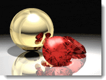

---
---

<!-- TODO: This is a combination of the old information here and the Rhino render Windows.  These two still need to be combined. -->

# 彩現視窗
彩現視窗有可以調整曝光度與後處理效果的設定，彩現視窗的大部分功能來自 Rhino，關於功能表與工具列按鈕的詳細說明請參考 [Rhino 彩現視窗](http://docs.mcneel.com/rhino/5/help/en-us/index.htm#information/renderwindowpostprocess.htm)說明主題。

### 功能表
功能表與工具列按鈕的詳細說明請參考 [Rhino 彩現視窗](http://docs.mcneel.com/rhino/5/help/en-us/index.htm#information/renderwindowpostprocess.htm)說明主題

### 工具列

### 儲存 (含背景 Alpha 通道)
{: #save-with-alpha-channel}
儲存含有 Alpha 通道的 32 位元 PNG、TIF、BMP 圖片格式，方便應用於影像合成，彩現影像中背景的部分在 Alpha 通道裡為黑色。

### 輸出 Flamingo nXt 的原生檔案 (.nXtImage)
{: #export-to-nxtimage}
儲存未壓縮，含照明、[Alpha](environment-tab.html#alpha)、距離、材質通道的 nXtImage 檔案格式，可以在 Flamingo nXt 的[彩現影像編輯器](image-editor.html)開啟調整[曝光度](#adjust-image)與加入數種[後處理效果](#effects)，再儲存為一般的圖片格式。
.nXtImage 格式是不同平台的 nXt 彩現器的原生檔案，此為建議使用的檔案格式，因為它可以保留最多的彩現資訊，可以使用 [nXt 彩現影像編輯器](image-editor.html)做後續調整、加入特殊效果、輸出數種常見的圖片格式與 [Piranesi EPix file (.epx)](http://www.piranesi.co.uk/) 格式。

### 輸出 HDR 檔案
{: #export-to-hdr}
輸出含高動態範圍 (High Dynamic Range) 亮度資訊的圖片格式。

### 輸出 EXR 檔案
{: #export-to-exr}
EXR 是由 Industrial Light and Magic (ILM) 制定的一種開放的高動態範圍圖片格式標準，這種格式支援每個通道 16 位元的浮點數值 (半精度)，以一個位元表示正負號，五個位元表示指數，十個位元表示尾數，共可以表示三十階的高動態範圍曝光度，進一步的資訊請參考：[Wikipedia article: OpenEXR](http://en.wikipedia.org/wiki/OpenEXR)。
EXR 是可儲存高動態範圍 (High Dynamic Range) 亮度資訊的圖片格式，以無亮度資訊背景 (例如：一般照片) 彩現的影像儲存為這類格式時背景會變為黑色。

## 結束
關閉彩現視窗。

##  [彩現視窗的 Flamingo 面板](render-window.html#help)

## 進度
{: #progress}

### 動作

### 處理數

### 掃描線

### 已使用時間

### 射線/秒

### 像素/秒

## 彩現限制
{: #number-of-passes}
{: #time}
{: #render-constraints}

## 調整影像
{: #adjust-image}
調整彩現影像的亮度，可以將同一個彩現影像以不同的曝光度輸出，後續的彩現影像會套用修改後的設定。
在這裡的調整稱為**色調對應**，色調對應是 Flamingo 將亮度資訊轉換為螢幕色彩顯示範圍 (RGB) 的方法。

### 亮度
{: #brightness}
調整中間色 (Gamma 值)，可以用來平衡彩現影像明暗區域的比例，當彩現影像裡應該是白色的部分顯示為灰色時可以適度調高這個數值。

*亮度值調高前 (左) 後 (右) 的差別。*

### 加亮
{: #burn}
調整高亮度區域的範圍，這個數值對高亮度區域的影響大於低亮度區域，可以用來製造過度曝光的效果。
請參考：[Wikipedia article: White point](http://en.wikipedia.org/wiki/White_point)。

*加亮值調高前 (左) 後 (右) 的差別。*

### 飽和度
{: #saturation}
用來控制彩現影像色彩的鮮豔度，飽和度為 0 時會變為灰階影像，飽和度在 1 以上時，數值越大色彩越鮮豔，飽和度數值的最大限制為 2。

*飽和度調高前 (左) 後 (右) 的差別。*

### 色階分布圖
{: #histogram}
以圖形顯示彩現影像裡所有像素的明暗度分布。
請參考：[Wikipedia article: Histogram](http://en.wikipedia.org/wiki/Histogram)。網路上有許多關於如何使用色階分布圖分析數位照片曝光度的文章，這些文章也適用於彩現影像。

*色階分布圖。*

#### 色階分布圖選項

>在色階分布圖上按滑鼠右鍵的選項

#### 完整

#### 中間值

#### 平均值

#### 顯示排序後的圖形

#### 顯示比例

#### 圖形顏色

#### 顯示亮度值

### 鎖定曝光度
{: #lock-exposure}
當曝光度鎖定時，變更照明亮度時不會自動調整曝光補償。

## 資訊
{: #information}

### 解析度
顯示彩現影像的長寬像素。

### 網格面
顯示模型彩現時使用的網格面數。

### 網格面 (含圖塊引例)
當彩現的模型含有圖塊引例時，Flamingo nXt 可以使用單一圖塊定義的網格面彩現它的所有引例，因為參與彩現計算的網格面減少，可以縮短彩現時間，這個數值顯示的是包含圖塊引例在內的網格面數。

## 像素資訊
視窗點
影像點
Image Y-Up
像素顏色
亮度
距離

## 照明資訊

###  [預設組](lighting-tab.html)

###  [太陽](sun-and-sky-tabs.html#sun)

###  [天空](sun-and-sky-tabs.html#sky)

###  [燈光](lights-tab.html)

###  [間接照明](lighting-advanced-tab.html#indirect)

###  [環境光開啟/關閉](lighting-advanced-tab.html#ambient)

## 通道
{: #channels}
可以用來調整照明通道的亮度。

## 後處理效果
{: #post-process-effects}
{: #effects}
後處理效果是彩現後可以增加的 2D 效果，這些效果可以開啟/關閉，清單中的效果的順序可以調整，每一種效果都有自己的設定。

## 後處理效果選項
每個效果的滑鼠右鍵功能表裡也有相同的選項。

>您可以在一個效果上按滑鼠右鍵彈出該功能表。

切換選取的效果的開啟/關閉狀態。
將選取的效果在清單中上移。
將選取的效果在清單中下移。
選取的效果的內容。
將目前的效果清單的順序與內容儲存為預設值。
將目前的效果清單儲存為已命名清單。
匯入已命名效果清單。

## 景深
{: #postprocessingdof}
彩現影像以像素離攝影機的距離遠近加上不等量的模糊效果。

## 景深內容
{: #depth-of-field-properties}

### 視覺效果內容
{: #dofvisualproperties}

#### 模糊強度
{: #dofblurringstrength}
設定模糊量的大小，不同的彩現影像可能需要不同的模糊強度才能產生適當的效果。

#### 最大模糊度
{: #dofmaxblurring}
設定模糊計算的最大半徑，避免模糊量非常大的區域拖累模糊計算的速度。

### 作用區域
{: #dofareaofeffect}

#### 焦距
{: #dofocaldistance}
攝影機鏡頭至焦點的距離，也是彩現影像經過模糊處理後最清晰的點。

#### 指定
在彩現影像裡指定焦點的距離。

#### 模糊背景
{: #dofblurbackground}
設定彩現背景是否做模糊處理，開啟這個選項時，背景以最大模糊度進行模糊處理。

## 霧氣
{: #postprocessingfog}
霧氣效果是以像素離攝影機的距離遠近不等量加上設定的顏色，這個效果可以加入濃厚的霧氣，也可以加入淡薄的霧氣用以增加彩現影像遠處的距離感。

*沒有後處理效果。*

### 霧氣漸層背景
霧氣效果可以用來產生漸層背景
這個例子的設定如下：
強度=1、雜訊=0.1、霧氣顏色=黑色、終點距離=110、起點距離=90、霧氣背景=開啟、羽化=80。

*霧氣漸層背景。*

## 霧氣內容
{: #fogsettings}

### 視覺效果內容
{: #fogvisualproperties}
設定霧氣效果的外觀。

#### 強度
{: #fogstrength}
設定霧氣的最大濃度，0 等同於關閉霧氣效果，數值越大霧氣越濃。數值大於 1 時要使用**雜訊**才有意義。

#### 雜訊
{: #fognoise}
在霧氣加入隨機變化的**強度**。

#### 顏色
{: #fogcolor}
設定霧氣的顏色。

>按顏色方塊，在[選取顏色](select-color.html)對話框設定顏色。
>以**取色滴管**選取彩現影像中的顏色。

### 作用區域
設定霧氣效果的範圍。

#### 起點距離
{: #fogstartdistance}
從攝影機位置算起的距離，從這個距離開始產生霧氣效果。

>按**指定**按鈕，在彩現影像中指定距離。

#### 終點距離
{: #fogenddistance}
從攝影機位置算起的距離，從這個距離霧氣達到最大濃度。

>按**指定**按鈕，在彩現影像中指定距離。

### 範圍 (左、右、上、下)
{: #fogbounds}
設定彩現影像受霧氣影響的區域，可以用來產生距離地面較近的低高度霧氣效果。
按**指定區域**按鈕，在彩現影像中框選一個矩形區域。

### 霧氣

#### 霧氣背景
設定彩現背景是否做霧氣處理，開啟這個選項時，背景以最大強度進行霧氣處理。

#### 羽化
{: #fogfeathering}
設定模糊範圍邊緣漸變區的大小 (像素)。

### 預覽
在變更設定後可以預覽結果。

## 光芒
{: #postprocessingglare}
光芒與光暈非常類似，差別在於光暈是以設定的顏色決定是否產生光暈效果，光芒是以亮度高低決定是否產生光芒效果。光芒的效果通常用於夜間場景，可以使燈光看起來更具真實感。

*光芒關閉 (左) 與開啟 (右)。*

## 光芒內容
{: #glaresettings}

### 白點界線
{: #glarewhitepointbound}
設定開始產生光芒效果的臨界點，這個數值可以直接在色階圖上指定，色階圖在**白點界線**右邊的像素都會產生光芒效果。

### 光芒大小
{: #glaresize}
光芒效果的半徑。

### 增益值
{: #glaregain}
光芒效果的倍數值，預設值 1.0 可以產生一般的光芒效果，數值越高，光芒效果越強烈。

### 使用光度資訊
{: #glareusephotometric}
這個設定以像素比白色更亮的程度控制光芒的大小，否則這個效果是以彩現影像中最亮的像素控制。

### 色階分布圖
{: #glarehistogram}
以圖形顯示所有像素的明暗度分布。

#### 色階分布圖選項

>在色階分布圖上按滑鼠右鍵的選項

#### 完整

#### 中間值

#### 平均值

#### 顯示排序後的圖形

### 預覽
在變更設定後可以預覽結果。

## 光暈
{: #postprocessingglow}
光暈可以在指定的顏色周圍製造發光效果，有色燈光與霓虹燈都可以使用這個效果，最多可以設定 10 種產生光暈效果的顏色。
在這個例子中，紅寶石的顏色被設為產生光暈效果的顏色，但因為增益值的關係讓光暈看起來偏白色。

*光暈的效果。*

*光暈關閉 (左) 與開啟 (右)。*

## 光暈內容
{: #glowsettings}

### 啟用
開啟一種顏色的光暈效果。

### 顏色
{: #glowcolor}
設定產生光暈的顏色。

>按顏色方塊，在[選取顏色](select-color.html)對話框設定顏色。
>以**取色滴管**選取彩現影像中的顏色。

### 靈敏度
{: #glowsensitivity}
設定相近的顏色是否產生光暈效果的範圍。

### 光暈大小
{: #glowsize}
光暈效果的半徑。

### 增益值
{: #glowgain}
光暈效果的倍數值，預設值 1.0 可以產生一般的光暈效果，數值越高，光暈效果越強烈。

### 預覽
在變更設定後可以預覽結果。

## 線條與文字
{: #postprocessingwireframe}
將曲線、文字、尺寸標註、結構線、網格框線與點物件疊加在彩現影像上。

*有 (左) 與沒有 (右) 線條與文字。*

## 線條與文字的內容

### 曲線
顯示曲線物件。

### 尺寸標註與文字
顯示尺寸標註與文字。

### 結構線
顯示曲面上的結構線。

### 網格邊緣
顯示網格邊緣。

### 點物件
顯示點物件。

### 預覽
在變更設定後可以預覽結果。
