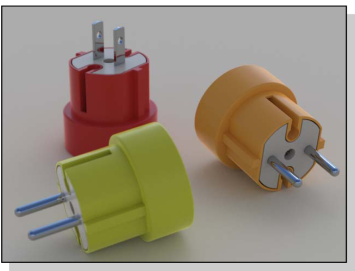

# {: .inline} {{page.title}}
彩現視窗有可以調整曝光度與後處理效果的設定，彩現視窗的大部分功能來自 Rhino，關於功能表與工具列按鈕的詳細說明請參考 [Rhino 彩現視窗](http://docs.mcneel.com/rhino/5/help/zh-tw/index.htm#information/renderwindowpostprocess.htm)說明主題，本說明主題只涉及 Flamingo 提供的功能。

## 管理進行中的彩現
彩現開始後會開啟[彩現視窗](http://docs.mcneel.com/rhino/5/help/zh-tw/index.htm#information/renderwindowpostprocess.htm)，Flamingo 使用多層次彩現，彩現影像會持續更新。Flamingo 彩現一開始的初始化階段可能需要幾秒鐘或幾分鐘，此階段的工作是匯入模型與收集材質貼圖使用的圖片，並建立彩現影像緩衝區。彩現模型一般有幾個步驟：

1. [多層次彩現](#multi-pass)
1. [停止彩現](#stop-render)
1. [調整影像](#adjusting)
1. [儲存圖片](#saving)

### 多層次彩現
{: #multi-pass}
Flamingo nXt 使用全新的彩現引擎，使用多層次細化得到進階彩現效果，同時簡化操作界面的複雜度。彩現一開始的幾個處理數彩現影像可能會有些瑕疵，例如：邊緣銳利相互重疊的許多陰影。這些陰影隨著處理數增加逐漸混合變細緻。有許多其它彩現效果也會隨著處理數增加而改善。請 [Flamingo 標籤](#flamingo-tab) to track the rendering process.

除非您設定時間、處理數限制或是在彩現品質達到要求時手動停止，否則 Flamingo nXt 會持續細化彩現影像，永不停止。

每個處理數改善的項目：

* 照明
* 柔化陰影
* 模糊反射
* 折射
* 反鋸齒
* 景深

### 停止彩現
{: #stop-render}
停止彩現有許多方法：

{: .inline} 按彩現視窗右上角的 "X" 可立即停止彩現並關閉彩現視窗，讓您可以快速回到 Rhino 視窗修改模型或彩現設定。

{: .inline} 按**停止彩現**按鈕，在目前的處理數完成後停止彩現，如果您想儲存目前的彩現影像可使用此方法。

### 調整影像
{: #adjusting}
彩現停止後可用 [Flamingo 標籤](#flamingo-tab)頁面的設定調整彩現影像的亮度，這些影像調整設定是製作高品質彩現的重要功能。

調整彩現影像的功能有：

* [調整影像](#adjust-image)
* [通道](#channels)
* [後處理效果](#post-process-effects)

### 儲存圖片
{: #saving}
儲存彩現影像有許多方法，使用何種方法因用途而異，通常建議儲存為 JPG 或 PNG 格式，但也可以儲存為其它圖片格式。

#### {: .inline} 儲存圖片
彩現影像調整完成後通常是儲存為 JPG 或 PNG 格式方便後續的影像處理作業。  

JPG 圖片檔案小，適合做為網頁圖片或以電子郵件寄送，為了使檔案變小，它使用破壞性壓縮，可能降低彩現影像的品質。

PNG 圖片使用非破壞性壓縮，可完整保留彩現影像的所有像素、顏色資訊，並有 Alpha 通道，是高品質圖片常用的格式。

#### 儲存 (含背景 Alpha 通道)
{: #save-with-alpha-channel}
將彩現影像儲存為含有 Alpha 通道的 32 位元 PNG、TIF、BMP 圖片格式，方便應用於影像合成，彩現影像中背景的部分在 Alpha 通道裡為黑色。此核取方塊與[另存新檔](#flamingo-tab)對話框的**儲存 Alpha 通道**都勾選時才能將 Alpha 通道儲存到圖片裡。

#### 輸出 Flamingo nXt 的原生檔案 (.nXtImage)
{: #export-to-nxtimage}
儲存未壓縮，含照明、[Alpha](environment-tab.html#alpha)、距離、材質通道的 nXtImage 檔案格式，可以在 Flamingo nXt 的[彩現影像編輯器](image-editor.html)開啟調整[曝光度](#adjust-image)與加入數種[後處理效果](#effects)，再儲存為一般的圖片格式。

.nXtImage 格式是不同平台的 nXt 彩現器的原生檔案，此為建議使用的檔案格式，因為它可以保留最多的彩現資訊，可以使用 [nXt 彩現影像編輯器](image-editor.html)做後續調整、加入特殊效果、輸出數種常見的圖片格式與 [Piranesi EPix file (.epx)](http://www.piranesi.co.uk/) 格式。

#### 輸出 HDR 檔案
{: #export-to-hdr}
輸出含高動態範圍 (High Dynamic Range) 亮度資訊的圖片格式。

#### 輸出 EXR 檔案
{: #export-to-exr}
EXR 是由 Industrial Light and Magic (ILM) 制定的一種開放的高動態範圍圖片格式標準，這種格式支援每個通道 16 位元的浮點數值 (半精度)，以一個位元表示正負號，五個位元表示指數，十個位元表示尾數，共可以表示三十階的高動態範圍曝光度，進一步的資訊請參考：[Wikipedia article: OpenEXR](http://en.wikipedia.org/wiki/OpenEXR)。
EXR 是可儲存高動態範圍 (High Dynamic Range) 亮度資訊的圖片格式，以無亮度資訊背景 (例如：一般照片) 彩現的影像儲存為這類格式時背景會變為黑色。

#### {: .inline} 結束
關閉彩現視窗。

#### 功能表
功能表與工具列按鈕的詳細說明請參考 [Rhino 彩現視窗](http://docs.mcneel.com/rhino/5/help/zh-tw/index.htm#information/renderwindowpostprocess.htm)說明主題

## Flamingo 標籤頁面
{: #flamingo-tab}
Render 視窗的 **Flamingo 標籤頁面**有許多 Flamingo 彩現引擎特有的設定，了解這些設定對建立高品質彩現影像有很大的幫助。

#### 儲存 (含 Alpha 通道)
儲存含有 Alpha 通道的 32 位元 PNG、TIF、BMP 圖片格式，方便應用於影像合成，彩現影像中背景的部分在 Alpha 通道裡為黑色。此核取方塊與[另存新檔](#saving)對話框的**儲存 Alpha 通道**都勾選時才能將 Alpha 通道儲存到圖片裡。

## 進度
{: #progress}
進度資訊可用來檢視 Flamingo 彩現的狀態。

#### 動作
顯示目前的彩現狀態。

狀態訊息有：

* 彩現已開始 - 彩現一開始有些準備工作要進行，例如：轉換模型與設定彩現用的記憶體。
* 作業已完成 - 按下**停止彩現**、達到**時間**或**處理數**限制彩現完全停止。
* 處理數完成 - 完成一個處理數。
* 正在更新 - 一個處理數完成之後下一個處理數開始之前。

#### 處理數
顯示目前正在彩現的處理數，Flamingo 是多層次彩現引擎，每個處理數都會細化照明、陰影與複雜的彩現效果。

#### 掃描線
目前正在處理的掃描線，掃描線是水平方向像素組成的直線，一個處理數代表彩現影像的掃描線數目。

#### 已使用時間
彩現開始的準備工作完成後算起到目前經過的時間。

#### 射線/秒
每秒鐘解算射入場景的射線數目。

#### 像素/秒
每秒鐘解算的像素數目。

## 調整影像
{: #adjust-image}
Flamingo 非常重要的功能之一，這裡就像照相機一樣可以調整影像的曝光度。如果您想將彩現影像變亮、變暗、修改對比或色彩飽和度，都可以在這裡調整，這此功能稱為[色調對應](https://en.wikipedia.org/wiki/Tone_mapping)。Flamingo 可計算的亮度範圍遠大於電腦螢幕可顯示的範圍，色調對應是 Flamingo 將亮度資訊轉換為螢幕色彩顯示範圍 (RGB) 的方法。

{: .inline} {: .inline}
*原來的彩現影像 (左)、套用亮度 (0.20)、加亮 (0.16)、飽和度 (1.2) 後的結果(右)。*
彩現影像的亮度或顏色不理想時可用這裡的功能快速調整，不必重新彩現。

### 亮度
{: #brightness}
調整中間色 (Gamma 值)，可以用來平衡彩現影像明暗區域的比例，當彩現影像裡應該是白色的部分顯示為灰色時可以適度調高這個數值。

*亮度值調高前 (左) 後 (右) 的差別。*



### 加亮
{: #burn}
調整高亮度區域的範圍，這個數值對高亮度區域的影響大於低亮度區域，可以用來製造過度曝光的效果。
請參考：[Wikipedia article: White point](http://en.wikipedia.org/wiki/White_point)。

*加亮值調高前 (左) 後 (右) 的差別。*

### 飽和度
{: #saturation}
用來控制彩現影像色彩的鮮豔度，飽和度為 0 時會變為灰階影像，飽和度在 1 以上時，數值越大色彩越鮮豔，飽和度數值的最大限制為 2。

*飽和度調高前 (左) 後 (右) 的差別。*

### 色階分布圖
{: #histogram}
以圖形顯示彩現影像所有像素的明暗度分布，中央到左側邊緣代表偏暗到黑色，中央到右側邊緣代表偏亮到白色。通常我們必需調整彩現影像，使像素分布在左至右的整個範圍。例如：當彩現影像的像素分布未達右側邊緣時，請調高**亮度**或**加亮**數值，使像素分布延展到右側邊緣，請參考：[Wikipedia article: Histogram](http://en.wikipedia.org/wiki/Histogram)。網路上也有許多關於數位影像如何利用色階分布圖的文章可參考。

*此為色階分布圖的實例，此彩現影像沒有較暗至極暗的黑色 (左端) 像素，是一個偏亮的彩現影像，但也無極亮的白色 (右端) 像素。*

#### 色階分布圖選項
在色階分布圖上按滑鼠右鍵有一些選項可設定色階分布的特性，修改這些選項不會影響彩現影像。

* **完整** - 以色階分布圖的最高點做為垂直方向的顯示範圍。
* **中間值** - 以色階分布圖的中間值做為垂直方向的顯示範圍。
* **平均值** - 以色階分布圖的平均值做為垂直方向的顯示範圍。
* **顯示排序後的圖形** - 以不同亮度值的像素數目重新排序圖形。
* **顯示灰階尺** - 在色階分布圖顯示灰階漸層色條。
* **圖形顏色...** - 設定色階分布圖使用的顏色。

### 鎖定曝光度
{: #lock-exposure}
當曝光度鎖定時，變更照明亮度不會自動調整曝光補償。

## 彩現限制
{: #number-of-passes}
{: #time}
{: #render-constraints}


## 資訊
{: #information}

#### 解析度
顯示目前的[彩現解析度](render-tab.html#resolution)。

#### 網格面
顯示模型彩現時使用的網格面數，可做為設定 Rhino 的[彩現網格轉換](http://docs.mcneel.com/rhino/5/help/zh-tw/index.htm#documentproperties/mesh.htm)設定。

#### 網格面 (含圖塊引例)
當彩現的模型含有圖塊引例時，Flamingo nXt 可以使用單一圖塊定義的網格面彩現它的所有引例，因為參與彩現計算的網格面減少，可以縮短彩現時間，此數值顯示的是包含圖塊引例在內的網格面數。

#### 照明資訊
目前彩現的場景的照明資訊，包括：

* [預設組](lighting-tab.html)
* [太陽](sun-and-sky-tabs.html#sun)
* [天空](sun-and-sky-tabs.html#sky)
* [燈光](lights-tab.html)
* [間接照明](lighting-tab.html#indirect)
* [環境光開啟/關閉](lighting-tab.html#ambient)

## 通道
{: #channels}
為模型裡的每個燈光設定不同的照明通道，彩現後可直接在彩現視窗調整彩現影像裡每個燈光的照明亮度，此為 Flamingo nXt 的重要功能之一，詳細說明請參考[照明通道](render-channel.html#adjustng-channels)主題。

## 後處理效果
{: #post-process-effects}
模型彩現後可在彩現影像裡加上一些特殊效果，請試著打開/關閉**後處理效果**面板的每一種效果，包括：

* 霧氣
* 光暈
* 光芒
* 景深
* 點物件
* 曲線
* 結構線
* 註解

每一種效果的詳細說明請參考[彩現影像後處理](http://docs.mcneel.com/rhino/5/help/zh-tw/index.htm#information/renderwindowpostprocess.htm)主題。
