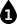
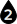

# {: .inline} {{page.title}}
許多材質設定與物件內容都有顏色方塊，它們的功能大同小異。

顏色方塊有兩個部分：

1. [顏色方塊](#swatch) - 按此色塊可開啟**選取顏色**對話框。
1. [選項功能表](#options) - 按此小三角形，彈出的功能表有一些顏色工具。

## 顏色方塊 {: .inline}
{: #swatch}
按顏色方塊，在**選取顏色**對話框設定顏色。

##### 從**顏色名稱**清單選取
* 在**選取顏色**對話框左邊的顏色清單選擇一種顏色。

##### 從**色環**選取
1. 移動圓環上的標記設定顏色的**色調**。
1. 水平移動中間矩形區域的標記設定顏色的**飽和度**。
1. 垂直移動中間矩形區域的標記設定顏色的**亮度**。

##### 從色調、飽和度、亮度欄位設定
1. 色調以 0 至 359 度表示，也大約等於彩虹的色調範圍，每個色調相隔 60 度：紅、橙、黃、綠、藍、紫。
1. 飽和度是一個顏色的鮮豔度，以 0 至 255 表示。飽和度為 0 的顏色為灰色，灰色的深、淺以顏色的亮度而定，此時色調數值沒作用。飽和度為 255 時色調可以完全反應在顏色上。
1. 亮度是一個顏色所含的白色成份的多寡，亮度以 0 至 255 表示。

#### 紅、綠、藍 (RGB)
{: #rgb}
紅、綠、藍是電腦螢幕顯示顏色的三種原色，螢幕上的每一個像素都是由紅、綠、藍三個發光體構成，三個發光體以不同的亮度混合成各種顏色。顏色為純紅色時，綠色與藍色的亮度為 0；純黑色時，三個顏色的亮度都為 0；純白色時，三個顏色的亮度都為 255。

## 功能表選項 {: .inline}
{: #options}

#### 調色盤
開啟**選取顏色**對話框，與按**顏色方塊**開啟的是相同的對話框。

#### 取色滴管
可用來擷取螢幕上任何位置的顏色。

#### 複製
複製顏色方塊的顏色到剪貼簿，可在另一個顏色方塊貼上。

#### 貼上
將複製到剪貼簿的顏色貼上至目前的顏色方塊。
