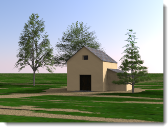
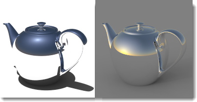

# {: .inline} {{page.title}}
[太陽](#sun)與[天空](#sky)有很大的關聯性，天空設為**自動**時，它的強度受到太陽強度的影響。當太陽開啟時將天空設為 HDRi，平衡兩者的強度非常重要。

## 太陽
{: #sun}
太陽是一個亮度極高的平行光源，它的設定模擬真實世界的情形，以經緯度、時間、季節等設定控制太陽的方位與照明的亮度。

此主題說明的是 Flamingo 太陽，它與[Rhino 太陽](http://docs.mcneel.com/rhino/5/help/en-us/commands/sun.htm)有許多共用的設定。

##### 可以在哪找到 Flamingo 的太陽設定?

[照明預設組](lighting-tab.html#lighting-presets)中只有**戶外日光**、**室內日光**、**自訂**有 Flamingo 的太陽頁面。

* {: .inline} 工具列 > {: .inline} Flamingo nXt 工具列
* {: .inline} 功能表 > Flamingo nXt 5.0 > 顯示控制面板 > Flamingo 面板 > 太陽

**附註：**開啟太陽才會有太陽頁面。

太陽的角度是計算太陽照明的必要因素，有兩種方法可以設定太陽的角度：一是以日期、時間與地點間接設定，可以用來分析模型在地球上某個位置受陽光照明的情形；一是以方位與高度直接設定，這個方式較為直觀，不考慮日期、時間與地點的因素。

  
*澳洲雪梨 6月21日 09:30 (左)、瑞典斯德哥爾摩 6月21日 09:30 (右)。*

### 設定方位與高度
{: #set-azimuth-and-altitude}
啟用[方位](#azimuth)與[高度](#altitude)設定，以手動設定太陽的角度。

#### 方位
{: #azimuth}
設定太陽的方向，從北方 (0度) 順時針方向計算的角度。

#### 高度
{: #altitude}
以從赤道 (0度) 算起的角度設定太陽的高度。

### 設定地球上的位置
{: #set-location-on-earth}
以日期、時間與地點自動設定太陽的方位與高度。**附註：**不同的太陽計算器計算得到的太陽位置不一定完全相同，需要絕對精確時請務必加以確認。  

#### 日期
{: #date}
設定日期。

#### 時間
{: #time}
設定當地的時間。

#### 日光節約時間
{: #daylight-savings-time}
將時間提前一小時。

#### 經度/緯度
{: #latitude-longitude}
在這兩個欄位輸入經度與緯度，或直接在地圖上指定位置。
以滑鼠游標在地圖上指定位置時經度與緯度欄位的數值也會更新。

#### 時區
{: #time-zone}
顯示目前位置的時區。

#### 城市清單
{: #city-list}
以選擇城市的方式設定時區。

#### 地圖
{: #map}
在地圖上按住滑鼠左鍵可平移地圖。

### 太陽強度
{: #sun-intensity}
調整太陽的直接照明亮度，太陽對場景的照明是從太陽的角度與天空的狀況計算而來，但可以做調整，與其它光源做調和。

### 太陽反光
{: #sun-highlight}
反射材質上太陽的銳利度。

*太陽反光為 0  (左) 與 1 (右)。*

**附註：**在戶外場景中如果您不想讓物件上的太陽反光太明顯，可以降低太陽反光的數值。
{: #speckle-artifacts}



#### 北方
{: #north}
**附註：**北方是世界座標 Y 軸的方向。

## 天空
{: #sky}
天空是一個環繞場景、具有照明功能的巨型球體，天空與環境非常不同，天空控制照明亮度、環境控制可見的背景，有些情形需要對天空與環境做不同的設定。

#### 可以在哪找到 Flamingo 的天空設定?
[照明預設組](lighting-tab.html#lighting-presets)中只有**戶外日光**、**室內日光**、**自訂**有 Flamingo 的太陽頁面。

 1. {: .inline} 工具列 > {: .inline} Flamingo nXt 工具列
 1. {: .inline} 功能表 > Flamingo nXt 5.0 > 顯示控制面板 > Flamingo 面板 > 天空

照明預設組的[戶外日光](lighting-tab.html#exterior-daylight)與[室內日光](lighting-tab.html#interior-daylight)以自動天空為預設值，[攝影棚照明](lighting-tab.html#studio-lighting)以 HDRi 為預設值。

天空有五種設定：

* [關閉](lighting-tab.html#off)
* [天空 (自動)](#automatic-sky)
* [高動態範圍圖片 (HDRI)](#high-dynamic-range-image-sky)
* [顏色](#color-sky)
* [圖片](#image-sky)

Flamingo nXt 內建兩種天空照明：[HDR 圖片](#high-dynamic-range-image-sky)天空與[自動天空](#automatic-sky)。HDR 圖片的每個像素都含有亮度數值，可以照亮場景也可以做為材質的環境反射，自動天空可以用來模擬真實世界的太陽與雲量。

### 天空 (自動)
{: #automatic-sky}
自動天空使用[太陽頁面](sun-and-sky-tabs.html)設定天光的顏色範圍與強度，例如：中午與傍晚時陽光的強度與顏色有非常大的差別。

*自動天空：太陽高角度 (左) 與低角度 (右)。*

#### 雲量
{: #sky-cloudiness}
當雲量為 0 時，模型會有比較銳利的陰影，雲量設定值越大，陰影就越模糊。雲量的設定會影響日光計算的許多面相，包括：直接照明與間接照明的相對量、間接照明的計算方式與使用自動天空時天空的顏色。雲量的設定值 0 為晴朗無雲，1 為多雲。雲量設定在 0.35 - 0.50 左右有較廣的動態範圍。

*雲量 0 (左) 與 1 (右)。*

#### 天空亮度
{: #sky-intensity}
調整天空的間接照明亮度，天空對場景的照明是從太陽的角度與天空的狀況計算而來，但可以做調整。**附註：**這個設定只有在場景中有需要補償的人造光源時才有作用。場景中沒有人造光源時，彩現影像不會因為這個設定自動調亮或調暗。



### 高動態範圍圖片天空
{: #high-dynamic-range-image-sky}
高動態範圍 (HDR) 圖片是一種 2D 圖檔，常見的圖片格式 (JPG、 PNG...) 的像素可以儲存最亮的顏色為白色，這也是電腦螢幕能顯示最亮的顏色，但自然界的光源的亮度遠超過白色可以描述的範圍，HDR 格式的像素可以描述比白色更高的亮度值，所以稱為高動態範圖片，可以用來照明場景。如果 HDR 圖片所含的亮度資訊是精確的，照明效果也會是精確的。攝影棚照明預設組使用 HDR 圖片做為天空，您可以將 HDR 圖片視為室內場景來自牆或天花板的間接照明，HDR 圖片上的色彩會影響照明的色調。

*HDRi 照明。*

HDR 圖片裡的亮度值會被當做以瓦特為單位，如果不是，您必需對 HDR 圖片的亮度做調整，以達到適當的照明效果。

HDR 圖片除了可用在天空的設定以外，也可用在[環境背景](environment-tab.html#advanced-background)、[反射背景](environment-tab.html#advanced-background)與[折射背景](environment-tab.html#advanced-background)。

#### HDRI 圖片
選擇 HDR 圖片檔案 (HDR 與 HDRI 是相同的檔案類型)，按圖片縮圖選擇不同的 HDR 圖片。

*球面矩形投影。*

HDR 圖片有兩種投影方式將圖片投影至天空球體。最常用的是球面矩形投影，此種投影方式的 HDR 圖片的寬高比為 2:1，圖片的不同部分的解析度大致相同。第二種是球體投影，球體投影的 HDR 圖片為正方形，圖片在接縫處的解析度較低。

#### 強度
設定 HDR 圖片的照明亮度，此設定只有在場景中有需要補償的人造光源時才有作用。場景中沒有人造光源時，彩現影像不會因為此設定自動調亮或調暗。

*低與高 HDR 強度。*

{: .inline} 旋轉 HDR 圖片，讓圖片的某一部分出現在物件的反射裡，您可以使用圖形化界面調整，或直接輸入角度數值。

*旋轉圖片的位置，使太陽可以出現在物件上的反射裡。*

#### 飽和度
以 HDR 圖片照明場景時，圖片的顏色即光源的顏色，在某些情形下可能產生非預期的效果。如果您不想讓 HDR 圖片的顏色影響照明，可以將飽和度設為 0。

*低 (左) 與高 (右) 飽合度。*





### 顏色
{: #color-sky}
單一顏色或顏色漸層都可用來照亮場景，天空顏色的照明亮度可用強度數值調整。

#### 強度
每個顏色通道的數值可以是 0 - 255，天空的照明亮度是顏色數值乘以強度數值。

#### 顏色類型
天空的顏色有三種控制方式，與環境顏色的控制方式類似，詳細說明請參考：[顏色背景](environment-tab.html#environment-color-and-gradient-backgrounds)。

### 圖片
{: #image-sky}
圖片也可用來照亮場景，圖片顏色的照明亮度可用強度數值調整。

#### 強度
每個顏色通道的數值可以是 0 - 255，天空的照明亮度是顏色數值乘以強度數值。

#### 圖片投影
將圖片投影到天空球體有許多方式，與環境背景圖片類似，詳細說明請參考：[圖片背景](environment-tab.html#environment-image)。
