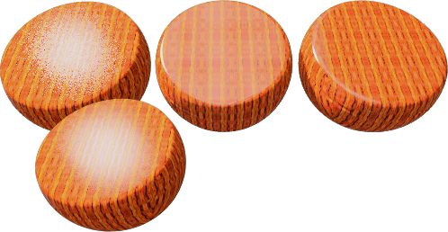

---
---

# Advanced Material Properties: Main

A Flamingo material is made up of a series property groups that dascibe a complete material.

<!-- TODONotes: We need an diagram describing the Proceedure Hirarchyarchy. -->
 1. Name
 1. Material Procedure
 1. Basic Properties
 1. Reflective Finish
 1. Transparency Properties
 1. Procedural Textures
 1. Bitmap Textures
 1. Notes

 ## Material Name
 {: #name}
 This is the name of the material in the Rhino model.  Materials are stored in the Rhino model.

 ## Material Procedures
{: #procedures}
The **Procedures** tree combines one or more materials using a set of rules for how the materials interact. The tree displays the components used to create the material and lets you add components. For simple materials, there will be only one component in the list: **Base**.

Each procedure combines two &quot;child&quot; materials using a specific method. Each of these child materials can in turn consist of a procedure, combining two children of its own. In this way, extremely elaborate materials can be built from simpler constituents. Procedures for combining materials include angular blend, blend, marble, granite, tile, and wood.

<!-- TODONotes: We need an diagram describing the Proceedure Hirarchyarchy. -->

##### To add a procedure
1. Right-click on **Base** the **Procedures** window.
1. On the menu, click a procedure type.
> [Angular Blend](procedural-materials.html#angular-blend) 
> [Blend](procedural-materials.html#blend) 
> [Granite](procedural-materials.html#granite) 
> [Marble](procedural-materials.html#marble) 
> [Tile](procedural-materials.html#tile) 
> [Wood](procedural-materials.html#wood) 

##### To remove a procedure
 1. In the **Procedures** window,right-click the procedure name.
 2. On the menu, click **Remove**.

## Basic material properties
{: #basic-materials-properties}


## Reflective Finish and Highlight
{: #reflective-finish-and-highlight}
These settings vary the way a material reflects light and objects. The highlight effect is normally associated with light areas on glossy materials where the light hits the object.
 **Note** : To activate these settings, the **Intensity** value must be greater than zero.

### Highlight color
{: #highlight-color}

#### White
Materials with a white highlight tend to resemble plastics.

#### Metallic
{: #metallic}
Sets the highlight color to match the base color.
 **Note** : Chrome and other reflective materials do not make an interesting image unless they have something to reflect. Simply applying a reflective metal material to an object is not enough.

#### Custom
Specify any color for the highlight.

### Intensity
{: #intensity}
Adjusts the strength of the highlight. Larger values increase the size and strength of the highlight.

### Fresnel
{: #fresnel}
Pronounced (fray-NELL) Controls the reflectivity of opaque materials, a phenomenon known as [Fresnel reflection of conductors](http://en.wikipedia.org/wiki/Fresnel_equations) .The Fresnel setting &#160;models the tendency of many materials to become more specular (mirror-like) at glancing angles while retaining more matte properties at perpendicular viewing angles.
Reduce the value for very dark materials to prevent too much reflection.&#160;Increase the value for materials like varnished wood, where the Fresnel reflectivity is more pronounced.

### Sharpness
{: #sharpness}
Sets the size of the highlight. Lower numbers specify a broader highlight; higher numbers focus the highlight in a smaller area.

### Type
{: #type}
Changes how reflections are calculated when artificial light sources are reflected.
Reflections are calculated using two methods: *raycasting* and *highlight*. These two methods will eventually produce identical results; however, in certain situations, you will find that one method gets a good result more quickly. For example, objects might not look good because a light source reflection hides the material's appearance.
In the illustration below for **Balanced** type, the object on the left has a bright white reflection that overpowers the material's appearance.
 **Note** : Blurry reflections of light sources can be associated with interior renderings where the light sources are small. The surfaces exhibiting the artifact typically have blurry reflections. Changing the type to [Glossy](advanced-material-properties-main.html#glossy), [No Light Source Reflections](advanced-material-properties-main.html#no-light-source-reflection), or [Monte Carlo](advanced-material-properties-main.html#monte-carlo) can help alleviate this problem.

#### Balanced
{: #balanced}
Automatically balances raycasting and highlight based on the **Sharpness** setting. Both the actual reflection of the light source and the artificial highlight are calculated.

#### Glossy
{: #glossy}
Increases the blurriness of the highlight and prevents raycasting. No object or light reflections are calculated, therefore performance is increased, and artifacts for materials with very blurry reflections are prevented. Some reflective subtlety may be lost.

#### Monte Carlo
{: #monte-carlo}
Only raycasting is used to calculate reflections of light sources. The raycasting is initially very noisy and gradually converges to the correct solution. It is most useful when the highlight is not blurry.

#### No Highlight
{: #no-highlight}
Only raycasting is used to calculate reflections of light sources. This is useful when light sources are large and the material is not blurry; in which case, the highlight calculation can take a long time. The light source reflections gradually converge.

#### No Light Source Reflection or No Highlight
{: #no-light-source-reflection-and-no-highlight}
Excludes all reflections of artificial light sources and the artificial highlight effect. Object reflections are still calculated.

#### No Light Source Reflections
{: #no-light-source-reflection}
Excludes raycast reflections of light sources, only the highlight is used. This is sometimes useful for preventing speckle artifacts if the material is blurry and the scene contains small, bright, light sources.

### Template
{: #template}
Indicates the template used with the [Simple Material Properties](simple-material-properties.html) dialog box.

### Simple Editor
{: #simple-editor}
Opens the [Simple Material Properties](simple-material-properties.html) dialog box. The more commonly used settings are available in this editor.

