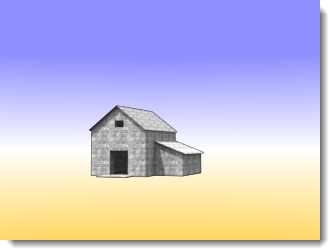

---
---

# Environment
Environments include elements of the rendering that are not part of the actual model geometry, but only appear when rendering.
You can think of the background as an infinite sphere surrounding the model. Backgrounds are projected onto this sphere. The background sphere is not an object that you can select, but a reference surface for the background effects.
The ground plane provides an infinite horizontal platform for the image that stretches to the horizon in all directions positioned at a defined elevation. The ground plane renders much faster than using a large planar surface as a base.

## Ground plane

### Enabled
Turns the ground plane on.

*Ground plane disabled (left) and enabled (right).*

### Alpha
Applies a transparent alpha channel to the ground plane so the image can be composited with the cast shadow into another image. See: [Wikipedia article: Alpha compositing](http://en.wikipedia.org/wiki/Alpha_compositing).

 *Ground plane shows shadow, but is otherwise transparent in the image.* 

### Elevation
Specifies the ground plane's height above zero.

*Ground plane elevation above zero.*

### Material
Assigns a [material](simple-material-properties.html) to the ground plane.

*Ground plane with raised elevation and water material.*

## Background
 **Note** : A color background is always turned on, but it may be hidden behind an image or other background.

### Intensity
Modifies the relative brightness of the background.

## Background type
Specifies the color scheme that will fill the background of the rendered image. Backgrounds can be of the following types:

> [Sky](environment-tab.html#sky) 
> [Solid and gradient color](environment-tab.html#color-and-gradient-backgrounds) 
> [Image](#environment-image) 
> [HDR and planar HDR images](environment-tab.html#hdr-and-planar-hdr-backgrounds) 

## Sky
The Sky environment uses the sun and sky settings from the [Lighting](lighting-tab.html) tabs for settings.

*Automatic (left) and HDR image and sun (right).*

## Color and Gradient Color
A background color is always present, but may be obscured by images.

### Solid Color
A solid color background consists of a single color that fills the background.

*Solid-color background.*

### Two-Color Gradient
 **Note** : Two- and three-color gradient backgrounds only apply to perspective views.
Two-color gradient backgrounds interpolate the background color between two selected colors.

*Two-color gradient background: blue and yellow.*

### Three-Color Gradient
Three-color gradient backgrounds interpolate the background color between three selected colors.

*Three-color gradient background: blue, white, yellow.*

## Color controls
Clicking a color swatch opens the [Select Color](select-color.html) dialog box.
The edit boxes indicate the angle where the color will be the most saturated.

##### To change the gradient color

>Click the color swatches to set the colors in the [Select Color](select-color.html) dialog box.

##### To change the range of the gradient color
If the current viewport is a perspective projection, the top and bottom colors and the extents of the gradient relative to the view can be controlled.

>Enter an angle in degrees above and below the horizon in the Top, Middle, or Bottom boxes.

Or, drag the angle markers in the angle graphic.
A cone of vision is displayed in the graphic as a light gray shaded region.
The angle filled by the background is displayed in the graphic as a light gray shaded region.
The red flag indicates the angle where the Top color will be the most saturated.
The blue flag indicates where the Bottom color&#160;will be the most saturated.
For three-color gradients, the green flag indicates the angle where the Middle color is most saturated.

###  **Swap top and bottom colors** 
Reverses the color order for the gradient.

###  **Get angles from view** 
Sets the angles of the gradient extents to match the viewport.

## Image
A background image is projected onto the background.
You can use a digital photograph, a scanned artwork, or an image created with an electronic paint program. For best results, use high-resolution images for background images. It is also a good idea to blur and lighten sharp images to simulate natural focus and aerial perspective.

>Place the model into an existing context.
>Add panoramic city or mountain skylines.
>Add surrealistic effects.

The image can be mapped to a planar, cylindrical, or spherical shape or offset using coordinates or the visual graphic.

## Image Properties

>Click the **Click here to assign** button to select an image.



### Projection
Three types of background image projections are supported: [Planar](environment-tab.html#planar), [Cylindrical](environment-tab.html#cylindrical), and [Spherical](environment-tab.html#spherical). Each projection method has its own set of controls for positioning the image.

#### Planar
Projects the image to a flat background.

Drag the pink rectangle or use the numerical controls to move or scale the background image.
 *Background area (1), image size and shape (2).* 

#### Planar Options

##### XScale / YScale
Specifies the size of the background image.

##### XOffset / YOffset
Specifies the offset of the background image from the lower left corner of the viewport.

#### Cylindrical
Cylindrical projection maps the image to an imaginary cylinder that surrounds the model. While this projection works best with true cylindrical images, it can also be used effectively with standard panoramas built from photographs.
Specify the size and position of the image map in height and width angles. Use the graphical tools and the mouse to position and size the image. The current cone of vision is displayed in the graphic as a light gray shaded region.

#### Cylindrical Options

#####  [Background color](environment-tab.html#backgroundcolors) 

##### Width
Specifies the angular width of the image map. Enter an angle or drag the flags in the control widget to set the width. The blue area indicates the extents of the angular width.

##### Top / Bottom
Specifies the vertical extents of the image. Enter an angle or drag the flags in the control widget to set the top and bottom angles. The cylindrical projection is limited to 45&#160;degrees above or below the horizon.

##### Rotation
Specifies the image rotation and extents. Enter an angle or drag the control widget to set the rotation. The red dot indicates the center of the image. The gray area indicates the view.

#####  **Angles From View** 
Sets the **Width** and **Top/Bottom** angles to match the viewport.

#### Spherical
Spherical projection maps the image to a complete sphere. This method generally produces good results only if with an equirectangular spherical image.

#### Spherical Options

##### Rotation
Specifies the image rotation. The red dot indicates the center of the image.

#####  **Angles From View** 
Sets the rotation angle to match the viewport.

## HDR and Planar HDR Backgrounds
High-dynamic-range images provide lighting from luminance information stored in the image.
Using an HDR image as an environment allows more control over the relationship between the light in the background and other light in the image. This is especially useful for depicting an interior space with a bright exterior space showing through a window.
An HDR environment image has more range of light than a normal bitmap image and can be assigned a channel so the contrast can be managed in a [multi-channel](lights-tab.html#channel) rendering.

## HDR options

>Click the **Click here to assign** button to select an image.



## Planar HDR options
Planar high-dynamic-range images provide both an image background and lighting. These are often used outside windows in architectural renderings where light from the exterior is required.

>Click the **Click here to assign** button to select an image.

### 
*Background image (left) and Planar HDR (right) shows subtle lighting difference in background.*


## Advanced Background
The **Advanced Background** settings control environments that are not visible in the rendering, but show in reflections and refractions for the objects.
In the illustration, the background is black, but the reflected environment is an HDR image of a building interior.

## Reflected
A reflected environment is not visible in the rendered image, but it reflects in shiny objects.

*Normal environment (left) and reflected HDR sky environment (right).*

### Sky
Objects reflect the sky as specified in the [Lighting: Sun and Sky](sun-and-sky-tabs.html) settings.

### Custom
Objects reflect a [Color or gradient](environment-tab.html#color-and-gradient-backgrounds), [Image](environment-tab.html#image), or [HDR](environment-tab.html#hdr-and-planar-hdr-backgrounds) background.

### Visible Background
Objects reflect the visible background as specified in the [Environment](environment-tab.html) settings.

## Refracted

### Sky
Objects refract the sky as specified in the [Lighting: Sun and Sky](sun-and-sky-tabs.html) settings.

### Custom
Objects refract a [Color or gradient](environment-tab.html#color-and-gradient-backgrounds), [Image](environment-tab.html#image), or [HDR](environment-tab.html#hdr-and-planar-hdr-backgrounds) background.

### Visible Background
Objects refract the visible background as specified in the [Environment](environment-tab.html) settings.

### No Transparent Object Alpha
Prevents seeing alpha channel through transparent objects and will prevent alpha channel compositing through transparent objects.
If images will be pasted into the alpha channel, turn this setting off.

