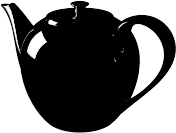

---
---

# Lighting: Advanced

### Sun
The sun is a very bright directional light source infinitely far away from the model.

#### On/Off
Turns the sun on and off.
Sun on and off.

### Sky
Defines a hemispherical light source infinitely far away from the model.

#### Off
Turns the sky off.

#### Auto
Provides an analytical model based on real-world sky conditions. The settings on the [Sun](sun-and-sky-tabs.html) tab control the appearance and light qualities of the sky.

#### HDRi
An HDR image provides something for shiny objects to reflect.

#### Color
Sets the sky to a solid color or a two- or three-color gradient using controls similar to [Environment: Color and Gradient Backgrounds](../environment/environment-tab.html#color-and-gradient-backgrounds).

#### Image
Uses an image background with a planar, cylindrical, or spherical projection similar to [Environment: Image](../environment/environment-tab.html#image).

### Studio Brightness
Reduces the brightness of the [sun](sun-and-sky-tabs.html) and sky to mimic the interior lighting levels of a photographer's studio.
Studio Brightness off (left) and on (right).

### Lights

#### On/Off
Turns artificial lighting on and off.
Lights on (left) and off (right).

## Indirect
Defines the lighting reflected from surfaces. By default, it is on for interior lighting and off for exterior and studio lighting preset schemes. It is possible to turn on indirect lighting for exterior renderings.

#### Method
Sets the calculation method for indirect lighting.

#### Off
Turns indirect lighting calculation off.

#### Interior
Optimizes the indirect lighting for indoor situations.

#### Exterior
Optimizes the indirect lighting for outdoor situations.
Indirect lighting reflected from other surfaces, can add subtlety and realism to your exterior rendering. In particular, the undersides of overhanging features such as eaves or balconies render more accurately when using indirect lighting.

#### Bounces
Specifies the number of reflections caused by an indirect light.

#### Color Bleed
Specifies the amount of color transfer associated with each indirect bounce.

### Ambient
Ambient light is a constant light added to the rendering. These settings control&#160;the intensity of the ambient light as a percentage of the total estimated ambient light in the scene.
Decreasing the amount of ambient light generally produces images with more contrast. Too much ambient light can make a rendered image seem flat and uninteresting; too little can cause excessive contrast.

#### None
No ambient light.

#### Exterior
Optimizes ambient light for exterior scenes.

#### Interior
Optimizes ambient light for interior scenes.

#### Studio
Optimizes ambient light for studio scenes.

### Monte Carlo reflections
Tries to resolve blurry reflections containing small, bright areas. This is normally slower than the standard reflection algorithm. See: [Wikipedia article: Monte Carlo method](http://en.wikipedia.org/wiki/Monte_Carlo_method).
