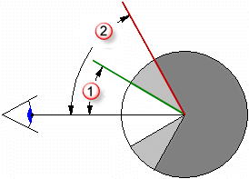
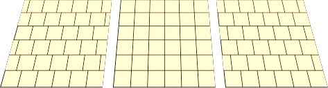

# Advanced Material Properties: Main
 

## Basic material properties
 

All materials share three basic properties: name, color, and preview.

### Name
 

The material name.

### Color
 

Controls the local color for the material. All materials have a base color. [More about color...](general\select-color.html) 

#### Color swatch selector

Click the color swatch to select colors from the [Select Color](general\select-color.html) dialog box.

### Preview
 

The preview image shows the material as it will appear on objects in the model. The style and size of the preview are part of the material definition.

 **Note** : Set the default size for the preview object in [Options: Flamingo nXt](general\options-flamingo.html).

 * Right-click the material preview pane to specify options that control the preview's appearance:

#### Sphere

Sets the preview object to a sphere.

#### Box

Sets the preview object to a box with a width equaling the sphere radius.

#### Plane

Sets the preview object to a plane with a width equaling the sphere radius.

#### Sphere radius

Sets the preview sphere radius and box and plane width. Set the size to approximate the size of the objects to which the material will be assigned to help visualize the material.

## Reflective Finish and Highlight
 

These settings vary the way a material reflects light and objects. The highlight effect is normally associated with light areas on glossy materials where the light hits the object.

 **Note** : To activate these settings, the **Intensity** value must be greater than zero.

### Highlight color
 

#### White

Materials with a white highlight tend to resemble plastics.

#### Metallic

Sets the highlight color to match the base color.

 **Note** : Chrome and other reflective materials do not make an interesting image unless they have something to reflect. Simply applying a reflective metal material to an object is not enough.

#### Custom

Specify any color for the highlight.

### Intensity
 

Adjusts the strength of the highlight. Larger values increase the size and strength of the highlight.

### Fresnel
 

Pronounced (fray-NELL) Controls the reflectivity of opaque materials, a phenomenon known as [Fresnel reflection of conductors](http://en.wikipedia.org/wiki/Fresnel_equations) .The Fresnel setting &#160;models the tendency of many materials to become more specular (mirror-like) at glancing angles while retaining more matte properties at perpendicular viewing angles.

Reduce the value for very dark materials to prevent too much reflection.&#160;Increase the value for materials like varnished wood, where the Fresnel reflectivity is more pronounced.

### Sharpness
 

Sets the size of the highlight. Lower numbers specify a broader highlight; higher numbers focus the highlight in a smaller area.

### Type
 

Changes how reflections are calculated when artificial light sources are reflected.

Reflections are calculated using two methods: *raycasting* and *highlight*. These two methods will eventually produce identical results; however, in certain situations, you will find that one method gets a good result more quickly. For example, objects might not look good because a light source reflection hides the material's appearance.

In the illustration below for **Balanced** type, the object on the left has a bright white reflection that overpowers the material's appearance.

 **Note** : Blurry reflections of light sources can be associated with interior renderings where the light sources are small. The surfaces exhibiting the artifact typically have blurry reflections. Changing the type to [Glossy](advanced-material-properties-main.html#glossy), [No Light Source Reflections](advanced-material-properties-main.html#no-light-source-reflection), or [Monte Carlo](advanced-material-properties-main.html#monte-carlo) can help alleviate this problem.

#### Balanced

Automatically balances raycasting and highlight based on the **Sharpness** setting. Both the actual reflection of the light source and the artificial highlight are calculated.

#### Glossy

Increases the blurriness of the highlight and prevents raycasting. No object or light reflections are calculated, therefore performance is increased, and artifacts for materials with very blurry reflections are prevented. Some reflective subtlety may be lost.

#### Monte Carlo

Only raycasting is used to calculate reflections of light sources. The raycasting is initially very noisy and gradually converges to the correct solution. It is most useful when the highlight is not blurry.

#### No Highlight

Only raycasting is used to calculate reflections of light sources. This is useful when light sources are large and the material is not blurry; in which case, the highlight calculation can take a long time. The light source reflections gradually converge.

#### No Light Source Reflection or No Highlight

Excludes all reflections of artificial light sources and the artificial highlight effect. Object reflections are still calculated.

#### No Light Source Reflections

Excludes raycast reflections of light sources, only the highlight is used. This is sometimes useful for preventing speckle artifacts if the material is blurry and the scene contains small, bright, light sources.

### Template
 

Indicates the template used with the [Simple Material Properties](simple-material-properties.html) dialog box.

### Simple Editor
 

Opens the [Simple Material Properties](simple-material-properties.html) dialog box. The more commonly used settings are available in this editor.

## Procedures
 

### Base
 

The **Procedures** tree combines one or more materials using a set of rules for how the materials interact. The tree displays the components used to create the material and lets you add components. For simple materials, there will be only one component in the list: **Base**.

Each procedure combines two &quot;child&quot; materials using a specific method. Each of these child materials can in turn consist of a procedure, combining two children of its own. In this way, extremely elaborate materials can be built from simpler constituents. Procedures for combining materials include [angular blend](advanced-material-properties-main.html#angular-blend), [blend](advanced-material-properties-main.html#blend), [marble,](advanced-material-properties-main.html#marble)  [granite](advanced-material-properties-main.html#granite), [tile](advanced-material-properties-main.html#tile), and [wood](advanced-material-properties-main.html#wood).

#### To add a procedure

1.

href="javascript:BSSCPopup('../mouse_button_right.htm');" id="a11" style="position: relative; text-decoration: underline; ">Right-clickanywhere in the **Procedures** window.

2.

On the menu, click a procedure type.

 [Angular Blend](advanced-material-properties-main.html#angular-blend) 

 [Blend](advanced-material-properties-main.html#blend) 

 [Granite](advanced-material-properties-main.html#granite) 

 [Marble](advanced-material-properties-main.html#marble) 

 [Tile](advanced-material-properties-main.html#tile) 

 [Wood](advanced-material-properties-main.html#wood) 

#### To remove a procedure

 **1.** 

In the **Procedures** window,ref="javascript:BSSCPopup('../mouse_button_right.htm');" id="a18" style="position: relative; text-decoration: underline; ">right-clickthe procedure name.

 **2.** 

On the menu, click **Remove**.

## Angular Blend
 

Blends between two different materials to create materials that change characteristics based on the angle of view to the surface of the object.

### 
 

The **Angular Blend** procedure blends between two different materials to create special effects. Use **Angular Blend** to create materials that change characteristics based on the angle of view to the surface of the object.

### Inner
 

From 0 degrees from the viewpoint to the **Start angle**, the **Inner** component will show completely. Think of this as a base material.

### Outer
 

From the **Stop angle** to 90 degrees from the view, the **Outer** component will be the only material showing. Think of this as a coating.

### Start angle
 

The angle from the viewpoint at which the **Outer** component material starts.

### Stop angle
 

The angle from the viewpoint at which the **Outer** component material stops.

Between the **Start Angle** and the **Stop angle**, the **Inner** and the **Outer** components blend.

Start (1) and Stop (2) angles.

In the illustration, the **Start angle** is 30 degrees (the green circle) and the **Stop angle** is 60 degrees (the red circle).

The **Inner** material is white, and the **Outer** material is black.

 * Between 0 and 30 degrees from the viewpoint, you see white.
 * Between 30 and 60 degrees&#160;from the viewpoint, you see a gradient from white to black.
 * Between 60 and 90 degrees&#160;from the viewpoint, you see black.

## Blend
 

The **Blend** procedure combines two base components and controls the proportions of each. All of the standard library wood materials use a **Blend** procedure to change the finish of the wood from clear matte to dark shiny.

Blends work well changing an entire material definition by adding an overall color to a base patterned material.

### Blend
 

Varies the amount of each component material used.

### Use image
 

Bitmap images usually consisting of grayscale patterns define where two component materials will show. The materials are blended by the value of the gray pixels in the image. Use a grayscale image map to mediate between the first and second components. The **First** component will be placed where there is black in the bitmap pattern, and the **Second** component will be placed where there is white in the bitmap pattern.

In the image, the same materials are used for the first and second components, but the blend is controlled by three different bitmaps.

The resolution of the mask bitmap affects the quality of the material. Higher resolution bitmaps allow a viewpoint closer to the material with fewer quality issues, but they also use more memory.

### Tiles

#### Width

The width in pixels of a single instance of the image.

The scale of the material is independent of the resolution of the bitmap used to define it. In order to scale the material correctly, decide how large an area in real units one copy of the bitmap represents. If the bitmap represents the height of six 4-unit tiles and the length represents twelve 4-unit tiles, the scale would be 48&#160;units in the x-direction and 24&#160;units in the y-direction. This stretches the bitmap to the proper size for the pattern.

#### Height

The height in pixels of a single instance of the image.

#### Lock

Maintains the ratio between the **Width** and **Height**.

#### Mirror tiles

Mirrors the bitmap image in both the x- and y-directions. This sometimes helps to cut down on seams showing in the repeats.

### Use Alpha channel
 

If the image has an alpha channel, this can be used instead of the bitmap grayscale to determine where the colors blend.

### Reverse
 

The **First** component will be placed where there is white in the bitmap pattern, and the **Second** component will be placed where there is black in the bitmap pattern.

### Linking options
 

Specifies how the image file will be linked to materials.

#### Linked

Creates a link to the image file. The file must be present on the local disk.

#### Embedded

Embeds the image information in the current file.

#### Linked and embedded

If the bitmap is found on the disk before rendering, the external file is used. If the image cannot be found on the disk, the internal definition will be used.

 **Note:** The images are cached for the life of the document.

#### To see changes in linked or linked and embedded files

 * On the **Flamingo nXt** menu, click **Utilities** and then click **Clear bitmap cache**.

## Granite
 

Creates a 3-D material with solid pockets of a second material embedded in the **Base** component. The **Granite** procedure combines a randomly distributed **Spot** component in a **Base** component. The **Granite** procedure defines how the **Base** and **Spot** components combine. **Granite** procedures can be used for a variety of different materials including rust, sparkly plastic, and other randomly spotted materials.

### Base/Spot
 

The **Base** and **Spot** components are two materials. Their properties are specified in the same way as any material.

### X/Y/Z Scale
 

Changes the absolute size of the pattern in the x-, y-, and z-directions.

#### Lock

Maintains the ratio between the **X Scale**, **Y Scale**, and **Z scale**.

### Density
 

A fraction of the whole pattern. Increasing this setting increases the relative size of the spots.

### Blend
 

Blurs the boundaries between the components.

## Marble
 

Creates alternating slabs of **Base** and **Vein** components.

### 
 

The **Marble** procedure defines how the **Base** and **Vein** components combine. The slabs are infinitely large, and the orientation of the object affects the way the slabs are oriented with respect to the object. Texture [mapping](..\objectproperties\properties-object.html#mapping) for the objects controls the orientation of the material on the object.

No texture mapping (left). With texture mapping (right).

### Base/Vein
 

The **Base** and **Vein** components are two materials. Their properties are specified in the same way as any material.

### X/Y/Z Scale
 

Changes the absolute size of the pattern in the x-, y-, and z-directions.

#### Lock

Maintains the ratio between the **X Scale**, **Y Scale**, and **Z scale**.

### Vein Width
 

Alters the relative size of the slabs to each other. **Vein Width** is a fraction of the distance from one **Base** stripe to the next. Values range from 0 (zero) for no **Vein** component to 1 for no **Base** component.

### Blend
 

Blurs the boundaries between the components.

### Turbulence
 

Produces the swirled appearance by causing the alternating components to bend and twist.

### Veneer
 

Causes the material to appear as a planar pattern on the surfaces of the object instead of cutting through the object.

Veneer (left), normal (right).

## Tile
 

Tile is a 2-D material.&#160;Texture [mapping](..\objectproperties\properties-object.html#mapping) for the objects controls the orientation of the material on the object. The **Tile** material combines a **Base** component and a **Joint** component. Each of these materials can also include any other material.

Scale tile differently in each direction for special effects. For example, use a tile material that is extremely long in one direction to create siding materials.

### Tile

Sets the overall tile size. The width and height sizes can be set independently.

#### Width/Height

Specifies the width and height of the tiles.

#### Lock

Maintains the ratio between the **Width** and **Height**.

### Joint

Specifies the size of the joint material.

#### Horizontal joint/Vertical joint

Specifies the width and height of the joint material.

#### Lock

Maintains the ratio between the **Horizontal** and **Vertical joint** sizes.

#### Offset

Provides a relative horizontal offset per vertical tile.&#160;For example, use a setting of .5 to produce a standard running bond. This allows modeling of material such as marble tile, without the effect of having the entire floor hewn from the same block of marble.

### Vary Tiles

Add randomness to the material color for each tile. This makes it possible to model material such as non-uniform bricks.

#### R/G/B

Modifies the red, green, and blue color components.

#### X/Y/Z

Offsets the material from the world origin. Do this if a seam that marks the beginning of the material appears an in inappropriate place.

## Wood
 

Creates concentric cylinders of alternating **Base** and **Ring** components.

Wood consists of concentric cylinders of alternating **Base** and **Ring** components. The Wood settings define how the **Base** and **Ring** components combine.

The method used to create wood materials depends on how close it will be viewed. If the viewpoint is not close to the wood, a solid color can take the place of wood without sacrificing image quality. This allows faster rendering.

One of the advantages of using a wood material is that when rendering different sides of an object, the wood grain will look correct. End grain will show on the ends and parallel grain will show on the sides of an object.

### Base/Ring
 

The **Base** and **Ring** components are two materials. Their properties are specified in the same way as any material.

### X/Y/Z Scale
 

Changes the absolute size of the pattern in the x-, y-, and z-directions.

#### Lock

Maintains the ratio between the **X Scale**, **Y Scale**, and **Z scale**.

### Ring Width
 

A fraction of the distance between one **Base** stripe and the next. Values range from 0 (zero) for no **Ring** component to 1 for no **Base** component.

### Blend
 

Blurs the boundaries between the components.

### Turbulence
 

Produces the swirled appearance by causing the alternating components to bend and twist.

### Veneer
 

Causes the material to appear as a planar pattern on the surfaces of the object instead of cutting through the object.

Veneer (left), normal (right).

