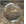

# Materials
{: .toc-title }

Materials can be assigned to layers or individual objects from materials either saved in the current model or from material libraries.

Assigning materials by layer is the recommended method. Assign materials by object if you have only a few objects that you do not want on separate layers.

## Assign materials to layers
{: .toc-header }

Assigning materials by layer assigns a material to all objects on a layer.

#### Assign a material to a layer

1.

In Rhino, open the **Layers** dialog box.

2.

Select one or more layer names, and click the **Material** column.

3.

In the **Material Editor** dialog box, under **Assign By**, click **Plug-in**.

4.

Click the <kbd>Browse</kbd> button.

5.

In the **Flamingo Materials** dialog box, select a material either from the **Materials in Model** palette or from the **Material Libraries**, and click **OK**.

#### Drag a material to a layer

1.

In Rhino, open the **Layers** dialog box.

2.

In the **Flamingo nXt [Control Panel](..\general\welcome.html#control-panel) **, on the **Materials** tab, drag a material either from the **Materials in Model** palette or from the **Material Libraries** on to a layer name.

#### Remove a material from a layer

1.

In Rhino, open the **Layers** dialog box.

2.

Select one or more layer names, and click the **Material** column.

3.

In the **Material Properties** dialog box, under **Assign By**, click **Basic**.

4.

If desired, reset the material color.

## Assign material to objects
{: .toc-header }

You can assign materials from the material libraries to a layer or object.

Assigning materials by layer is the recommended method. Assign materials by object if you have only a few objects that you do not want on separate layers.

#### Assign a material through object properties

1.

Select objects.

2.

On the **Edit** menu, click **Object Properties** command to edit the object.

3.

In the ** [Properties](..\objectproperties\properties-object.html) ** dialog box, on the **Material** page, under **Assign By**, click **Plug-in**, and then click the <kbd>Browse</kbd> button.

4.

In the **Flamingo Materials** dialog box, select a material either from the **Materials in Model** palette or from the **Material Libraries**, and click **OK**.

#### Drag a material onto a single object

 * In the **Flamingo nXt [Control Panel](..\general\welcome.html#control-panel) **, on the **Materials tab**, drag a material either from the **Materials in Model** palette or from the material library onto an object.

#### Assign a material to selected objects

1.

Select objects.

2.

In the **Flamingo nXt [Control Panel](..\general\welcome.html#control-panel) **, on the **Materials** tab, right-click a material from the **Materials in Model** palette.

3.

On the menu, click **Assign to Selected Objects**.

## Select objects with material assignment
{: .toc-header }

1.

In the **Flamingo nXt [Control Panel](..\general\welcome.html#control-panel) **, on the **Materials** tab, right-click a material from the **Materials in Model** palette.

2.

On the menu, click **Select Objects with this Material**.

## Remove a by-object material assignment
{: .toc-header }

1.

Select objects.

2.

On the **Edit** menu, click **Object Properties**.

3.

In the ** [Properties](..\objectproperties\properties-object.html) ** dialog box, on the **Material** page, under **Assign by**, select **Layer**.

## Manage Materials
{: .toc-header }

1.

On the **Flamingo nXt** menu, click **Control Panel**.

2.

In the **Control Panel**, click the **Materials** tab.

&#160;

 1. New material menu
 1. Assign to object
 1. Assign to layer
 1. View menu
 1. Materials in Model palette
 1. Material library name
 1. Material Library folders
&#160;

 * Drag materials from the library folders to the **Materials in Model** palette or directly onto objects or layers.
 * Drag materials from the **Materials in Model** palette onto objects or layers.
 * Double-click a material thumbnail in either the Materials in Model palette or a library to edit the material.

## Materials Toolbar
{: .toc-header }

### Create new material
{: .toc-subheader }

Choose a material template. Templates provide preset values to help start a material.

#### New [Solid Color Material](simple-material-properties.html#solid-color) 

#### New [Metal Material](simple-material-properties.html#metal) 

#### New [Plastic Material](simple-material-properties.html#plastic) 

#### New [Glass Material](simple-material-properties.html#glass) 

#### New [ClearFinish Material](simple-material-properties.html#clearfinish) 

#### New [Glossy Material](simple-material-properties.html#glossy) 

#### New [Textured Material](simple-material-properties.html#textured) 

#### New [Texture Set Material](simple-material-properties.html#texture-set) 

#### New [Advanced Material](advanced-material-properties-main.html) 

###  [Assign to selected objects](#byobject) 
{: .toc-subheader }

###  [Assign material to layers](#bylayer) 
{: .toc-subheader }

### View menu
{: .toc-subheader }

#### Large thumbnail view

#### Thumbnail view

#### List view

#### Right-click thumbnail to

### List View
{: .toc-subheader }

### Thumbnail View
{: .toc-subheader }

### Large Thumbnail View
{: .toc-subheader }

### Export Materials to Folder
{: .toc-subheader }

### Import from File
{: .toc-subheader }

###  [Assign to Selected objects](#bylayer) 
{: .toc-subheader }

###  [Assign to Layer](#byobject) 
{: .toc-subheader }

### Select Objects with this Material
{: .toc-subheader }

### Duplicate
{: .toc-subheader }

### Delete
{: .toc-subheader }

### Rename
{: .toc-subheader }

### Properties
{: .toc-subheader }

## Library panel
{: .toc-header }

### Hide Library panel
{: .toc-subheader }

### Show Library panel
{: .toc-subheader }

### Go up one level
{: .toc-subheader }

### View menu
{: .toc-subheader }

### Folder name
{: .toc-subheader }

## Right-click panel to
{: .toc-header }

### List View
{: .toc-subheader }

### Thumbnail View
{: .toc-subheader }

### Large Thumbnail View
{: .toc-subheader }

### Up One Level
{: .toc-subheader }

### Back
{: .toc-subheader }

### Forward
{: .toc-subheader }

### Browse for Folder
{: .toc-subheader }

### Default Folder
{: .toc-subheader }

### Add to Library List
{: .toc-subheader }

### Remove from Library List
{: .toc-subheader }

### Rename
{: .toc-subheader }

### Delete
{: .toc-subheader }

