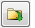
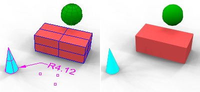

# Render Window
{: .toc-title }

The render window provides options for exposure adjustment and adding post-processing effects.

## File menu
{: .toc-header }

### Save
{: .toc-subheader }

Saves the image to file including alpha channel if the image format supports it. Does not save other rendered channels or [exposure](#adjust-image).

The Save button allows you to save your rendering to several different image formats.

#### JPEG Bitmap (.jpeg, .jpg)

Saves JPEG compressed (lossy) 24-bit RGB with no alpha channel.

#### Portable Network Graphics (.png)

Saves non-lossy compressed 24-bit RGB with no alpha channel.

#### Tagged Image File Format (.tif, .tiff)

Saves uncompressed 24-bit RGB with no [alpha](../environment/environment-tab.html#alpha) channel.

#### Windows Bitmap (.bmp)

Saves uncompressed 24-bit RGB color with no alpha channel.

### Save with background alpha channel
{: .toc-subheader }

Saves image 32-bit PNG, TIF, and BMP including alpha channel background. The Alpha channel versions of the file formats are used for high-quality compositing. Backgrounds will appear black when the rendering is saved with Alpha channel.

### Print
{: .toc-subheader }

Opens the **Print Preview** dialog box.

#### Print

Opens the Print dialog box.

#### Landscape

Prints the image horizontally on the paper.

#### Portrait

Prints the image vertically on the paper.

#### Close

Closes the Print Preview dialog box.

### Export to native Flamingo nXt file (.nXtImage)
{: .toc-subheader }

Saves uncompressed luminance and color information. Saves all rendered channels including [alpha](../environment/environment-tab.html#alpha). The nXtImage files can be opened in the [Image Editor](image-editor.html) where [exposure](#adjust-image) and [post-processing effects](#effects) can be applied and the image re-saved to another bitmap format.

The .nXtImage format is the native image format of the nXt renderers. It is the recommended format for storing your renderings, since it preserves the most information about your rendering. Images stored in this format can be manipulated in the [nXt Image Editor](image-editor.html) and special effects can be added. From this editor, you can save to many popular standard formats, including all of the formats supported in nXt. You can also save to [Piranesi EPix file (.epx)](http://www.piranesi.co.uk/) format.

### Export to HDR file
{: .toc-subheader }

Saves uncompressed luminance and color information. The .hdr format stores luminance data directly in a High Dynamic Range format. Non-luminance backgrounds, such as normal photographs, will appear black when saved in one of these formats.

### Export to EXR file
{: .toc-subheader }

A&#160;high-dynamic-range image file format, released as an&#160;open standard&#160;along with a set of software tools created by&#160;Industrial Light and Magic (ILM), released under a&#160;free software license. This file format supports 16-bits-per-channel&#160;floating-point&#160;values (half precision) with a sign bit, five bits of exponent, and a ten-bit&#160;mantissa. This allows a dynamic range of over thirty&#160;stops&#160;of exposure. See: [Wikipedia article: OpenEXR](http://en.wikipedia.org/wiki/OpenEXR).

The .exr format stores luminance data directly in a High Dynamic Range format. Non-luminance backgrounds, such as normal photographs, will appear black when saved in one of these formats.

## Exit
{: .toc-header }

Closes the render window.

## Edit menu
{: .toc-header }

### Copy
{: .toc-subheader }

Places a copy of the image in the Windows Clipboard.

## View menu
{: .toc-header }

### Zoom
{: .toc-subheader }

Magnifies the view of the image.

#### Actual Size

#### Zoom In

#### Zoom Out

#### Zoom Extents

### Rendered Display
{: .toc-subheader }

Displays the original rendered image.

### Alpha Mask
{: .toc-subheader }

Displays the [alpha mask](image-editor.html#alpha-channel).

### Distance Mask
{: .toc-subheader }

Displays the [distance mask](image-editor.html#distance-channel).

### Hide toolbar
{: .toc-subheader }

Closes the toolbar.

### Help
{: .toc-subheader }

Displays the Flamingo Help.

## Stop/Resume Rendering
{: .toc-header }

Stops/continues rendering the image.

## Toolbar
{: .toc-header }

###  [Save](render-window.html#save) 
{: .toc-subheader }

###  [Save with background alpha channel](render-window.html#save-with-alpha-channel) 
{: .toc-subheader }

###  [ [Print](render-window.html#renderwindowprint) ](render-window.html#print-preview) 
{: .toc-subheader }

###  [Export to native Flamingo nXt file (.nXtImage)](render-window.html#export-to-nxtimage) 
{: .toc-subheader }

###  [Export to HDR file](render-window.html#export-to-hdr) 
{: .toc-subheader }

###  [Export to EXR file](render-window.html#export-to-exr) 
{: .toc-subheader }

###  [Copy to clipboard](render-window.html#copy) 
{: .toc-subheader }

###  [Zoom to actual image size](render-window.html#zoom) 
{: .toc-subheader }

###  [Rendered Display](render-window.html#rendered-display) 
{: .toc-subheader }

###  [Alpha Mask](render-window.html#alpha-mask) 
{: .toc-subheader }

###  [Distance Mask](render-window.html#distance-mask) 
{: .toc-subheader }

### Options
{: .toc-subheader }

#### Pan increment

Specifies how many pixels a pan moves the image in the render window when using the arrow keys to pan.

#### Zoom increment

Specifies the ratio of the image in the render window a mouse wheel step or pressing the + or - keys moves the view in or out.

### Show/Hide menu
{: .toc-subheader }

###  [Help](render-window.html#help) 
{: .toc-subheader }

## Progress
{: .toc-header }

### Action
{: .toc-subheader }

### Pass
{: .toc-subheader }

### Scan line
{: .toc-subheader }

### Elapsed time
{: .toc-subheader }

### Rays / second
{: .toc-subheader }

### Pixels / second
{: .toc-subheader }

## Render Constraints
{: .toc-header }

Sets the default time and number of passes constraints. These may be changed using the controls in the **Render Window.** 

Setting the **Number of passes** and **Time** to 0 allows the rendering to continue until you click <kbd>Stop Rendering</kbd>.

### Time
{: .toc-subheader }

Specifies the amount of time in **Hours/Minutes/Seconds** the render will continue to process.

 **Note** : The rendering stops after the last pass after the time limit has been reached. If you click <kbd>Resume Rendering</kbd>, the rendering will continue for one additional pass.

### Number of passes
{: .toc-subheader }

Specifies the number of rendering passes the render will process.

 **Note** : Any time you click <kbd>Resume Rendering</kbd>, the counter for the number of passes is reset. For example, if you set the number of passes to 10 and stop the rendering after pass 8, the rendering will continue until it reaches 18 passes. If you allow the rendering to complete the 10 passes and then click Resume Rendering, the rendering will continue until it reaches 20 passes.

## Adjust Image
{: .toc-header }

The settings that control the screen display also control any image file made from that display. Multiple image files with different exposure settings can be saved from a single rendering. The exposure settings for one rendered image will be applied to the next.

This adjustment process is called *tone mapping.* Tone mapping is the process of converting the luminance data used by Flamingo nXt into&#160;Red, Green, and Blue (RGB) pixels that can be displayed or printed.

### Brightness
{: .toc-subheader }

Adjusts the overall brightness of the image. For example, if a white surface in the model is rendering gray, increase the brightness until the surface appears white. Or, if the exterior scene seems overexposed, decrease the brightness until the scene appears more correct.

 *Brightness at default (left) and increased.* 
 **Note** : In nXt, the overall brightness of a scene cannot be controlled by boosting the intensity of the light sources. The automatic exposure adjustment built into the tone-mapping process will defeat this. Adjust overall scene brightness by using the **Brightness** control.

### Burn
{: .toc-subheader }

Adjusts the image white point. This is the brightest white color in the image. Burn can add drama, life,&#160;and sharpness to a rendering by adding more areas of white to contrast with the dark areas.

See [Wikipedia article: White point](http://en.wikipedia.org/wiki/White_point).

 *Burn at the default setting (left) and increased.* 

### Saturation
{: .toc-subheader }

Saturation controls the amount of color in the image. A saturation of 0.00 will result in a grayscale image. Values above 1.00 can make colors richer.

 *Saturation at the default (left) and increased by about 3 (right).* 

### Histogram
{: .toc-subheader }

Graphically displays the distribution of the light and dark areas in the image.

See: [Wikipedia article: Histogram](http://en.wikipedia.org/wiki/Histogram). The internet has many articles about using histograms to evaluate exposure in digital photography. The principles are the same for rendering.

 *Histogram.* 

#### Histogram options

 * Right-click the histogram image for options

#### Fit

#### Median

#### Mean

#### Show Sorted Graph

#### Show Scale

#### Graph Color

#### Show Luminance Values

### Lock exposure
{: .toc-subheader }

When the exposure settings are locked, changing the lighting will not adjust the exposure to compensate.

## Information
{: .toc-header }

### Resolution
{: .toc-subheader }

Displays the [render resolution](render-tab.html#resolution).

### Faces
{: .toc-subheader }

Displays the number of mesh faces used to render the model.

### Apparent faces
{: .toc-subheader }

When there are blocks in the model, Flamingo nXt is able to use the block definition to render block instances without remeshing each instance. The **Apparent faces** display shows how many additional temporary faces are generated.

## Pixel information
{: .toc-header }

Window point

Image point

Image Y-Up

Pixel color

Luminance

Distance

## Lighting information
{: .toc-header }

###  [Presets](../lighting/lighting-tab.html) 
{: .toc-subheader }

###  [Sun](../lighting/sun-and-sky-tabs.html#sun) 
{: .toc-subheader }

###  [Sky](../lighting/sun-and-sky-tabs.html#sky) 
{: .toc-subheader }

###  [Lights](../lighting/lights-tab.html) 
{: .toc-subheader }

###  [Indirect](../lighting/lighting-advanced-tab.html#indirect) 
{: .toc-subheader }

###  [Ambient On/Off](../lighting/lighting-advanced-tab.html#ambient) 
{: .toc-subheader }

## Channels
{: .toc-header }

Displays the status of the lighting channels.

## Effects
{: .toc-header }

Post-processing effects are applied after the image is rendered. These can be turned on and off and re-ordered in the list. Each effect has its own settings.

## Effects Options
{: .toc-header }

These options are also available from a context menu.

 * Right-click an effect to display the context menu.
Toggle the on/off state of the selected effect.

Move the selected effect up in the list.

Move the selected effect down in the list.

Selected effect properties.

Save the current effects list order and properties as default.

Save the current effects list as named list.

Import named effects list.

## Depth of Field
{: .toc-header }

The Depth of Field effect blurs the image depending on the distance from the camera.

## Depth of Field Properties
{: .toc-header }

### Visual Properties

#### Blurring strength

Determines the amount of blurring. This is an arbitrary value and different values will work better with different images.

#### Max blurring

Determines the maximum blurring radius used. Since extremely blurred areas can cause the effect to be slow, this limits the effect.

### Area of Effect

#### Focal distance

The distance from the camera at which the image is in focus (not blurry).

#### Pick

Pick a location on the image to set the focal distance.

#### Blur background

Determines whether the background is blurry. The background will be blurred at the maximum effect.

## Fog
{: .toc-header }

The fog effect adds depth-dependent coloration in the image. This effect can be used to add a thick fog effect or a subtle depth cue.

 *No post processing effects.* 

### Fog as Gradient Background
{: .toc-subheader }

Fog can be used to create a gradient background.

In this case the settings to create the background are as follows:

Strength = 1Noise = .1Fog Color = BlackEnd distance = approximately 110Start distance = approximately 90Fog Background = OnFeathering = 80

 *Fog as gradient background.* 

## Fog Properties
{: .toc-header }

### Visual properties

Determines the appearance of the fog effect.

#### Strength

Determines the maximum amount of fogginess. Setting Strength to 0.0 turns the effect off; setting Strength to 1.0 represents total fog. Values higher than 1.0 can be used but only make sense when used with the **Noise**.

#### Noise

Adds a random variation to Fog **Strength**.

#### Color

Specifies the fog color.

 * Click the color swatch to select a color from the [Select color](../general/select-color.html) dialog box.
 * Click the **Pick** button to select the color from the rendered image.

### Area of effect

Determines the area encompassed by the fog effect.

#### Start distance

Specifies the distance from the camera at which the fog begins to appear.

 * Click the **Pick** button to pick the depth from the rendered image.

#### End distance

Specifies the distance from the camera at which the maximum amount of fogginess is achieved.

 * Click the **Pick** button to pick the depth from the rendered image.

### Bounds (Left, Right, Top, Bottom)

Specifies the area of the image affected by the fog. This can be used to create a low-lying mist effect.

 * Click the **Pick Area** button to pick bounding area from the rendered image.

### Fog

#### Fog background

Determines whether the background image is also made foggy. The background will be fogged at the maximum strength.

#### Feathering

Determines the number of pixels outside the bounding area to “fade in” the fogginess.

### Preview
{: .toc-subheader }

Preview the effect on the image as you change the values.

## Glare
{: .toc-header }

Glare and Glow are very similar. Whereas Glow uses a selected color, Glare pushes the color to white. Glare makes extremely bright parts of the image appear to glare. It does this by making the area surrounding the bright area brighter. This very subtle effect is usually used for night scenes where it will make the lights seem much more realistic.

 *Glare off (left) and on (right).* 

## Glare Properties
{: .toc-header }

### White point bound
{: .toc-subheader }

Determines where in the tonal range the glare will begin. The value is represented on the histogram and can be adjusted graphically. Pixels lighter than the **White Point Bound** (in either luminance or the grey-scale value) will glare.

### Glare size
{: .toc-subheader }

The radius of the glare around the bright pixel.

### Gain
{: .toc-subheader }

Multiplier for the lightness of the glare. The default value of 1.0 should result in normal glare effects. Use higher values for extremely bright glare.

### Use photometric information
{: .toc-subheader }

When using photometric information, the amount of glare is controlled by how &quot;whiter than white&quot; the pixel is. Otherwise, the effect uses the whitest pixels in the image.

### Histogram
{: .toc-subheader }

Graphically displays the distribution of the light and dark.

#### Histogram options

 * Right-click the histogram image for options

#### Fit

#### Median

#### Mean

#### Show Sorted Graph

### Preview
{: .toc-subheader }

Preview the effect on the image as you change the values.

## Glow
{: .toc-header }

The Glow effect produces a bright area around specific colors. It can be used to make colored lights or objects like neon lights appear to glow. Select up to 10 colors to affect in the image.

In the illustration, a red color from the ruby is used with the gain set so that the color becomes close to white.

 *Glow as sparkle.* 

 *Glow off (left) and on (right).* 

## Glow Properties
{: .toc-header }

### On
{: .toc-subheader }

Turns glow for the corresponding color on.

### Color
{: .toc-subheader }

Specifies the glow color.

 * Click the color swatch to select a color from the [Select color](../general/select-color.html) dialog box.
 * Click the **Pick** button to select the color from the rendered image.

### Sensitivity
{: .toc-subheader }

Controls how much variation on the selected color is permitted when calculating glow on pixels close to that color.

### Glow Size
{: .toc-subheader }

The radius of the glow around the bright pixel.

### Gain
{: .toc-subheader }

Multiplier for the lightness of the glow. The default value of 1.0 should result in normal glow effects. Use higher values for extremely bright glow.

### Preview
{: .toc-subheader }

Preview the effect on the image as you change the values.

## Wires &amp; Text
{: .toc-header }

Overlays curves, text, dimensions, isocurves, mesh edges, and point objects over the rendered image.

 *With (left) and without Wires &amp; Text (right).* 

## Wires and Text Properties
{: .toc-header }

### Curves
{: .toc-subheader }

Displays curve objects.

### Dimensions and text
{: .toc-subheader }

Displays dimension and text objects.

### Isocurves
{: .toc-subheader }

Displays surface isoparametric curves.

### Mesh edges
{: .toc-subheader }

Displays mesh edges.

### Points
{: .toc-subheader }

Displays point objects.

### Preview
{: .toc-subheader }

Preview the effect on the image as you change the values.

