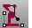
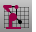
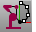
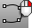
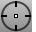

---
---

# 3-D Digitizing toolbar
{: #kanchor2300}
 [To open a toolbar](javascript:void(0);) Toolbars can be opened as a free-standing group or added to the current group.
To open a toolbar as a free-standing group
Click theOptionsicon in any toolbar group.On the menu, clickShow Toolbar, and then select the toolbar name from the list.To open a toolbar as a new tab in the current group
Click theOptionsicon in the toolbar group where you want to add the new tab.On the menu, clickShow or Hide Tabs, and then select the toolbar name from the list. [DigCalibrate](digitize.html#digcalibrate) 
Validate digitizer measurements against a model.
 [Digitize](digitize.html) 
Connect and initialize a digitizing arm.
 [DigDisconnect](digitize.html#digdisconnect) 
Disconnect the digitizing arm.
 [DigLine](digitize.html#digline) 
Draw a line normal to a surface with a digitizing arm.
 [DigPause](digitize.html#digpause) 
Suspend/pause input from the digitizing arm.
 [DigScale](digitize.html#digscale) 
Set a scale factor for digitized points.
 [DigSection](digitize.html#digsection) 
Create planar cross sections with a digitizing arm.
 [DigSketch](digitize.html#digsketch) 
Sketch a curve with a digitizing arm.
 [DigClick](digitize.html#digclick) 
Pick a location with a digitizing arm.
 [InterpCrv](interpcrv.html) 
Fit a curve through picked locations.
 [InterpCrvOnSrf](interpcrvonsrf.html) 
Fit a curve through locations on a surface.
 [Points](points.html) 
Draw multiple point objects.
 [ViewportProperties, *Target* ](viewport.html#target-location) 
Pick a location for the viewport target.
 [ViewportProperties, *Camera and Target* ](viewport.html#cameraandtarget) 
Pick a location for the viewport camera and target.
&#160;
&#160;
Rhinoceros 6 © 2010-2015 Robert McNeel &amp; Associates.11-Nov-2015
 [Open topic with navigation](3-d-digitizing-toolbar.html) 

