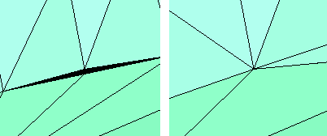

---
---

# AlignMeshVertices
{: #kanchor62}
 [Where can I find this command?](javascript:void(0);) Toolbars
 [Mesh Tools](mesh-tools-toolbar.html) 
Menus
Mesh
Mesh Repair Tools
Align Mesh Vertices
The AlignMeshVertices command force mesh vertices to the same location.

Note
Some STL/SLA printers have problems if meshes contain many long, thin facets. These can slow the printer's slicing process down, produce odd printed results, and run the printer out of memory.The [MeshRepair](meshrepair.html) command may be useful when tuning up meshes for STL/SLA printing.Steps
 [Select](select-objects.html) mesh objects or [specify a command line option](specifycommandlineoption.html), and press [Enter](enter-key.html) .If the distances between mesh vertices are smaller than the value of DistanceToAdjust, the vertices are forced together.This command is useful for fixing areas that have many vertices that should be in the same spot but for some reason are not.Command-line options
SelectVertices
Lets you select vertices to align.
SelectNakedEdges
Lets you select naked edges to align all vertices on the naked edge.
DistanceToAdjust
Sets the tolerance distance.
See also
 [Edit mesh objects](sak-meshtools.html) 
&#160;
&#160;
Rhinoceros 6 © 2010-2015 Robert McNeel &amp; Associates.11-Nov-2015
 [Open topic with navigation](alignmeshvertices.html) 

