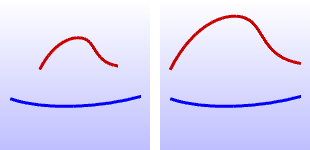

---
---

# AlignProfiles
{: #kanchor65}
{: #kanchor64}
{: #kanchor63}
 [Where can I find this command?](javascript:void(0);) Toolbars
 [Not on toolbars.](toolbarwhattodo.html) 
Menus
 [Not on menus.](menuwhattodo.html) 
The AlignProfiles command lines up and adjusts the length of one curve to another based on their bounding boxes.

Original red curve (left), aligned red curve (right).
Steps
 [Select](select-objects.html) the curve to align to.Select the curve to change.The curve will be translated and scaled so that its bounding box aligns with that of the first curve.
The curves must be planar, and both of the planes must be parallel to a world construction plane: World Top, World Front, or World Right.
The translation and rescaling is in the world axis directions.
See also
 [Edit curves](sak-curvetools.html) 
&#160;
&#160;
Rhinoceros 6 © 2010-2015 Robert McNeel &amp; Associates.11-Nov-2015
 [Open topic with navigation](alignprofiles.html) 

