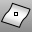
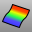
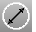

---
---

# Analyze toolbar
{: #kanchor2302}
 [To open a toolbar](javascript:void(0);) Toolbars can be opened as a free-standing group or added to the current group.
To open a toolbar as a free-standing group
Click theOptionsicon in any toolbar group.On the menu, clickShow Toolbar, and then select the toolbar name from the list.To open a toolbar as a new tab in the current group
Click theOptionsicon in the toolbar group where you want to add the new tab.On the menu, clickShow or Hide Tabs, and then select the toolbar name from the list. [Angle](angle.html) 
Report the angle between two picked or defined lines.
 [AreaCentroid](areacentroid.html) 
Report and marks an object's area centroid.
Link to [Mass Properties toolbar](mass-properties-toolbar.html) 
 [Bounce](bounce.html) 
Shoot a ray at a collection of surfaces to create a polyline path.
 [Check](check.html) 
Report errors in an object's data structure.
Link to [Geometry Fix toolbar](geometry-fix-toolbar.html) 
 [CheckNewObjects](check.html#checknewobjects) 
Report errors in an object's data structure as it is created or imported.
 [CrvDeviation](crvdeviation.html) 
Report the maximum and minimum distances between two curves.
 [Curvature](curvature.html) 
Evaluate the curvature of a curve or surface.
 [CurvatureAnalysis](curvatureanalysis.html) 
Evaluate surface curvature using false-color analysis.
Link to [Surface Analysis toolbar](surface-analysis-toolbar.html) 
 [CurvatureGraph](curvaturegraph.html) 
Evaluate curve or surface curvature with a graph.
 [CurvatureGraphOff](curvaturegraph.html#curvaturegraphoff) 
Turn off curvature graph display.
 [Diameter](diameter.html) 
Report the diameter of a curve at a specified point.
 [Dir](dir.html) 
Display and edit an object's normal direction.
 [Flip](flip.html) 
Reverse the normal direction of a curve, surface, or mesh.
 [ShowDir](dir.html#showdir) 
Open the Direction Analysis control and turn on direction analysis for curves, surfaces, and polysurfaces.
 [ShowDirOff](dir.html#showdiroff) 
Close the Direction Analysis control, and turn off direction analysis.
 [Distance](distance.html) 
Report the distance between two picked locations.
 [EvaluatePt](evaluatept.html) 
Report the world and construction plane coordinates of a picked location.
 [EvaluateUVPt](evaluateuvpt.html) 
Report the u and v&#160;coordinates of a specified location on a surface.
 [GCon](gcon.html) 
Report the geometric continuity between two curves.
 [Length](length.html) 
Report the length of curves or surface edges.
 [Domain](domain.html) 
Report the domain of a curve or surface.
 [PolygonCount](polygoncount.html) 
Report the number of mesh polygons in a selected object.
 [Radius](radius.html) 
Report the radius of a curve.
 [SelBadObjects](selection-commands.html#selbadobjects) 
Select all objects that do not pass [Check](check.html).
Link to [Diagnostics toolbar](diagnostics-toolbar.html) 
 [CheckNewObjects](check.html#checknewobjects) 
Report errors in an object's data structure as it is created or imported.
 [ShowEdges](showedges.html) 
Highlight edges of surfaces and polysurfaces. Displays the Edge Analysis control.
Link to [Edge Tool toolbar](edge-tools-toolbar.html) 
 [ShowEdgesOff](showedges.html#showedgesoff) 
Turn off edge display.
 [ShowEnds](showends.html) 
Open the End Analysis control, and display the endpoints of curves.
 [ShowEndsOff](showends.html#showends) 
Close the End Analysis control, and turn off endpoints of curves.
&#160;
&#160;
Rhinoceros 6 © 2010-2015 Robert McNeel &amp; Associates.11-Nov-2015
 [Open topic with navigation](analyze-toolbar.html) 

