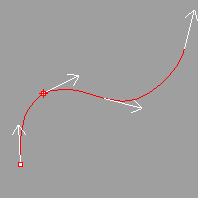
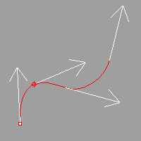

---
---

{: #kanchor2678}{: #kanchor2679}{: #kanchor2680}{: #kanchor2681}{: #kanchor2682}{: #kanchor2683}{: #kanchor2684}{: #kanchor2685}{: #kanchor2686}{: #kanchor2687}{: #kanchor2688}{: #kanchor2689}{: #kanchor2690}{: #kanchor2691}{: #kanchor2692}
# Appearance
 [Where can I find this command?](javascript:void(0);) Toolbars
 [Properties](properties-toolbar.html)  [Standard](standard-toolbar.html)  [Tools](tools-toolbar.html) 
Menus
Tools
Options
TheAppearanceoptions define the colors and visibility of Rhino display items.
Language used for display
Sets the language used for the Rhino interface. You can select from the list of available languages.
{: #commandprompt}Command prompt
These settings affect the appearance of the [command prompt](rhino-window.html#appwindow-commandprompt) and the [command history window](rhino-window.html#appwindow-commandhistory).
Font
Sets the font style.
Text size
Sets the font size.
Background
Sets the background color.
Text color
Sets the color of the text.
Hover color
Sets the color that displays when the mouse hovers over an option at the command prompt.
Echo prompts to history
Allows the command prompt to move into a command history window after use. Turn this off to see only the command name in the history window and not the prompts.
Autocomplete commands
Turns on automatic command completion when typing at the [command prompt](rhino-window.html#appwindow-commandprompt).
Use fuzzy autocomplete
When enabled, in-line autocomplete suggests the most used candidate. For example, LI most likely autocompletes toLinerather than something likeLimitReferenceModel, and the autocomplete menu contains best partial and inexact matches.
When disabled, autocomplete uses the first letters of the command name in an alphabetical list.
{: #directionarrow}Direction arrow icon
Shaft size
Sets the length of the shaft for the arrows in the [Dir](dir.html) command.
Arrowhead size
Sets the size of the arrowhead for the arrows in the [Dir](dir.html) command.

Default direction arrow shaft and head size.

Size of arrow shaft and head doubled.
{: #showinterfaceobjects}Show the following items
{: #menu-show}Menu
Toggles the visibility of [menus](rhino-window.html#appwindow-menus).
Command prompt
Toggles the [command area](rhino-window.html#appwindow-commandprompt) display.
{: #status-bar-show}Status bar
Toggles the visibility of the [status bar](rhino-window.html#appwindow-statusbar).
{: #viewport-titles-show}Viewport titles
Toggles the visibility of the [viewport titles](rhino-window.html#appwindow-viewporttitle).
{: #main-window-title-bar-show}Main window title bar
Toggles the visibility of the Rhino main window [title bar](rhino-window.html#appwindow-title).
Full path in title bar
Displays the full path to the model in the title bar.
Crosshairs
Toggles the display of full-screen crosshairs.
{: #viewport-tabs-at-start}Viewport tabs at start
Displays viewport tabs by default when Rhino starts.
 **Restore Defaults** 
Restores the default system values. All custom appearance settings will be lost.
To save options for use on other computers
 [OptionsExport](optionsexport.html) 
Save [Options](options.html) settings to a file.
 [OptionsImport](optionsexport.html#optionsimport) 
Restore [Options](options.html) settings from a file.
See also
 [Interface color options](appearance-colors.html) 
&#160;
&#160;
Rhinoceros 6 © 2010-2015 Robert McNeel &amp; Associates.11-Nov-2015
 [Open topic with navigation](appearance.html) 

