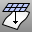

---
---

# Apply a mesh to a surface
Commands that apply mesh objects to a surface in order to shape the mesh to match the surface.

# ApplyMesh
{: #kanchor98}
{: #kanchor97}
{: #kanchor96}
{: #kanchor95}
 [Where can I find this command?](javascript:void(0);) Toolbars
 [Mesh Tools](mesh-tools-toolbar.html) 
Menus
Mesh
Apply to Surface
The ApplyMesh command fits a mesh that has the same number of [mesh vertices](meshvertex.html) as a source mesh onto a surface.
This is useful for creating morph targets.
See Wikipedia: [Morph target animation](https://en.wikipedia.org/wiki/Morph_target_animation).
Note
If the surface is trimmed, the mesh matches the untrimmed surface.ApplyMesh succeeds only on meshes that are generated from [NURBS](http://www.rhino3d.com/nurbs) objects that have embedded the u and v [direction](curvesurfacedirection.html) information.If you are making morph targets, mesh the most complex surface first, and then apply that mesh to the simpler surface.ApplyMesh is sensitive to the u and v&#160;directions of a surface. Use the [Dir](dir.html) command to swap the u and v&#160;directions.Steps
 [Select](select-objects.html) a mesh.Select the target surface.
# ApplyMeshUVN
{: #kanchor100}
{: #kanchor99}
{: #applymeshuvn}
 [Where can I find this command?](javascript:void(0);) Toolbars
 [Mesh Tools](mesh-tools-toolbar.html) 
Menus
Mesh
Apply Mesh UVN
The ApplyMeshUVN command wraps meshes and points onto a surface.
To create meshes from bitmaps, see the [Heightfield](heightfield.html) command.
Steps
 [Select](select-objects.html) meshes and points.Select the target surface.Your browser does not support the video tag.Command-line options
VerticalScale
Sets the scaling factor for the height of the applied mesh.
See also
 [Mesh](mesh.html) 
Create a mesh from a NURBS surface or polysurface.
&#160;
&#160;
Rhinoceros 6 © 2010-2015 Robert McNeel &amp; Associates.11-Nov-2015
 [Open topic with navigation](applymesh.html) 

