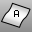

---
---

# Area
{: #kanchor106}
{: #kanchor105}
 [Where can I find this command?](javascript:void(0);) Toolbars
 [Mass Properties](mass-properties-toolbar.html) 
Menus
Analyze
Mass Properties
Area
The Area command reports the surface area of closed planar curves, surfaces, polysurfaces, hatches, or meshes.
Steps
 [Select](select-objects.html) objects.The accumulated area of the objects displays on the command line.Command-line options
Units
Set the [units](unit-systems.html) for the area display.
Note: This option is only available if no objects are selected.
See also
 [Measure objects](sak-measure.html) 
 [Analyze an object's mass properties](sak-massproperties.html) 
&#160;
&#160;
Rhinoceros 6 © 2010-2015 Robert McNeel &amp; Associates.11-Nov-2015
 [Open topic with navigation](area.html) 

