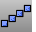

---
---

# ArrayLinear
{: #kanchor124}
 [Where can I find this command?](javascript:void(0);) Toolbars
 [Array](array-toolbar.html) 
Menus
Transform
Array
Linear
The ArrayLinear command copies and spaces objects in a single direction.
Steps
 [Select](select-objects.html) objects to array. [Pick](pick-location.html) the first reference point.Pick the second reference point.The direction of the array and the distance between the objects is determined by the second pick point.Your browser does not support the video tag.Command-line options
Number
The number of total objects resulting from the array.
Preview
Displays a dynamic preview.
You can change the options and the preview will update.
See also
 [Array objects](sak-array.html) 
&#160;
&#160;
Rhinoceros 6 © 2010-2015 Robert McNeel &amp; Associates.11-Nov-2015
 [Open topic with navigation](arraylinear.html) 

