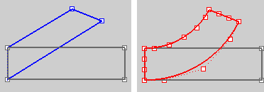

---
---

# Bend
{: #kanchor144}
 [Where can I find this command?](javascript:void(0);) Toolbars
 [Transform](transform-toolbar.html)  [Deformation Tools](deformation-tools-toolbar.html) 
Menus
Transform
Bend
The Bend command deforms objects by bending along a spine arc.
Steps
 [Select](select-objects.html) the objects. [Pick](pick-location.html) the Start of a spine line that represents the original orientation of the object.Pick the end of the spine line.Pick a point to bend through.Your browser does not support the video tag.Command-line options
Copy
 [&#160;History enabled](historyenabled.html) 
The Copy option specifies whether or not the objects are copied. A plus signappears at the cursor when copy mode is on.
The [RememberCopyOptions](remembercopyoptions.html) command determines whether the selected option is used as the default.
Rigid
The Rigid option specifies that individual objects will not be deformed as they are transformed.
The illustration shows the Rigid option with the Bend command.

Original objects (left), Rigid=No (center), Rigid=Yes (left).
Yes
Individual objects will not change, only their positions will change.
Your browser does not support the video tag.No
Individual objects are transformed as well as their positions.
Your browser does not support the video tag.LimitToSpine
Determines how closely the structure obeys the spine limitation.
Yes
Only the region of the spine is bent.
Your browser does not support the video tag.No
The mouse click point determines the region to bend.
Your browser does not support the video tag.Angle
Enter an angle to set the bend amount.
Symmetric
The Symmetric option determines how the bend is formed.
Yes
The bend spine starts in the middle of the object to bend symmetrically around the center.
Your browser does not support the video tag.No
Only one end of the object bends.
Your browser does not support the video tag.PreserveStructure
Specifies whether the control-point structure of a curve or surface will be maintained after the deformation.
The PreserveStructure option does not apply to polysurfaces, and will not be displayed if polysurfaces are selected for editing.
Yes
The [control point](controlpoint.html) structure of the surface is maintained. Deformation may be less accurate if there are too few control points in on the object.
No
The objects are [refit](fitcrv.html) as needed with more [control points](controlpoint.html) to allow accurate deformation.
PreserveStructure=Yes (left); PreserveStructure=No (right).
See also
 [Use Universal Deformation Technology](sak-udt.html) 
&#160;
&#160;
Rhinoceros 6 © 2010-2015 Robert McNeel &amp; Associates.11-Nov-2015
 [Open topic with navigation](bend.html) 

