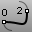

---
---

# BlendCrv
{: #kanchor146}
{: #kanchor145}
 [Where can I find this command?](javascript:void(0);) Toolbars
 [Curve Tools](curve-tools-toolbar.html) 
Menus
Curve
Blend Curves
Adjustable Curve Blend
 [&#160;History enabled](historyenabled.html) 
The BlendCrv command creates a blend curve between curves and / or surface edges with control over the continuity with the input curves.
Steps
 [Select](select-objects.html) the curves.Select a control point to adjust.Press [Shift](shift-key.html) and select for symmetry.A preview of the curves displays that allows adjustment of the curve before it is made.Your browser does not support the video tag.Selection options
BlendStart
Specifies where on the curve the blend will start.
CurveEnd
Starts the blend at the end of the curve where the curve was selected.

PickPoint
Starts the blend at the location on the curve where the curve was selected.

Edges
Restricts selection to surface edges.
Your browser does not support the video tag.Point
Specifies a point to blend to.
Your browser does not support the video tag.Edit
If the blend was made with [history](history.html) recording on, you can select the blend to re-edit the curve.
Adjust Curve Blend options
Continuity Curve 1 / 2
Sets the continuity option between the blend curve and the input curves or edges.
 [Position](continuity-descriptions.html#position-g0) 
 [Tangency](continuity-descriptions.html#tangency-g1) 
 [Curvature](continuity-descriptions.html#curvature-g2) 
 [G3](continuity-descriptions.html#g3) 
 [G4](continuity-descriptions.html#g4) 
Flip 1 / 2
Reverses the [direction](dir.html#normaldirection) of the specified curve.
Your browser does not support the video tag.Trim
Trims the input curves to the resulting curve.
Your browser does not support the video tag.Join
Joins the resulting curves.
Show Curvature
Displays the [curvature graph](curvaturegraph.html).
Your browser does not support the video tag.Keys for control
Alt
Hold [Alt](alt-key.html) while dragging the handles to change the angle between the shape curve and the surface edge. By default the shape curves are perpendicular to the surface edge.
Shift
Hold [Shift](shift-key.html) to control symmetry. By default the shape curves are separately edited at each end, with symmetry, point editing is mirrored to the other end of the curve.
Your browser does not support the video tag.See also
 [Fillet, blend, or chamfer between curves and surfaces](sak-fillet-blend-chamfer.html) 
&#160;
&#160;
Rhinoceros 6 © 2010-2015 Robert McNeel &amp; Associates.11-Nov-2015
 [Open topic with navigation](blendcrv.html) 

