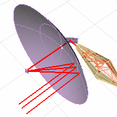
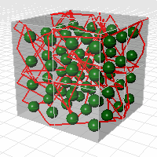

---
---

# Bounce
{: #kanchor192}
 [Where can I find this command?](javascript:void(0);) Toolbars
 [Analyze](analyze-toolbar.html) 
Menus
Curve
Polyline
The Bounce command shoots a ray at a collection of surfaces to create a polyline path.

Steps
 [Select](select-objects.html) reflecting surfaces.Infinite Plane: TypeIPfor [InfinitePlane](infiniteplane.html) options.
 [Pick](pick-location.html) the ray start point.Pick the ray direction.Command-line options
Reflections
The maximum number of times the ray will be reflected.
ArrowLength
The length of the segment with the arrowhead. If 0, no arrowhead segment is drawn.
See also
 [Create curves from other objects](sak-curvefromobject.html) 
&#160;
&#160;
Rhinoceros 6 © 2010-2015 Robert McNeel &amp; Associates.11-Nov-2015
 [Open topic with navigation](bounce.html) 

