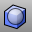
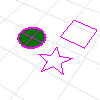
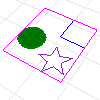
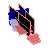
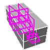

---
---

# BoundingBox
{: #kanchor196}
{: #kanchor195}
{: #kanchor194}
 [Where can I find this command?](javascript:void(0);) Toolbars
 [Box](box-toolbar.html) 
Menus
Analyze
Bounding Box
The BoundingBox command creates a rectilinear box object (polyline or [polysurface](polysurface.html) ) that encloses selected objects.
Steps
 [Select](select-objects.html) the objects.If the objects are contained in a plane parallel to a coordinate system plane, the bounding box is a rectangular polyline.Otherwise, a [polysurfaces](polysurface.html) box is created.The extreme corners of the bounding box object are reported at the command line in the chosen coordinate system.Command-line options
CoordinateSystem
CPlane
Bases the object creation on construction plane coordinates.
World
Bases the object creation on world coordinates.
Output
For three-dimensional objects, specifies the results.
Solids
Creates a solid [box](box.html).
Meshes
Creates a [mesh box](meshbox.html).
Curves
Creates six [grouped](group.html) rectangles.
None
Reports the dimensions of the bounding box at the command line.
See also
 [Analyze objects](sak-analysis.html) 
&#160;
&#160;
Rhinoceros 6 © 2010-2015 Robert McNeel &amp; Associates.11-Nov-2015
 [Open topic with navigation](boundingbox.html) 

