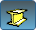

---
---

# Box
{: #kanchor199}
{: #kanchor198}
{: #kanchor197}
 [Where can I find this command?](javascript:void(0);) Toolbars
 [Box](box-toolbar.html)  [Main1](main1-toolbar.html)  [Solids Creation](solid-creation-toolbar.html)  [Solids Sidebar](solids-sidebar-toolbar.html) 
Menus
Solid
Box
Corner to Corner, Height
Diagonal
3 Points, Height
Vertical Base
Center of Base, Corner, Height
&#160; [Extrusions enabled](extrusionsenabled.html) 
The Box command draws a solid box.
Steps
Draw the base rectangle.Press and hold [Shift](shift-key.html) to draw a square.Draw a height for the box.Press [Enter](enter-key.html) to use the width value for the height.Your browser does not support the video tag.
## Base rectangle options
{: #box-diagonal}

## Default
The default option draws the base rectangle using two opposite corners.
Steps
 [Pick](pick-location.html) the first corner.Pick the other corner or type a length.Your browser does not support the video tag.
## Diagonal
TheDiagonaloption draws the base rectangle from two diagonal corners. No option for side length is offered.
Diagonal steps
 [Pick](pick-location.html) two opposite corners.Your browser does not support the video tag.Cube option
TheCubeoption specifies a height that also defines the cube's orientation.

## 3Point
{: #3point}
The3Pointoption draws the base rectangle using two adjacent corner locations and a location on the opposite side.
3Point steps
 [Pick](pick-location.html) the start of an edge.Pick the end of the edge.Pick or type the width.Your browser does not support the video tag.
## Vertical
{: #vertical}
TheVerticaloption draws the base rectangle perpendicular to the construction plane.
Vertical steps
 [Pick](pick-location.html) the start of the edge.Pick the end of the edge.Pick or type a width.Your browser does not support the video tag.
## Center
{: #center}
TheCenteroption draws the base rectangle around a center point.
Center steps
 [Pick](pick-location.html) the center.Pick the other corner or type a length.Your browser does not support the video tag.See also
 [Create solid objects](sak-solid.html) 
&#160;
&#160;
Rhinoceros 6 © 2010-2015 Robert McNeel &amp; Associates.11-Nov-2015
 [Open topic with navigation](box.html) 

