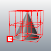
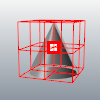
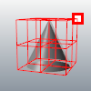
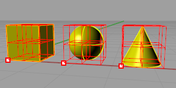
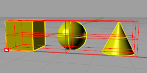
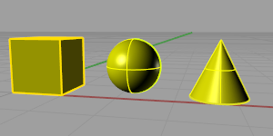

---
---

# BoxEdit
{: #kanchor203}
{: #kanchor202}
{: #kanchor201}
{: #kanchor200}
 [Where can I find this command?](javascript:void(0);) Toolbars
 [Not on toolbars.](toolbarwhattodo.html) 
Menus
Panels
Box Edit
The BoxEdit command edits objects according to their bounding box size, orientation, and position.
New bounding boxes are calculated each time the settings are applied.
Note
When in individual transform mode, you can type a value (instead of scrolling) to set a value for all objects (absolute vs. relative).The edit controls can use units other than the model units.Steps
 [Select](select-objects.html) objects.Specify transform options.ClickApplyto accept the changes.Or, clickResetto reject the changes.Box Edit Panel
 [Panel options](panel-options.html) 
 *n* objects selected
Reports the number of objects selected.
 **Apply** 
Save the changes.
 **Reset** 
Reject the changes and revert the objects to their previous state.
Size
X/Y/Z
Specifies the x, y, or z&#160;size in model units.
Increment
Increment used by the spinner controls.
Scale
X/Y/Z
Specifies the x, y, or z&#160;scale factor.
Increment
Increment used by the spinner controls.
Position
X/Y/Z
Specifies the x, y, or z&#160;position in model units.
Increment
Increment used by the spinner controls.
Rotation
X/Y/Z
Specifies the x, y, or z&#160;rotation in degrees.
Increment
Increment used by the spinner controls.
Options
Pivot location
Sets the base point for scale and rotate transforms.
X/Y/Z
Min
Uses the minimum bounding box x, y, or z&#160;point.
Set X, Y, and Z to Min to use the "lower-left" corner of the bounding box as the pivot.

Minimum x, y, and z.
Cen
Uses the centroid bounding box x, y, or z&#160;point.
Set X, Y, and Z to Cen to use the "middle" of the bounding box as the pivot.

Center x, y, and z.
Max
Uses the maximum bounding box x, y, or z&#160;point.
Set X, Y, and Z to Max to use the "upper-right" corner of the bounding box as the pivot.

Maximum x, y, and z.
Use world CPlane
Uses world coordinates for the transformations.
Use current CPlane
Uses construction plane coordinates for the transformations.
Transform objects individually
Transforms each object from its own pivot point and bounding box.

Individual bounding boxes and pivot for each object.
By default, selected objects are all contained in one bounding box and are transformed from one pivot point as one unit.

Single bounding box and pivot for all selected objects.
Show bounding box
Displays a control polygon that represents the bounding box.

Bounding box off.
Copy objects
Transforms a copy instead of the original objects.
Select copied objects
Leaves the copied objects selected. This allows incremental changes to the copied objects.
See also
 [Transform objects](sak-transform.html) 
&#160;
&#160;
Rhinoceros 6 © 2010-2015 Robert McNeel &amp; Associates.11-Nov-2015
 [Open topic with navigation](boxedit.html) 

