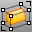

---
---

# Cage toolbar
{: #kanchor2311}
 [To open a toolbar](javascript:void(0);) Toolbars can be opened as a free-standing group or added to the current group.
To open a toolbar as a free-standing group
Click theOptionsicon in any toolbar group.On the menu, clickShow Toolbar, and then select the toolbar name from the list.To open a toolbar as a new tab in the current group
Click theOptionsicon in the toolbar group where you want to add the new tab.On the menu, clickShow or Hide Tabs, and then select the toolbar name from the list. [CageEdit](cageedit.html) 
Deform objects smoothly using control cage objects.
 [Cage](cage.html) 
Create a control cage object used by the [CageEdit](cageedit.html) command to deform other objects.
 [ReleaseFromCage](cageedit.html#releasefromcage) 
Remove objects from a control cage.
 [SelControls](selection-commands.html#selcontrols) 
Select all cage controls.
 [SelCaptives](selection-commands.html#selcaptives) 
Select captive objects of a specified cage controls.
&#160;
&#160;
Rhinoceros 6 © 2010-2015 Robert McNeel &amp; Associates.11-Nov-2015
 [Open topic with navigation](cage-toolbar.html) 

