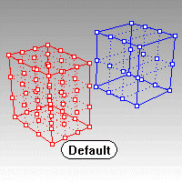

---
---

# Cage
{: #kanchor239}
 [Where can I find this command?](javascript:void(0);) Toolbars
 [Cage](cage-toolbar.html)  [Transform](transform-toolbar.html)  [Deformation Tools](deformation-tools-toolbar.html) 
Menus
Transform
Cage Editing
Create Cage
The Cage command creates a box-shaped cage object to be used with the [CageEdit](cageedit.html) command to deform other objects.

Note
Cages with a small number of cage control points can modify more complex objects. This ensures that transitions are smoother than could be achieved using standard control point editing.After creating the cage object, use the [CageEdit](cageedit.html) command to capture objects with the cage. Use the cage's [control points](pointson.html) to deform the captive objects.Steps
 [Select objects](selection-commands.html#select-object-basics), and press [Enter](enter-key.html) .Note: See the [Rectangle](rectangle.html) command for option descriptions.Draw the cage box.Command-line options
BoundingBox{: #kanchor240}
The BoundingBox option uses the object bounding box to determine the box location.
Your browser does not support the video tag.BoundingBox options
See the [BoundingBox](boundingbox.html) command for detailed option descriptions.
CoordinateSystem
The coordinate system for the bounding box.
CPlane
 [Construction plane coordinates.](unit-systems.html#construction-plane-coordinates) 
World
 [World coordinates.](unit-systems.html#world-coordinates) 
3Point
 [Pick](pick-location.html) three points to establish a coordinate system.
Diagonal
Draws the base rectangle from two diagonal corners. No option for side length is offered.
Your browser does not support the video tag.Diagonal steps
 [Pick](pick-location.html) two opposite corners.Cube option
 [Pick](pick-location.html) a height that also defines the cube's orientation.Cage points
Specify the number of cage control points and [degree](degree.html) of the cage in each direction as appropriate for the cage object.
PointCount (UV or XYZ)
Specifies the number of cage [control points](pointson.html) in each direction of the line, rectangle, or box.
Degree (UV or XYZ)
Specifies the [degree](degree.html) in each direction of the line, rectangle, or box.
See also
 [Use Universal Deformation Technology](sak-udt.html) 
&#160;
&#160;
Rhinoceros 6 © 2010-2015 Robert McNeel &amp; Associates.11-Nov-2015
 [Open topic with navigation](cage.html) 

