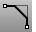

---
---

# Chamfer
{: #kanchor262}
{: #kanchor261}
{: #kanchor260}
 [Where can I find this command?](javascript:void(0);) Toolbars
 [Curve Tools](curve-tools-toolbar.html) 
Menus
Curve
Chamfer Curves
The Chamfer command creates a line segment between two input curves and trims or extends the curves to meet the line segment.
Your browser does not support the video tag.Steps
 [Select](select-objects.html) the first curve near the end for the chamfer.Select the second curve near the end for the chamfer.Command-line options
Distances
The [distance](distance-pick-2pts.html) from the intersection of the curves to the chamfer.
Join
Joins the resulting curves.
Trim
Trims the input curves to the resulting curve.
ExtendArcsBy
Applies when arcs are filleted or chamfered but need to be extended to meet the fillet curve or chamfer line.
Arc
The arc is extended maintaining its validity.
Line
The arc is extended with a line segment, which is joined to the arc converting it to a [polycurve](polycurve.html).
See also
 [Fillet, blend, or chamfer between curves and surfaces](sak-fillet-blend-chamfer.html) 
&#160;
&#160;
Rhinoceros 6 © 2010-2015 Robert McNeel &amp; Associates.11-Nov-2015
 [Open topic with navigation](chamfer.html) 

