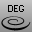

---
---

# ChangeDegree
{: #kanchor270}
{: #kanchor269}
{: #kanchor268}
 [Where can I find this command?](javascript:void(0);) Toolbars
 [Curve Tools](curve-tools-toolbar.html) 
 [Surfaces](surface-tools-toolbar.html) 
Menus
Edit
Change Degree
The ChangeDegree command changes the [degree](degree.html) of the polynomial that defines the curve or surface by adding or subtracting [control points](controlpoint.html) between [knot](knot.html) spans, while maintaining the [knot](knot.html) structure.
Steps
 [Select](select-objects.html) the objects.Type a degree value.For surfaces type values in the u and v [directions](curvesurfacedirection.html) .Command-line option
Deformable
Yes
If the degree of the curve/surface is different from the requested [degree](degree.html), the new curve/surface will have simple interior [knots](knot.html).
No
If the degree of the curve/surface is LESS than the requested degree, the new curve/surface will have exactly the same geometry and [parameterization](parameterization.html) as the original, but it will have knots of multiplicity = old multiplicity + new degree - old degree.
If the degree of the curve/surface is GREATER than the requested degree, the new curve/surface will be an approximation of the original with simple [knots](knot.html).
Note
The ChangeDegree command changes the [degree](degree.html) of the polynomial Rhino uses to create the curve. It keeps the [knot](knot.html) structure of the curves the same, but it adds or subtracts [control points](controlpoint.html) between each knot span.Often it is better to use [InsertKnot](insertknot.html) and [RemoveKnot](insertknot.html#removeknot) instead of ChangeDegree, because you can add/remove control points more locally.If you want the surface to have the same geometry, but more [control points](controlpoint.html) for editing, then try increasing the degree to 5 with the Deformable option set to No. In this case, you may want to consider using the [InsertKnot](insertknot.html) command, which will add [control points](controlpoint.html) but leave the degree unchanged.If you are going to export your geometry to another application, make every attempt to keep the [degree](degree.html) of your surfaces low. In particular, many mechanical CAD systems cannot import surfaces that have degrees greater than 3.The number of [control points](controlpoint.html) you add or subtract depends on the [degree](degree.html) ; the higher the degree, the greater the number of control points.If you raise the [degree](degree.html) of a surface with Deformable=No, it will no longer be periodic. Use [MakePeriodic](makeperiodic.html) to restore the periodicity of the surface.Objects with higher [degrees](degree.html) take longer to display and use more memory.See also
 [Edit curves](sak-curvetools.html) 
 [Edit surfaces](sak-surfacetools.html) 
&#160;
&#160;
Rhinoceros 6 © 2010-2015 Robert McNeel &amp; Associates.11-Nov-2015
 [Open topic with navigation](changedegree.html) 

