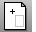

---
---

# ChangeSpace
{: #kanchor312}
{: #kanchor311}
 [Where can I find this command?](javascript:void(0);) Toolbars
 [Not on toolbars.](toolbarwhattodo.html) 
Menus
 [Not on menus.](menuwhattodo.html) 
The ChangeSpace command changes the "space" of object from layout space to model space and vise versa.
You must have a [layout](layout.html) open. TheChangeSpacecommand will not work if you are working in a normal model view.
To move an object from model space to layout space
In a detail view, select the objects you want to change space.The objects are moved to the layout page.To move an object from layout space to model space
Select the objects in layout space.Select the target detail view by clicking on the detail edge.Command-line option
Copy
The Copy option specifies whether or not the objects are copied. A plus signappears at the cursor when copy mode is on.
The [RememberCopyOptions](remembercopyoptions.html) command determines whether the selected option is used as the default.
See also
 [Layout](layout.html) 
Create a print layout viewport.
 [Detail](detail.html#detail) 
Manage layout detail viewports.
&#160;
&#160;
Rhinoceros 6 © 2010-2015 Robert McNeel &amp; Associates.11-Nov-2015
 [Open topic with navigation](changespace.html) 

