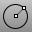
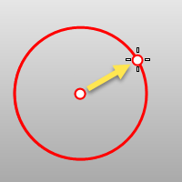
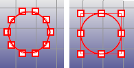
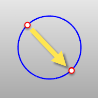
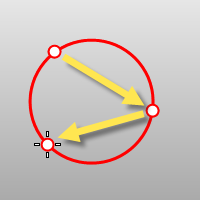
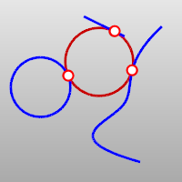
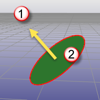

---
---

# Circle
{: #kanchor329}
{: #kanchor328}
 [Where can I find this command?](javascript:void(0);) Toolbars
 [Main1](main1-toolbar.html)  [Circle](circle-toolbar.html)  [Curve Drawing](curve-drawing-toolbar.html) 
Menus
Curve
Circle
The Circle command draws a circle from a center location and a radius.
Steps
 [Pick](pick-location.html) the center location.Pick a radius location or [specify an option](specifycommandlineoption.html) .Command-line options
{: #deformable}Deformable
Draws a [NURBS](http://www.rhino3d.com/nurbs) approximation of the curve will be created with the degree and number of points you specify.

Deformable (degree 3) (left); Not deformable (degree 2) (right).
Deformable options
Degree
Specifies the [degree](degree.html) of the arc.
When drawing a high-degree arc, the output curve will not be the degree you request unless there is at least one more [control point](controlpoint.html) than the degree.
PointCount
Specifies the number of [control points](controlpoint.html).
{: #2point}2Point
Draws the circle from the two ends of its diameter.
2Point steps
 [Pick](pick-location.html) the start of the diameter. [Pick](pick-location.html) the end of the diameter.{: #3point}3Point
Draws a circle through three points on the circumference.
3Point steps
 [Pick](pick-location.html) three points that define the circumference.3Point option
Radius
Specifies the radius and orientation for the circle after two points have been picked.
Radius steps
 [Pick](pick-location.html) a location or type a radius value.Pick a direction to orient the circle.{: #aroundcurve}AroundCurve
Draws a circle perpendicular to a curve.
AroundCurve steps
 [Select](select-objects.html) a curve and [pick](pick-location.html) the center of the circle on the curve and aRadiusorDiameter.{: #fitpoints}FitPoints
Draws a circle by fitting to selected point objects, curve and surface [control points](controlpoint.html), and mesh vertices.
FitPoint steps
 [Select](select-objects.html)  [point objects](point.html) or [control points](controlpoint.html) .A minimum of three points or control points is required.{: #tangent}Tangent
Draws a circle tangent to curves.
Tangent steps
 [Pick](pick-location.html) the first tangent location on the first curve.Pick the second tangent curve, or type a radius.Pick the third tangent curve, or press [Enter](enter-key.html) to draw the circle from the first and second tangent locations.Tangent options
FromFirstPoint
Forces the circle or arc to go through the first picked point on the curve instead of allowing the point to slide along the curve.
Point
Allows a point that does not have to be a tangent point on a curve.
Radius
The circle is restricted to the specified radius. If a tangent point exists on the second curve that meets the radius requirement, the tangent constraint will appear at that point as you drag the circle.
{: #vertical}Vertical
Draws a circle perpendicular to the construction plane.
Vertical steps
 [Pick](pick-location.html) the center and a radius or diameter.Diameter/Radius options
Radius/Diameter
Toggles between accepting a radius value and a diameter value.
To switch between radius and diameter
 [Pick](pick-location.html) a location or type a value.Orientation
Specifies an orientation not on the construction plane.
To specify orientation
Pick a direction that will be perpendicular to the circle plane.Perpendicular direction (1); Circle plane (2).
Circumference
Specifies the circle's circumference.
To specify circumference
Type the circumference value at the command line or pick a location to show the circumference length.Area
Specifies the circle's area.
To specify the area
Type the area value at the command line or pick a location to show the area value.See also
 [Draw lines and curves](sak-curve.html) 
&#160;
&#160;
Rhinoceros 6 © 2010-2015 Robert McNeel &amp; Associates.11-Nov-2015
 [Open topic with navigation](circle.html) 

