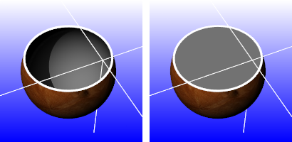
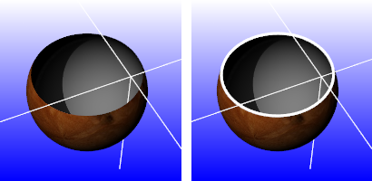

---
---

# ClippingPlane
{: #kanchor340}
{: #kanchor339}
{: #kanchor338}
 [Where can I find this command?](javascript:void(0);) Toolbars
 [Viewport Layout](viewport-layout-toolbar.html)  [Visibility](visibility-toolbar.html) 
Menus
View
 [Viewport title](rhino-window.html#viewport-title-menu) 
Clipping plane
The ClippingPlane command creates a clipping plane object that represents a plane for visibly clipping away geometry in a specific viewport.
Your browser does not support the video tag.
Steps
Draw a rectangle to represent the clipping plane.See the [Rectangle](rectangle.html) command for detailed option descriptions.Note
The appearance of the clipping plane edges is controlled in the [display modes](view-displaymode-options.html) .The clipping plane is infinite. The clipping plane object represents only the location and direction of the clipping plane.The visibility of clipping planes is controlled with [Hide](hide.html), [Show](hide.html#show), and [layer](layer.html) visibility like all Rhino objects.Clipping plane [Properties](#clippingplane-properties) specify the clipping plane's direction and the viewports affected by the clipping plane.The clipping plane pointer faces toward the objects that will be visible.
## Clipping plane properties
{: #clippingplane-properties}
Manages object [properties](properties.html) for the selected clipping plane.
 **Flip Direction** 
Reverses the direction of the clipping plane pointer.
 **Views Clipped** 
Specifies which views are clipped.
Model Views
Lists available model views.
Layout Views
Lists available layout views.

## Clipping plane appearance
The appearance of clipping planes is controlled by the [display mode](view-displaymode-options.html) of the viewport.
For appearance settings, see:&#160; [Display Mode Options](view-displaymode-options.html).

### Clipping plane objects
Specifies how clipping plane objects appear in the display mode.
Show fills(shaded modes only)
When a clipping plane intersects a 3-D object, the object is filled.

Fills off (left) and on (right).
Color usage
Specifies how the color for the clipping plane object fill is determined.
Viewport
Uses the viewport background color.
Render material
Uses the clipping plane's [render material](materialeditor.html).
Plane's material
Uses the clipping plane's color or layer color [property](properties.html).
Solid color
To select a color
Click the color swatch.Show edges
Shows the edges between the clipping plane and clipped objects.

Edges off (left) and on (right).
Color usage
Plane's color
Uses the clipping plane's [color](properties.html#displaycolor) (object or layer).
Solid color
To select a color
Click the color swatch.Edge thickness
Edge thickness in pixels.
Shade selected plane
Shades the selected clipping plane.
Color usage
Plane's color
Uses the clipping plane's [color](properties.html#displaycolor) (object or layer).
Plane's material
Uses the plane's [render material](material.html) (object or layer).
Solid color
To select a color
Click the color swatch.Transparency %
Specifies the clipping plane transparency.
Clip selection highlight
Clips the highlight wires. Shaded selections always clip.

Selection highlight clipped (left) and not clipped (right).

# Related commands

## DisableClippingPlane
{: #kanchor342}
{: #kanchor341}
{: #disableclippingplane}
 [Where can I find this command?](javascript:void(0);) Toolbars
 [Visibility](visibility-toolbar.html) 
Menus
 [Not on menus.](menuwhattodo.html) 
The DisableClippingPlane command turns off selected clipping planes in the active viewport.

## EnableClippingPlane
{: #kanchor343}
{: #enableclippingplane}
 [Where can I find this command?](javascript:void(0);) Toolbars
 [Visibility](visibility-toolbar.html) 
Menus
 [Not on menus.](menuwhattodo.html) 
The EnableClippingPlane command turns on selected clipping planes in the active viewport.
See also
 [Manage views](sak-view.html) 
 [Set viewport display modes](sak-displaymodes.html) 
&#160;
&#160;
Rhinoceros 6 © 2010-2015 Robert McNeel &amp; Associates.11-Nov-2015
 [Open topic with navigation](clippingplane.html) 

