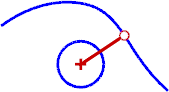
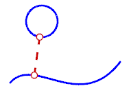

---
---

# ClosestPt
{: #kanchor389}
 [Where can I find this command?](javascript:void(0);) Toolbars
 [Point](point-toolbar.html) 
Menus
Curve
Point Object
Closest Point
The ClosestPt command creates a point object at the closest point from a specified location to a selected object or on two objects where they are closest to each other.

Steps
 [Select](select-objects.html) the target object or objects. [Pick](pick-location.html) the base point for the closest point calculation.Note
The closest point on all of the objects is calculated.If more than one object is selected, the closest point will appear on only one object. To find the closest point on each object, use theClosestPtcommand on each object individually.The distance is printed on the command line.Command-line options
Object
Calculates the closest point between two objects.
To calculate the closest point to an object
 [Select](select-objects.html) a curve or point object.To select parts of objects, use [sub-object selection](selection-commands.html#sub-object-selection) .The closest point from that object to the originally selected object is calculated.Point objects are created at the closest points.This is especially useful for testing two curve objects.CreateLine
Draws a line between the base point and the closest point on the object.See also
 [Point](point.html) 
Draw a single point object.
&#160;
&#160;
Rhinoceros 6 © 2010-2015 Robert McNeel &amp; Associates.11-Nov-2015
 [Open topic with navigation](closestpt.html) 

