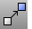

---
---

# Collapse Mesh toolbar
{: #kanchor2313}
 [To open a toolbar](javascript:void(0);) Toolbars can be opened as a free-standing group or added to the current group.
To open a toolbar as a free-standing group
Click theOptionsicon in any toolbar group.On the menu, clickShow Toolbar, and then select the toolbar name from the list.To open a toolbar as a new tab in the current group
Click theOptionsicon in the toolbar group where you want to add the new tab.On the menu, clickShow or Hide Tabs, and then select the toolbar name from the list. [Cancel](cancel.html) 
Cancel the current command and deselects objects.
 [Cancel, *All* ](cancel.html) 
Turns off [Points](pointson.html), [CurvatureGraph](curvaturegraph.html), [EMap](emap.html), [Zebra](zebra.html), [MoveUVN](moveuvn.html), [CurvatureAnalysis](curvatureanalysis.html), and [deselects objects](selection-commands.html#selnone).
 [Move](move.html) 
Move objects from one location to another.
Link to [Transform toolbar](transform-toolbar.html) 
 [CollapseMeshFacesByEdgeLength](collapsemeshface-commands.html#collapsemeshfacesbyedgelength) 
Move all [mesh face vertices](meshvertex.html) to a single vertex based on face edge length.
 [CollapseMeshFacesByAspectRatio](collapsemeshface-commands.html#collapsemeshfacesbyaspectratio) 
Move all mesh face [vertices](meshvertex.html) to a single vertex based on face aspect ratio.
 [CollapseMeshFacesByArea](collapsemeshface-commands.html#collapsemeshfacesbyarea) 
Move all mesh face [vertices](meshvertex.html) to a single vertex based on face area.
 [CollapseMeshFace](collapsemeshface-commands.html) 
Move all mesh face [vertices](meshvertex.html) to a single vertex.
 [CollapseMeshEdge](collapsemeshedge.html) 
Move mesh edge [vertices](meshvertex.html) to a single vertex.
 [CollapseMeshVertex](collapsemeshvertex.html) 
Move a [mesh vertex](meshvertex.html) to an adjacent mesh vertex.
&#160;
&#160;
Rhinoceros 6 © 2010-2015 Robert McNeel &amp; Associates.11-Nov-2015
 [Open topic with navigation](collapse-mesh-toolbar.html) 

