---
---

{: #kanchor1}{: #kanchor2}
# Command List
 [New in Rhino](newinrhino.html) 

## Numbers
 [3DFace](3dface.html) 
Draw a single mesh face.
 [3View](new-viewport-arrangements.html#3view) 
Set up a three-viewport workspace.
 [4View](new-viewport-arrangements.html#4view) 
Set up a four-viewport workspace.

## A
 [AcadSchemes](acadschemes.html) 
Edit AutoCAD export schemes.
 [AddGuide](modeling-aids-smarttrack.html#addguide) 
Add temporary infinite guide / construction line.
 [AddNextU](selection-commands.html#addnextu) 
Add the next control point in the u&#160;direction to the selection.
 [AddNextV](selection-commands.html#addnextv) 
Add the next control point in the v&#160;direction to the selection.
 [AddPrevU](selection-commands.html#addprevu) 
Add the previous control point in the u&#160;direction to the selection.
 [AddPrevV](selection-commands.html#addprevv) 
Add the previous control point in the v&#160;direction to the selection.
 [AddToGroup](group.html#addtogroup) 
Add an object to a selected group.
 [Alerter](alerter.html) 
Open the Alerter options page.
 [Align](align.html) 
Line up bounding boxes of objects.
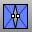 [AlignMeshVertices](alignmeshvertices.html) 
Force mesh vertices to the same location.
 [AlignProfiles](alignprofiles.html) 
Line up one curve to another.
 [Angle](angle.html) 
Report the angle between two picked or defined lines.
 [ApplyBoxMapping](texturemapping.html#applyboxmapping) 
Add a box texture mapping channel to an object.
 [ApplyCrv](applycrv.html) 
Wrap a curve onto a surface.
 [ApplyCustomMapping](texturemapping.html#applycustommapping) 
Add a custom texture mapping channel to an object.
 [ApplyCylindricalMapping](texturemapping.html#applycylindricalmapping) 
Add a cylindrical texture mapping channel to an object.
 [ApplyMesh](applymesh.html) 
Fit a mesh that matches a source mesh onto a surface.
 [ApplyMeshUVN](applymeshuvn.html) 
Wrap meshes and points onto a surface.
 [ApplyPlanarMapping](texturemapping.html#applyplanarmapping) 
Add a planar texture mapping channel.
 [ApplySphericalMapping](texturemapping.html#applysphericalmapping) 
Add a spherical texture mapping channel to an object.
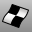 [ApplySurfaceMapping](texturemapping.html#applysurfacemapping) 
Add a surface texture mapping channel to an object.
ApplyWatermark
Embed invisible watermarks in Rhino models.
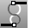 [ArcBlend](arcblend.html) 
Create an arc blend curve between two curves.
 [Area](area.html) 
Report an object's area.
 [AreaCentroid](areacentroid.html) 
Report and marks an object's area centroid.
 [AreaMoments](areamoments.html) 
Report an object's area moments of inertia.
 [Array](array.html) 
Copy and space objects in columns, rows, and levels.
 [ArrayCrv](arraycrv.html) 
Copy and space objects along a curve.
 [ArrayCrvOnSrf](arraycrvonsrf.html) 
Copy and space objects along a curve on a surface.
 [ArrayHole](arrayhole.html) 
Copy and space holes in rows and columns.
 [ArrayHolePolar](arrayholepolar.html) 
Copy and space holes around a central location.
 [ArrayLinear](arraylinear.html) 
Copy and space objects in a single direction.
 [ArrayPolar](arraypolar.html) 
Copy and space objects around a central location.
 [ArraySrf](arraysrf.html) 
Copy and space objects in rows and columns on a surface.
 [Arrowhead](arrowhead.html) 
Create or remove an arrowhead on a curve.
 [AssignBlankTexture](assignblanktexture.html) 
Assign texture names to objects.
 [AttachGHSData](attachghsdata.html) 
Add GHS-specific information to objects.
 [Autosave](autosave.html) 
Save the current model to a backup file.

## B
 [Bake](bake.html) 
Combine an object's textures and decals into a single bitmap file and assign that bitmap as object's texture.
 [Bend](bend.html) 
Deform objects along an arc.
Blend
Connect two curves maintaining continuity.
 [BlendCrv](blendcrv.html) 
Connect two curves with continuity control.
 [BlendEdge](blendedge.html) 
Create a surface between polysurface edges maintaining continuity.
 [BlendSrf](blendsrf.html) 
Create a blend surface between two surfaces with continuity control.
 [Block](block.html) 
Define a block object.
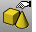 [BlockEdit](blockedit.html) 
Allow selecting a block instance to change the block geometry and update the block definition.
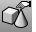 [BlockManager](blockmanager.html) 
Manage the block definitions.
 [Boolean2Objects](boolean2objects.html) 
Cycle through possible Boolean operations between two objects.
 [BooleanDifference](booleandifference.html) 
Subtract the volume of one set of objects from another.
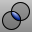 [BooleanIntersection](booleanintersection.html) 
Create a new solid from solids' intersected volumes.
 [BooleanSplit](booleansplit.html) 
Split and close solids at intersections.
 [BooleanUnion](booleanunion.html) 
Combine the volumes of one or more objects.
 [Boss](boss.html) 
Extrude closed planar curves normal to the curve plane toward a boundary surface where the boundary surface is trimmed and joined to the extruded objects.
 [Bounce](bounce.html) 
Shoot a ray at a collection of surfaces to create a polyline path.
 [BoundingBox](boundingbox.html) 
Creates a polyline or solid that encloses objects.
 [Box](box.html) 
Draws a solid box.
 [BoxEdit](boxedit.html) 
Size, scale, position, and rotate objects numerically.
 [BringForward](draworder.html#bringforward) 
Bring curves forward in draw order.
 [BringToFront](draworder.html#bringtofront) 
Bring curves to the front in draw order.
 [BringViewportToTop](viewport-arrangement.html#bringviewporttotop) 
Bring a viewport to the front.

## C
 [Cage](cage.html) 
Create a control cage object used by the [CageEdit](cageedit.html) command to deform other objects.
 [CageEdit](cageedit.html) 
Deform objects smoothly using control cage objects.
 [Calc](calc.html) 
Toggle the on-screen calculator.
 [CalcRPN](calc.html#calcrpn) 
Toggle the on-screen RPN (reverse Polish notation) calculator.
 [Camera](camera.html) 
Show, hide, or toggle the visibility of the viewport camera.
 [Cancel](cancel.html) 
Cancel the current command and deselects objects.
 [Cap](cap.html) 
Fill planar openings with a surface joined to the hole edge.
 [Catenary](catenary.html) 
Creates a curve that a hanging chain or cable assumes under its own weight when supported only at its ends.
 [Chamfer](chamfer.html) 
Create a line segment between two curves and trims or extends the curves to meet it.
 [ChamferEdge](chamferedge.html) 
Create a ruled surface at polysurface edges.
 [ChamferSrf](chamfersrf.html) 
Create a ruled surface between two surface edges.
 [ChangeDegree](changedegree.html) 
Change the degree of the polynomial that defines the curve or surface by adding or subtracting control points between knot spans, while maintaining the knot structure.
 [ChangeLayer](layer.html#changelayer) 
Change an object's layer.
 [ChangeSpace](changespace.html) 
Change the "space" of object from layout to detail and vise versa.
 [ChangeToCurrentLayer](layer.html#changetocurrentlayer) 
Change an object's layer to the current layer.
 [Check](check.html) 
Report errors in an object's data structure.
 [CheckInLicense](licenses.html#checkinlicense) 
Check in a license to the Zoo license manager.
 [CheckNewObjects](check.html#checknewobjects) 
Report errors in an object's data structure as it is created or imported.
 [CheckOutLicense](licenses.html#checkoutlicense) 
Check out a license from the Zoo license manager.
 [Circle](circle.html) 
Draw a circle from center and radius, diameter, points on the circumference, and circumference length.
 [ClearAllMeshes](clearallmeshes.html) 
Delete render and analysis meshes.
 [ClearDrawOrder](draworder.html#cleardraworder) 
Return curve draw order to the default.
 [ClearUndo](clearundo.html) 
Clear the undo buffer to free memory.
 [ClippingPlane](clippingplane.html) 
Create a plane that hides objects.
 [CloseCrv](closecrv.html) 
Close open curves.
 [CloseRenderWindow](render.html#closerenderwindow) 
Close the render display window.
 [ClosestPt](closestpt.html) 
Create a point object on an object at the nearest location to a base location or to another object.
 [CloseViewport](new-viewport-arrangements.html#closeviewport) 
Close the active viewport.
 [CollapseMeshEdge](collapsemeshedge.html) 
Move mesh edge [vertices](meshvertex.html) to a single vertex.
 [CollapseMeshFace](collapsemeshface-commands.html) 
Move all mesh face [vertices](meshvertex.html) to a single vertex.
 [CollapseMeshFacesByArea](collapsemeshface-commands.html#collapsemeshfacesbyarea) 
Move all mesh face [vertices](meshvertex.html) to a single vertex based on face area.
 [CollapseMeshFacesByAspectRatio](collapsemeshface-commands.html#collapsemeshfacesbyaspectratio) 
Move all mesh face [vertices](meshvertex.html) to a single vertex based on face aspect ratio.
 [CollapseMeshFacesByEdgeLength](collapsemeshface-commands.html#collapsemeshfacesbyedgelength) 
Move all [mesh face vertices](meshvertex.html) to a single vertex based on face edge length.
 [CollapseMeshVertex](collapsemeshvertex.html) 
Move a [mesh vertex](meshvertex.html) to an adjacent mesh vertex.
 [CommandHelp](help.html#commandhelp) 
Open the docking context Command Help window.
 [CommandHistory](commandhistory.html) 
Open the Command History window.
 [CommandList](commandlist.html) 
Open the Command List window.
 [CommandPrompt](commandprompt.html) 
Manage the display of the command prompt window.
 [Commands](commands.html) 
Display the Command List Help topic.
 [ComputeVertexColors](computevertexcolors.html) 
Evaluate texture coordinates and set [vertex](meshvertex.html) colors.
 [Cone](cone.html) 
Draw a cone.
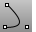 [Conic](conic.html) 
Draw a conic section curve with options for the start, end, apex, and rho value.
 [Connect](connect.html) 
Extend and trim curves to meet at their endpoints.
 [ConnectSrf](connectsrf.html) 
Extend surface edges to meet and trims the surfaces to each other.
 [ContentFilter](contentfilter.html) 
Open the Content Filter dialog box.
 [ContinueCurve](continuecurve.html) 
Continue to draw the selected curve using control points.
 [ContinueInterpCrv](continuecurve.html#continueinterpcrv) 
Continue to draw the selected curve interpolating through picked points.
 [Contour](contour.html) 
Create a spaced series of planar curves and points through objects.
 [Convert](convert.html) 
Change a curve to polyline or arc segments.
 [ConvertDots](dot.html#convertdots) 
Convert [Dot](dot.html) objects to either [points](point.html) or [text](text.html).
 [ConvertExtrusion](convertextrusion.html) 
Convert extrusion objects to surfaces and polysurfaces.
 [ConvertToBeziers](convert.html#converttobeziers) 
Change the structure of a NURBS object to a Bézier object.
 [Copy](copy.html) 
Duplicate objects.
 [CopyCPlaneSettingsToAll](cplane.html#copycplanesettingstoall) 
Match all viewports' grid and snap settings to the specified viewport.
 [CopyCPlaneToAll](cplane.html#copycplanetoall) 
Match all viewports' construction planes to the specified viewport.
 [CopyDetailToViewport](detail.html#copydetailtoviewport) 
Copy a detail viewport to a model viewport.
 [CopyLayout](layout.html#copylayout) 
Copy the active layout to a new layout.
 [CopyRenderWindowToClipboard](render.html#copyrenderwindowtoclipboard) 
Copy the image in the render window to the Clipboard.
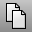 [CopyToClipboard](copytoclipboard.html) 
Copy objects to the Clipboard.
 [CopyToLayer](layer.html#copytolayer) 
Copy objects to a layer.
 [CopyViewportToDetail](detail.html#copydetailtoviewport) 
Copy or move a model viewport to a detail viewport.
 [CPlane](cplane.html) 
Set the construction plane in the active viewport.
 [CreaseSplitting](creasesplitting.html) 
Control whether surface creation commands divide creased surfaces into polysurfaces.
 [CreateRegions](createregions.html) 
Replace a non-manifold polysurface with all solid manifold regions defined by the surfaces of the input.
 [CreateSolid](createsolid.html) 
Create a closed polysurface from surfaces.
 [CreateUVCrv](createuvcrv.html) 
Project a surface boundary and trim curves onto the world xy plane.
 [Crv2View](crv2view.html) 
Create a curve by averaging two input curves that are planar in two different views.
 [CrvDeviation](crvdeviation.html) 
Report the maximum and minimum distances between two curves.
 [CrvEnd](crvstart.html#crvend) 
Place a point object at the end of a curve.
 [CrvSeam](crvseam.html) 
Change the seam (start/end) location on closed curves.
 [CrvStart](crvstart.html) 
Place a point object at the start of a curve.
 [CSec](csec.html) 
Create cross-section curves through profile curves.
 [CullControlPolygon](cullcontrolpolygon.html) 
Toggle the display of control points that are behind the surface.
 [CullDegenerateMeshFaces](culldegeneratemeshfaces.html) 
Delete zero-area mesh faces.
 [Curvature](curvature.html) 
Evaluate the curvature of a curve or surface.
 [CurvatureAnalysis](curvatureanalysis.html) 
Evaluate surface curvature using false-color analysis.
 [CurvatureAnalysisOff](curvatureanalysis.html#curvatureanalysisoff) 
Turn off curvature analysis display.
 [CurvatureGraph](curvaturegraph.html) 
Evaluate curve or surface curvature with a graph.
 [CurvatureGraphOff](curvaturegraph.html#curvaturegraphoff) 
Turn off curvature graph display.
 [Curve](curve.html) 
Draw a curve from [control point](controlpoint.html) locations.
 [CurveBoolean](curveboolean.html) 
Trim, split, and join curves based on their overlapping regions.
 [CurveThroughPolyline](curvethroughpolyline.html) 
Create a curve from polyline vertices.
 [CurveThroughPt](curvethroughpt.html) 
Fit a curve through point objects.
 [CurveThroughSrfControlPt](curvethroughsrfcontrolpt.html) 
Fit curves through surface control points.
 [Cut](cut.html) 
Delete objects and place them in the Clipboard.
 [CutPlane](cutplane.html) 
Create planar surfaces through objects at specified locations.
 [CutVolume](cutvolume.html) 
Report the volume of the intersection of a solid and a box.
 [Cylinder](cylinder.html) 
Draw a cylinder.

## D
 [Delete](delete.html) 
Erase objects.
 [DeleteHole](deletehole.html) 
Delete a hole from a polysurface and remake the surface.
 [DeleteMeshFaces](deletemeshfaces.html) 
Remove mesh faces from a mesh creating a hole.
 [DeleteMeshNgons](ngonulatemesh.html#deletemeshngons) 
Removes ngon groups from a mesh.
 [DeleteSubCrv](deletesubcrv.html) 
Remove a portion of a curve that is between two locations.
 [Detail](detail.html#detail) 
Manage layout detail viewports.
 [Diameter](diameter.html) 
Report the diameter of a curve at a specified point.
 [DigBeep](digitize.html#digbeep) 
Turn the digitizing arm sound on and off.
 [DigCalibrate](digitize.html#digcalibrate) 
Validate digitizer measurements against a model.
 [DigCamera](digitize.html#digcamera) 
Set the view based on the probe position and direction.
 [DigClick](digitize.html#digclick) 
Pick a location with a digitizing arm.
 [DigDisconnect](digitize.html#digdisconnect) 
Disconnect the digitizing arm.
 [Digitize](digitize.html) 
Connect and initialize a digitizing arm.
 [DigLine](digitize.html#digline) 
Draw a line normal to a surface with a digitizing arm.
 [DigPause](digitize.html#digpause) 
Suspend/pause input from the digitizing arm.
 [DigScale](digitize.html#digscale) 
Set a scale factor for digitized points.
 [DigSection](digitize.html#digsection) 
Create planar cross sections with a digitizing arm.
 [DigSketch](digitize.html#digsketch) 
Sketch a curve with a digitizing arm.
 [Dim](dim.html) 
Draw horizontal or vertical linear dimensions.
 [DimAligned](dimaligned.html) 
Draw a linear dimension lined up with two points.
 [DimAngle](dimangle.html) 
Dimension the angle between two lines.
 [DimArea](dimarea.html) 
Dimension the area of a closed curve, surface, mesh, or hatch.
 [DimCreaseAngle](dimcreaseangle.html) 
Dimension the angle between two planes.
 [DimCurveLength](dimcurvelength.html) 
Dimension the length of a curve.
 [DimDiameter](dimdiameter.html) 
Dimension the diameter of a curve.
 [DimOrdinate](dimordinate.html) 
Dimension the x or y&#160;distance from a base location.
 [DimRadius](dimradius.html) 
Dimension the radius of an arc or circle.
 [DimRecenterText](dimrecentertext.html) 
Return dimension text to its default location.
 [DimRotated](dimrotated.html) 
Draw a linear dimension that is rotated from the xy axis.
 [Dir](dir.html) 
Display and edit an object's normal direction.
 [DirectionalLight](directionallight.html) 
Insert a light with parallel rays pointing in a direction.
 [DisableClippingPlane](clippingplane.html#disableclippingplane) 
Turn off the selected clipping plane.
 [DisableOsnap](object-snaps.html#disableosnap) 
Manage persistent object snaps.
 [DisplayCommandPrompt](commandprompt.html#displaycommandprompt) 
Re-display the command prompt.
 [DisplayProperties](displayproperties.html) 
Open the Display panel.
 [Distance](distance.html) 
Report the distance between two picked locations.
 [Divide](divide.html) 
Create point objects along a curve by the number of equal length segments or segments of a specified length.
 [DivideAlongCreases](dividealongcreases.html) 
Divide a surface into separate parts at kinks.
 [DocumentProperties](documentproperties.html) 
Manage the settings for the current model.
 [DocumentPropertiesPage](documentpropertiespage.html) 
Open the Document Properties dialog box at the specified page.
 [DollyZoom](dollyzoom.html) 
Move the camera location and change the lens length at the same time.
 [Domain](domain.html) 
Report the domain of a curve or surface.
 [Dot](dot.html) 
Draw an annotation dot that stays parallel to and sizes with the view.
 [DraftAngleAnalysis](draftangleanalysis.html) 
Visually evaluate surface draft-angle using false-color analysis.
 [DraftAngleAnalysisOff](draftangleanalysis.html#draftangleanalysisoff) 
Turn off draft angle analysis.
 [DraftAnglePoint](draftanglepoint.html) 
Place a point object on a surface the surface's draft angle break location.
 [DragMode](dragmode.html) 
Specify the plane object dragging will be parallel to.
 [DragStrength](dragmode.html#dragstrength) 
Sets the amount of object drag as a percentage of mouse movement to control the speed of the drag movement.
 [Drape](drape.html) 
Create a surface through the intersections of objects and points projected toward the construction plane.
 [DrapePt](drapept.html) 
Create a grid of points at the intersections of objects and points projected toward the construction plane.
 [DupBorder](dupborder.html) 
Create a curve or polyline that copies a surface, polysurface, or mesh border.
 [DupDimStyle](dupdimstyle.html) 
Create new dimension styles by copying existing styles.
 [DupEdge](dupedge.html) 
Create a curve that copies a surface edge.
 [DupFaceBorder](dupfaceborder.html) 
Create a curve that copies a polysurface face border.
 [DupLayer](duplayer.html) 
Duplicate (copy) a layer including all layer attributes and geometry.
 [DupMeshEdge](dupmeshedge.html) 
Creates a polyline that duplicates the edge of a mesh.
 [DupMeshHoleBoundary](dupmeshholeboundary.html) 
Create a polyline that duplicates the boundary of a mesh hole.

## E
 [EarthAnchorPoint](earthanchorpoint.html) 
Add information about the model's position for GIS mapping applications.
 [Echo](rhinoscripting.html#echo) 
Turn on echoing of script commands to the command history window.
 [EdgeSrf](edgesrf.html) 
Create a surface from two, three, or four curves.
 [EditLightByLooking](editlightbylooking.html) 
Set a spotlight direction using view manipulation tools.
 [EditPtOn](pointson.html#editpton) 
Display points on the curve evaluated at [knot](knot.html) averages.
 [EditPythonScript](rhinoscripting.html#editpythonscript) 
Edit a Python script.
 [EditScript](rhinoscripting.html#editscript) 
Open a text editor utility for editing RhinoScript files.
 [EditText](edittext.html) 
Open an edit box in the viewport for changing text or annotation dot.
 [Ellipse](ellipse.html) 
Draw a closed elliptical curve from focus points, center and edges, bounding rectangle, and around a curve.
 [Ellipsoid](ellipsoid.html) 
Draw a solid ellipsoid.
 [EMap](emap.html) 
Visually evaluate surface smoothness using an image bitmap reflected in the surface.
 [EMapOff](emap.html#emapoff) 
Turn off environment map display.
 [EnableClippingPlane](clippingplane.html#enableclippingplane) 
Turn on selected clipping planes in the active viewport.
 [EndBulge](endbulge.html) 
Adjust the shape of a curve at its end or a surface near an untrimmed edge.
 [Enter](rhinoscripting.html#enter) 
Simulate the Enter key in a script.
 [EnterEnd](rhinoscripting.html#enterend) 
Simulate the Enter key to complete a command string in a script.
 [EnvironmentEditor](environmenteditor.html) 
Background color, image, projection.
 [EvaluatePt](evaluatept.html) 
Report the world and construction plane coordinates of a picked location.
 [EvaluateUVPt](evaluateuvpt.html) 
Report the u and v&#160;coordinates of a specified location on a surface.
 [Exit](rhinoscripting.html#exit) 
Close Rhino.
 [Explode](explode.html) 
Break objects down into components.
 [ExplodeBlock](explode.html#explodeblock) 
Explode a block including any nested blocks into component objects.
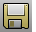 [Export](export.html) 
Save selected objects to a new file.
 [ExportBitmaps](exportbitmaps.html) 
Create files from bitmaps in the model.
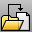 [ExportWithOrigin](export.html#exportwithorigin) 
Save objects to a new file with a specified origin and construction plane.
 [Extend](extend.html) 
Lengthen a curve.
 [ExtendCrvOnSrf](extendcrvonsrf.html) 
Lengthen a curve on a surface to the surface edges.
 [ExtendSrf](extendsrf.html) 
Lengthen a surface by a value.
 [ExtractAnalysisMesh](extractanalysismesh.html) 
Duplicate an object's [analysis](curvatureanalysis.html) mesh.
 [ExtractBadSrf](extractbadsrf.html) 
Separate surfaces with errors from a polysurface.
 [ExtractConnectedMeshFaces](extractmeshfaces-commands.html#extractconnectedmeshfaces) 
Separate mesh faces connected to a face.
 [ExtractControlPolygon](extractcontrolpolygon.html) 
Fit a polyline through curve control points or a mesh through surface control points.
 [ExtractCurvatureGraph](extractcurvaturegraph.html) 
Duplicate a curve's [curvature graph](curvaturegraph.html).
 [ExtractDuplicateMeshFaces](extractmeshfaces-commands.html#extractduplicatemeshfaces) 
Separate duplicated faces from a mesh.
 [ExtractIsocurve](extractisocurve.html) 
Duplicate surface [isoparametric curves](isocurve.html).
 [ExtractMeshEdges](extractmeshedges.html) 
Separate faces from the parent mesh determined by a draft angle or weld status.
 [ExtractMeshFaces](extractmeshfaces-commands.html) 
Separate faces from a mesh.
 [ExtractMeshFacesByArea](extractmeshfaces-commands.html#extractmeshfacesbyarea) 
Separate faces from a mesh by area.
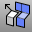 [ExtractMeshFacesByAspectRatio](extractmeshfaces-commands.html#extractmeshfacesbyaspectratio) 
Separate faces from a mesh by aspect ratio.
 [ExtractMeshFacesByDraftAngle](extractmeshfaces-commands.html#extractmeshfacesbydraftangle) 
Separate faces from a mesh by a draft angle or weld status.
 [ExtractMeshFacesByEdgeLength](extractmeshfaces-commands.html#extractmeshfacesbyedgelength) 
Separate faces from a mesh by edge length.
 [ExtractMeshPart](extractmeshfaces-commands.html#extractmeshpart) 
Separate faces from a mesh that are bounded by unwelded edges.
 [ExtractNonManifoldMeshEdges](extractmeshedges.html#extractnonmanifoldmeshedges) 
Separate non-manifold faces from a mesh.
 [ExtractPipedCurve](extractpipedcurve.html) 
Duplicate a curve's [piping](curvepiping.html) mesh.
 [ExtractPt](extractpt.html) 
Duplicate curve control or edit points, surface control points, and mesh vertices.
 [ExtractRenderMesh](extractrendermesh.html) 
Duplicate the [render](render.html) mesh.
 [ExtractSrf](extractsrf.html) 
Separate or duplicate a polysurface face.
 [ExtractSubCrv](extractsubcrv.html) 
Separate or duplicate polycurve segments.
 [ExtractUVMesh](texturemapping.html#extractuvmesh) 
Duplicate the uv mesh.
 [ExtractWireframe](extractwireframe.html) 
Duplicate surface or polysurface edge and [isoparametric curves](isocurve.html).
 [ExtrudeCrv](extrudecrv.html) 
Drive closed planar curves in a straight line.
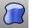 [ExtrudeCrvAlongCrv](extrudecrvalongcrv.html) 
Drive closed planar curves along a path curve.
 [ExtrudeCrvTapered](extrudecrvtapered.html) 
Drive closed planar curves in a straight line tapering at an angle.
 [ExtrudeCrvToPoint](extrudecrvtopoint.html) 
Drive closed planar curves tapering to a point.
 [ExtrudeSrf](extrudesrf.html) 
Drive surface edges in a straight line to create a solid.
 [ExtrudeSrfAlongCrv](extrudesrfalongcrv.html) 
Drive surface edges along a path curve to create a solid.
 [ExtrudeSrfTapered](extrudesrftapered.html) 
Drive surface edges in a straight line tapering at an angle to create a solid.
 [ExtrudeSrfToPoint](extrudesrftopoint.html) 
Drive surface edges tapering to a point to create a solid.

## F
 [Fair](fair.html) 
Remove large curvature variations in a curve while limiting the geometry changes to the specified tolerance.
 [Fillet](fillet.html) 
Add an arc between two curves and trims or extends the curves to the arc.
 [FilletCorners](filletcorners.html) 
Round polyline corners with arcs.
 [FilletEdge](filletedge.html) 
Create a tangent surface between polysurface edges.
 [FilletSrf](filletsrf.html) 
Create a constant-radius round surface between two surfaces.
 [FillMeshHole](fillmeshhole.html) 
Fill a hole in a mesh.
 [FillMeshHoles](fillmeshholes.html) 
Fill all holes in a mesh.
 [Fin](fin.html) 
Extrude a curve on a surface in the surface normal direction.
 [FindText](findtext.html) 
Search for specified text.
 [FitCrv](fitcrv.html) 
Make a non-rational NURBS curve of a specified degree that matches the input curve to within the specified tolerance.
 [FitSrf](fitsrf.html) 
Reduce the number of surface control points.
 [FixedLengthCrvEdit](fixedlengthcrvedit.html) 
Drag points on a curve to change its shape without changing the curve's length.
 [FlatShade](flatshade.html) 
Shade objects without smoothing between mesh faces.
 [FlattenSrf](flattensrf.html) 
Project surface edges onto the construction plane to create planar curves.
 [Flip](flip.html) 
Reverse the normal direction of a curve, surface, or mesh.
 [Flow](flow.html) 
Re-align objects from a base curve to a target curve.
 [FlowAlongSrf](flowalongsrf.html) 
Re-align objects from a source surface to a target surface.
 [FoldFace](foldface.html) 
Rotate polysurface faces around an axis.
 [Fullscreen](fullscreen.html) 
Hide menus, status bar, toolbars, command prompt, and windows title bar and maximize the Rhino window.

## G
 [GCon](gcon.html) 
Report the geometric continuity between two curves.
 [GetDocumentUserText](rhinoscripting.html#getdocumentusertext) 
Retrieve text information attached to a file with the [SetDocumentUserText](rhinoscripting.html#setdocumentusertext) command.
 [GetUserText](rhinoscripting.html#getusertext) 
Retrieve text information attached to an object using the [SetUserText](rhinoscripting.html#setusertext) command.
 [Grid](grid.html) 
Set grid properties.
 [GroundPlane](groundplane.html) 
Open the GroundPlane panel.
 [Group](group.html) 
Organize objects into a single component.
 [Gumball](gumball.html) 
Displays the gumball widget on a selected object facilitating move, scale, and rotate transformations around the gumball origin.
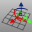 [GumballAlignment](gumball.html#gumballalignment) 
Resets the gumball widget alignment.
 [GumballAutoReset](gumball.html#gumballautoreset) 
Resets the gumball widget alignment.
 [GumballDragStrength](dragmode.html#dragstrength) 
Sets the amount of the gumball drag as a percentage of mouse movement to control the speed of the gumball movement.
 [GumballScaleMode](gumball.html#gumballscalemode) 
Sets the size of the scale handles either relative to the model or to a fixed size.

## H
 [HandleCurve](handlecurve.html) 
Draw chained [Bézier curves](http://en.wikipedia.org/wiki/Bézier_curve) with editing handles.
 [Hatch](hatch.html) 
Create a pattern of lines to fill bounding curves.
 [HatchBase](hatch.html#hatchbase) 
Set a starting point for existing hatches.
 [HatchScale](hatch.html#hatchscale) 
Scale hatch patterns in model and layout space.
 [HBar](hbar.html) 
Edit a curve or surface with Bézier curve editing handles.
 [Heightfield](heightfield.html) 
Create a surface based on gray-scale color values in an image file.
 [Helix](helix.html) 
Draw a helical curve with options for number of turns, pitch, vertical, reverse, and around a curve.
 [Help](help.html) 
Open the Help topic for the current command.
 [Hide](hide.html) 
Conceal objects from view.
 [HideInDetail](detail.html#hideindetail) 
Conceal objects in a detail view.
 [HideLayersInDetail](detail.html#hidelayersindetail) 
Conceal layers in a detail view.
 [HidePt](hide.html#hidept) 
Conceal control and edit points.
 [HideRenderMesh](showrendermesh.html#hiderendermesh) 
Hide the render mesh displayed with the [ShowRenderMesh](showrendermesh.html) command.
 [HideSwap](hide.html#hideswap) 
Conceal all visible objects and re-displays all previously hidden objects.
 [History](history.html) 
Store the connection between a command's input geometry and the result, so that when the input geometry changes, the result updates accordingly.
 [HistoryPurge](history.html#historypurge) 
Remove history from an object and its children.
 [HistoryUpdate](history.html#historyupdate) 
Redefine selected objects when parents are changed.
 [Hydrostatics](hydrostatics.html) 
Report hydrostatic values for surfaces and polysurfaces.
 [Hyperbola](hyperbola.html) 
Draw a hyperbolic curve from focus points, vertices, or coefficient.
 [Hyperlink](hyperlink.html) 
Manage URL addresses attached to an object.

## I
 [IGESStudy](iges-iges-import-export.html#igesstudy) 
Examine specific entities in an IGES file by limiting which portions of the IGES folder are parsed.
 [Import](import.html) 
Merge objects from another model file.
 [ImportDimStyles](dimensions-style.html#importdimstyles) 
Import dimension styles into the current document.
 [ImportLayout](layout.html#importlayout) 
Import a print layout viewport from another file.
 [IncrementalSave](save.html#incrementalsave) 
Save sequentially-numbered versions of a model.
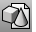 [Insert](insert.html) 
Insert block objects stored in the file or import a file as a block definition.
 [InsertControlPoint](insertcontrolpoint.html) 
Add control points to a curve or a row of control points to a surface.
 [InsertEditPoint](inserteditpoint.html) 
Add edit points to a curve.
 [InsertKink](insertkink.html) 
Add kinks to a curve.
 [InsertKnot](insertknot.html) 
Add knots to curves or surfaces.
 [InsertLineIntoCrv](insertlineintocrv.html) 
Flatten the curve segment between picked points.
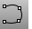 [InterpCrv](interpcrv.html) 
Fit a curve through picked locations.
 [InterpCrvOnSrf](interpcrvonsrf.html) 
Fit a curve through locations on a surface.
 [Intersect](intersect.html) 
Create point objects or curves at the intersections of curves and surfaces.
 [IntersectTwoSets](intersecttwosets.html) 
Find the intersection of one set of objects with another set of objects.
 [Invert](selection-commands.html#invert) 
Deselect all selected objects and select all previously unselected objects.
 [InvertPt](selection-commands.html#invertpt) 
Deselect all selected control or edit points and select all previously unselected control or edit points.
 [Isometric](isometric.html) 
Change the current viewport properties to a parallel projection isometric view looking from a specified quadrant toward 0.
 [Isolate](hide.html#isolate) 
Hide all but the currently selected objects.
 [IsolateLock](lock.html#isolatelock) 
Lock all but the currently selected objects.

## JK
 [Join](join.html) 
Connect curves, surface edges, or surfaces to form a single object.
 [JoinEdge](joinedge.html) 
Join two naked edges that are out of tolerance.

## L
 [Lasso](selection-commands.html#lasso) 
Select objects by drawing a freehand shape.
 [Layer](layer.html) 
Manage layer properties.
 [LayerStateManager](layerstatemanager.html) 
Save and restore the current layer state.
 [Layout](layout.html) 
Create a print layout viewport.
 [LayoutProperties](layout.html#layoutproperties) 
Manage layout viewport properties.
 [Leader](leader.html) 
Draw an annotation leader with attached text.
 [Length](length.html) 
Report the length of curves or surface edges.
 [Libraries](libraries.html#libraries) 
Open the Libraries panel.
 [Lights](lights.html) 
Open the Lights panel.
 [LimitReferenceModel](worksession.html#limitreferencemodel) 
Limit the amount of reference geometry that is available to work on.
 [Line](line.html) 
Draw a single line segment.
 [LinearLight](linearlight.html) 
Insert a tubular light.
 [Lines](lines.html) 
Draw multiple adjoining line segments.
 [LineThroughPt](linethroughpt.html) 
Fit a line through any combination of points, control points, and point-cloud objects.
 [LinetypeDisplay](linetypes.html#linetypedisplay) 
Display curves using their [linetype properties.](linetypes.html) 
 [List](list.html) 
Report information about object's data structure.
 [LoadScript](rhinoscripting.html#loadscript) 
Load a RhinoScript.
 [Lock](lock.html) 
Lock objects so they cannot be selected for editing.
 [LockSwap](lock.html#lockswap) 
Lock all unlocked objects and unlock all previously locked objects.
 [Loft](loft.html) 
Fit a surface through profile curves that define the surface shape.

## M
 [MacroEditor](rhinoscripting.html#macroeditor) 
Open an edit window for script creation and testing.
 [Maelstrom](maelstrom.html) 
Deform objects in a spiral.
 [Make2D](make2d.html) 
Project geometry to the construction plane.
 [MakeHole](makehole.html) 
Project a closed curve to a surface to define a hole.
 [MakeNonPeriodic](makeperiodic.html#makenonperiodic) 
Insert a kink at the start/end of a curve or surface.
 [MakePeriodic](makeperiodic.html) 
Remove the kink from the start/end of a curve or surface.
 [MakeUniform](makeuniform.html) 
Make the object knot vectors uniform without changing the control point locations.
 [MakeUniformUV](makeuniform.html#makeuniformuv) 
Make the surface knots uniform in u or v&#160;direction.
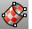 [MappingWidget](texturemapping.html#mappingwidget) 
Turn on texture mapping widgets.
 [MappingWidgetOff](texturemapping.html#mappingwidgetoff) 
Turn off texture mapping widgets.
 [MarkFoci](markfoci.html) 
Place point objects at focus locations of conic curves.
 [Match](match.html) 
Change a curve end to meet another curve or surface edge with a specified continuity.
 [MatchCrvDir](matchcrvdir.html) 
Change a curve's direction to match another curve's direction.
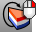 [MatchLayer](matchlayer.html) 
Change an object's layer to match another object.
 [MatchMapping](texturemapping.html#matchmapping) 
Change an object's texture mapping properties to match another object.
 [MatchMeshEdge](matchmeshedge.html) 
Move naked mesh face edges to meet adjacent face edges.
 [MatchProperties](matchproperties.html) 
Change an object's properties to match another object.
 [MatchSrf](matchsrf.html) 
Adjust a surface edge to have continuity with another surface edge.
 [MaterialEditor](materialeditor.html) 
Open the Material Editor to manage materials in the model.
 [Maximize](sizeapplicationwindow-commands.html#maximize) 
Maximize the Rhino application window.
 [MaxViewport](maxviewport.html) 
Maximize the active viewport.
 [Merge2MeshFaces](merge2meshfaces.html) 
Merge two triangular mesh faces into one quadrangular face.
 [MergeAllEdges](mergealledges.html) 
Merge all possible edges of a surface or polysurface.
 [MergeEdge](mergeedge.html) 
Combine adjacent edges of the same surface.
 [MergeFace](mergeface.html) 
Combine co-planar polysurface faces.
 [MergeFace](mergeface.html) 
Combine co-planar polysurface faces.
 [MergeSrf](mergesrf.html) 
Combine two surfaces at untrimmed edges.
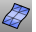 [Mesh](mesh.html) 
Create a mesh from a NURBS surface or polysurface.
 [MeshBooleanDifference](meshbooleandifference.html) 
Subtract the volume of one set of objects from another resulting in a mesh.
 [MeshBooleanIntersection](meshbooleanintersection.html) 
Create a new mesh from the intersected volumes of objects.
 [MeshBooleanSplit](meshbooleansplit.html) 
Split and close objects at intersections.
 [MeshBooleanUnion](meshbooleanunion.html) 
Combine the volumes of objects into a single mesh.
 [MeshBox](meshbox.html) 
Draw a mesh box.
 [MeshCone](meshcone.html) 
Draw a mesh cone.
 [MeshCylinder](meshcylinder.html) 
Draw a mesh cylinder.
 [MeshEllipsoid](meshellipsoid.html) 
Draw a mesh ellipsoid.
 [MeshFromLines](meshfromlines.html) 
Construct a mesh from lines.
 [MeshIntersect](meshintersect.html) 
Create a polyline at the intersection of mesh objects.
 [MeshOutline](meshoutline.html) 
Create a polyline outline of mesh objects or surface render mesh.
 [MeshPatch](meshpatch.html) 
Create a mesh from curves and points.
 [MeshPlane](meshplane.html) 
Draw a rectangular mesh plane.
 [MeshPolyline](meshpolyline.html) 
Create a mesh from a closed polyline.
 [MeshRepair](meshrepair.html) 
Open the Mesh Repair wizard.
 [MeshSphere](meshsphere.html) 
Draw a mesh sphere.
 [MeshSplit](meshsplit.html) 
Divide meshes into parts with another object.
 [MeshToNURB](meshtonurb.html) 
Duplicate each mesh face with a NURBS surface.
 [MeshTorus](meshtorus.html) 
Draw a mesh torus.
 [MeshTruncatedCone](meshtruncatedcone.html) 
Draw a mesh truncated cone.
 [MeshTrim](meshtrim.html) 
Delete portions of a mesh inside or outside intersections with another object.
 [Minimize](sizeapplicationwindow-commands.html#minimize) 
Minimize the Rhino application window.
 [Mirror](mirror.html) 
Create a mirror-image copy of objects.
 [MirrorHole](mirrorhole.html) 
Create a mirror image copy of one or more holes in a single planar surface.
 [ModelBasepoint](modelbasepoint.html) 
Set a world origin that is used when inserting the model into another.
 [ModifyRadius](modifyradius.html) 
Change the radius of existing arcs and circles.
 [Move](move.html) 
Move objects from one location to another.
 [MoveCrv](movecrv.html) 
Move a polycurve/polyline segment.
 [MoveEdge](moveedge.html) 
Move a polysurface edge.
 [MoveFace](moveface.html) 
Move a polysurface face.
 [MoveHole](movehole.html) 
Move or copy a hole in a planar surface.
 [MoveTargetToObjects](movetargettoobjects.html) 
Move the target to the center of selected objects.
 [MoveUntrimmedEdge](moveuntrimmededge.html) 
Move the edge of an untrimmed polysurface face.
 [MoveUntrimmedFace](moveuntrimmedface.html) 
Move an untrimmed polysurface face.
 [MoveUVN](moveuvn.html) 
Move curve or surface control points along the u, v, and normal directions of the object.
 [MPlane](mplane.html) 
Set up a relationship between a construction plane and an object.

## N
 [NamedCPlane](namedcplane.html) 
Manage the named construction planes list.
 [NamedPosition](namedposition.html) 
Save and restore the location of objects.
 [NamedView](namedview.html) 
Manage the named views.
 [NetworkSrf](networksrf.html) 
Fit a surface through a network of crossing curves.
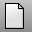 [New](new.html) 
Create a new model based on a template.
 [NewFloatingViewport](new-viewport-arrangements.html#newfloatingviewport) 
Create a new free-floating viewport.
 [NewViewport](new-viewport-arrangements.html#newviewport) 
Create a new viewport.
 [NextOrthoViewport](nextviewport.html#nextorthoviewport) 
Activate the next viewport with an orthogonal projection.
 [NextPerspectiveViewport](nextviewport.html#nextperspectiveviewport) 
Activate the next viewport with a perspective projection.
 [NextU](selection-commands.html#nextu) 
Select the control point in the positive u&#160;direction.
 [NextV](selection-commands.html#nextv) 
Select the control point in the positive v&#160;direction.
 [NextViewport](nextviewport.html) 
Activate the next viewport.
 [NextViewportToTop](viewport-arrangement.html#nextviewporttotop) 
Display the next viewport in front of all other viewports.
 [NgonulateMesh](ngonulatemesh.html) 
Creates ngons from regions of connected coplanar welded faces.
 [NoEcho](rhinoscripting.html#noecho) 
Turn off echoing of script commands to the command history window.
 [NonmanifoldMerge](nonmanifoldmerge.html) 
Create a non-manifold polysurface from intersecting surfaces and polysurfaces.
 [Notes](notes.html) 
Open a text notes window.

## O
 [Offset](offset.html) 
Copy a curve parallel to the original.
 [OffsetCrvOnSrf](offsetcrvonsrf.html) 
Copy a curve on a surface parallel to the original.
 [OffsetMesh](offsetmesh.html) 
Copy a mesh parallel to the original.
 [OffsetMultiple](offsetmultiple.html) 
Copy curves or surface edges parallel to the original.
 [OffsetNormal](offsetnormal.html) 
Copy a curve on a surface parallel to the original in the surface normal direction.
 [OffsetSrf](offsetsrf.html) 
Copy a surface parallel to the original.
 [OneLayerOff](onelayeron.html#onelayeroff) 
Turn off an object's layer.
 [OneLayerOn](onelayeron.html) 
Turn a layer on and all other layers off.
 [Open](open.html) 
Open an existing model file.
 [Options](options.html) 
Manage global options: [3D mouse](3dconnexion.html), [alerter](alerter.html), [aliases](aliases.html), [appearance](appearance.html), [context menu](context-menu.html), [display modes](view-displaymode-options.html), [files](files.html), [general](general.html), [idle processor](idleprocessor.html), [keyboard](keyboard.html), [libraries](libraries.html), [licenses](licenses.html), [modeling aids](modeling-aids.html), [mouse](mouse.html), [plug-ins](plug-ins.html), [render](rendering.html), [RhinoScript](rhinoscript.html), [selection menu](selection-menu.html), [toolbars](toolbars.html), [updates and statistics](updates-and-statistics.html), [view](view.html).
 [OptionsExport](optionsexport.html) 
Save [Options](options.html) settings to a file.
 [OptionsImport](optionsexport.html#optionsimport) 
Restore [Options](options.html) settings from a file.
 [OptionsPage](optionspage.html) 
Open the Options dialog box at a specified page.
 [Orient](orient.html) 
Transform objects using two reference and two target points.
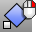 [Orient3Pt](orient3pt.html) 
Transform objects using three reference and three target points.
 [OrientCameraToSrf](orientcameratosrf.html) 
Align the view to a surface normal.
 [OrientCrvToEdge](orientcrvtoedge.html) 
Copy and align a curve to a surface edge.
 [OrientOnCrv](orientoncrv.html) 
Transform objects along a curve normal.
 [OrientOnSrf](orientonsrf.html) 
Transform objects normal to a surface.
 [Ortho](ortho.html) 
Restrict cursor movement to an angle.
 [OrthoAngle](ortho.html#orthoangle) 
Set the angle for cursor ortho movement.
 [Osnap](object-snaps.html#osnap) 
Set object snaps state.

## P
 [PackTextures](packtextures.html) 
Spread the texture over all of the faces of a polysurface.
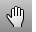 [Pan](pan.html) 
Shift the location of the view camera and target parallel to the view plane.
 [Parabola](parabola.html) 
Draw a parabolic curve from focus and vertex or endpoint.
 [Paraboloid](paraboloid.html) 
Draw a parabolic surface or capped solid.
 [Paste](paste.html) 
Insert objects from the Clipboard.
 [Patch](patch.html) 
Fit a surface through curves and point objects.
 [PatchSingleFace](patchsingleface.html) 
Fill a mesh hole with a single mesh face.
 [Pause](rhinoscripting.html#pause) 
Stop a script for user input.
 [PerspectiveAngle](perspectiveangle.html) 
Set the viewport field-of-view angle.
 [PerspectiveMatch](perspectivematch.html) 
Allow matching the view to the Wallpaper image.
 [Picture](picture.html) 
Draw a rectangular planar surface with a bitmap texture.
 [Pipe](pipe.html) 
Create a [surface](rhinoobjects.html#surfaces), [polysurface](rhinoobjects.html#polysurfaces), or [extrusion](rhinoobjects.html#lightweightextrusions) object with a circular profile around a curve.
 [PlaceHole](placehole.html) 
Project a closed curve to a surface to define a hole.
 [Plan](setview.html#plan) 
Set the viewport to a parallel plan view.
 [Planar](planar.html) 
Limit picking locations to an elevation.
 [PlanarMesh](planarmesh.html) 
Create a planar mesh from closed curves.
 [PlanarSrf](planarsrf.html) 
Create a planar surface from planar curves.
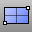 [Plane](plane.html) 
Draw a rectangular planar surface.
 [PlaneThroughPt](planethroughpt.html) 
Fit a rectangular planar surface through points.
 [PlayAnimation](animation.html#playanimation) 
Play back an animation or animation preview.
 [Point](point.html) 
Draw a single point object.
 [PointCloud](pointcloud.html) 
Create a set of vertices from point objects.
 [PointCloudSection](pointcloudsection.html) 
Create a planar curve by intersecting a plane with a point cloud.
 [PointDeviation](pointdeviation.html) 
Report the distance between points and a surface.
 [PointGrid](pointgrid.html) 
Draw a rectangular grid of point objects.
 [PointLight](pointlight.html) 
Insert an omni-directional light.
 [Points](points.html) 
Draw multiple point objects.
 [PointsFromUV](pointsfromuv.html) 
Create point objects at specified surface u and v&#160;coordinates.
 [PointsOff](pointson.html#pointsoff) 
Turn off [control](pointson.html), [edit](pointson.html#editpton), and [solid](pointson.html#solidpton) points display.
 [PointsOn](pointson.html) 
Display curve and surface control points.
 [Polygon](polygon.html) 
Draw a polygon with a specified number of sides with options for inscribed/circumscribed, by edge, star-shaped, around a curve, and vertical.
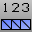 [PolygonCount](polygoncount.html) 
Report the number of mesh polygons in a selected object.
 [Polyline](polyline.html) 
Draw a multi-segment polyline with options for line and arc segments, tracking line helpers, and close.
 [PolylineOnMesh](polyline.html#polylineonmesh) 
Draw a multi-segment polyline on a mesh.
 [PopupMenu](popuppopular.html) 
Display a menu with favorites and most-recently-used commands.
 [PopupPopular](popuppopular.html) 
Display a menu with the most-used commands.
 [PopupToolbar](popuptoolbar.html) 
Open the specified toolbar at the cursor.
 [PrevU](selection-commands.html#prevu) 
Select the control point in the negative u&#160;direction.
 [PrevV](selection-commands.html#prevv) 
Select the control point in the negative v&#160;direction.
 [PrevViewport](nextviewport.html#prevviewport) 
Activate the previous viewport.
 [Print](print.html) 
Print the current viewport or layouts.
 [PrintDisplay](printdisplay.html) 
Display objects using their Print Color and Print Width properties.
 [Project](project.html) 
Project curves/points toward a construction plane to intersect a surface.
 [ProjectOsnap](object-snaps.html#projectosnap) 
Project object snaps to the construction plane.
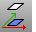 [ProjectToCPlane](projecttocplane.html) 
Flatten objects onto the construction plane.
 [Properties](properties.html) 
Object, material, texture mapping, decals.
 [PropertiesPage](propertiespage.html) 
Open the Properties dialog box at a specified page.
 [PtOffSelected](pointson.html#ptoffselected) 
Turn off control and edit points for selected objects.
 [Pull](pull.html) 
Pull curves/points in the surface normal direction to intersect a surface.
 [Purge](purge.html) 
Delete unused block definitions, groups, layers, hatch patterns, linetypes, dimension styles, and materials.
 [PurgeRefObjects](worksession.html#purgerefobjects) 
Delete worksession reference objects.
 [PushViewportToBack](viewport-arrangement.html#pushviewporttoback) 
Send a named viewport behind all viewports.
 [Pyramid](pyramid.html) 
Draw a pyramid.

## Q
 [QuadrangulateMesh](quadrangulatemesh.html) 
Merge mesh triangles into quadrangles.

## R
 [Radius](radius.html) 
Report the radius of a curve.
 [RailRevolve](railrevolve.html) 
Revolve a profile curve around an axis and along a rail curve.
 [ReadCommandFile](rhinoscripting.html#readcommandfile) 
Read and execute a command script from a text file.
 [ReadEveryIGESEntity](iges-iges-import-export.html#readeveryigesentity) 
Import all IGES entities.
 [ReadViewportsFromFile](new-viewport-arrangements.html#readviewportsfromfile) 
Set the viewport layout to match that of another model.
 [Rebuild](rebuild.html) 
Reconstruct curves, surfaces, and extrusion objects to a specified degree and control point number.
 [RebuildCrvNonUniform](rebuildcrvnonuniform.html) 
Interactively modify selected curves by non-uniformly re-spacing the control points.
 [RebuildEdges](rebuildedges.html) 
Restore surface edges to their surface.
 [RebuildMesh](rebuildmesh.html) 
Strip texture coordinates, [vertex](meshvertex.html) colors, surface curvatures, and surface parameters from a mesh.
 [RebuildMeshNormals](rebuildmeshnormals.html) 
Remove mesh normals and reconstruct the face and [vertex](meshvertex.html) normals.
 [RebuildUV](rebuilduv.html) 
Reconstruct surfaces to a specified control point number in the u or v&#160;directions.
 [RecordAnimation](animation.html#recordanimation) 
Render and save animation frames.
 [Rectangle](rectangle.html) 
Draw a rectangular closed polyline from with options for starting at the center, three points, vertical, and rounded with arc or conic corners.
 [RectangularLight](rectangularlight.html) 
Insert a rectangular directional light.
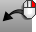 [Redo](undo.html#redo) 
Reverse the last Undo.
 [RedoMultiple](undo.html#redomultiple) 
Reverse the Undo command multiple times.
 [RedoView](undoview.html#redoview) 
Reverse the last UndoView.
 [ReduceMesh](reducemesh.html) 
Reduce the number of mesh polygons and triangulates quadrangles.
 [RefreshAllTextures](refreshalltextures.html) 
Re-read the texture from their files and refresh the display.
 [RefreshShade](refreshshade.html) 
Regenerate an object's render mesh.
 [ReleaseFromCage](cageedit.html#releasefromcage) 
Remove objects from a control cage.
 [GumballRelocate](gumball.html#gumballrelocate) 
Moves the [gumball](gumball.html) widget to a new location on an object.
 [RemapCPlane](remapcplane.html) 
Reorient objects to a different construction plane.
 [RememberCopyOptions](remembercopyoptions.html) 
Specify whether Copy option on transform commands is stored.
 [RemoveControlPoint](insertcontrolpoint.html#removecontrolpoint) 
Remove control points from a curve or surface.
 [RemoveEdge](trim.html#removeedge) 
Untrim selected surface edges.
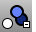 [RemoveFromGroup](group.html#removefromgroup) 
Detach objects from their parent group.
 [RemoveGuide](modeling-aids-smarttrack.html#removeguide) 
Remove temporary infinite guide / construction line.
 [RemoveKnot](insertknot.html#removeknot) 
Delete specified knots from a curve or surface.
 [RemoveMappingChannel](texturemapping.html#removemappingchannel) 
Remove mapping channels from an object.
 [RemoveMultiKnot](insertknot.html#removemultiknot) 
Remove multiple knots from curves and surfaces.
 [Render](render.html) 
Render the objects using the current renderer.
 [RenderInWindow](render.html#renderinwindow) 
Render a selected area in the render window at viewport resolution.
 [RenderOpenLastRendering](render.html#renderopenlastrendering) 
Open last rendering in render window.
 [RenderOpenRenderImage](render.html#renderopenrenderimage) 
Open an image with the .rimage format.
 [RenderPreview](render.html#renderpreview) 
Render the view in the render window with a with a rough quality for a fast preview.
 [RenderPreviewInWindow](render.html#renderpreviewinwindow) 
Render a selected area in the render window with a rough quality for a fast preview.
 [RenderPreviewWindow](render.html#renderpreviewwindow) 
Render a selected area in the viewport with a rough quality for a fast preview.
 [RenderReportMissingImageFiles](render.html#renderreportmissingimagefiles) 
Open the missing image files report.
 [RenderSettings](render.html#rendersettings) 
Open the [Render](rhino-render.html) panel.
 [RenderWindow](render.html#renderwindow) 
Render a selected area in the viewport at viewport resolution.
 [Reparameterize](reparameterize.html) 
Recalculate an object's parameter space to match its 3-D geometry.
 [Repeat](repeat.html) 
Repeat any command or script/macro.
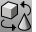 [ReplaceBlock](replaceblock.html) 
Replace block instances with a different block definition.
 [Rescue3dmFile](rescue3dmfile.html) 
Recover data from damaged files.
 [Restore](sizeapplicationwindow-commands.html#restore) 
Restore the application window from being maximized.
 [RevCloud](revcloud.html) 
Draw revision cloud curves.
 [Revert](revert.html) 
Discard changes and revert to the previously saved document.
 [Revolve](revolve.html) 
Create a surface by revolving a profile curve around an axis.
 [RevolvedHole](revolvedhole.html) 
Create holes by revolving a profile curve around an axis.
 [Rib](rib.html) 
Extrude a curve in two directions to a boundary surface.
 [Ribbon](ribbon.html) 
Offset a curve and create a ruled surface between the curves.
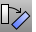 [Rotate](rotate.html) 
Rotate objects around an axis perpendicular to the construction plane.
 [Rotate3D](rotate3d.html) 
Rotate objects around a 3-D axis.
 [RotateCamera](rotatecamera.html) 
Rotate the view target around the camera.
 [RotateHole](rotatehole.html) 
Rotate a hole around an axis.
 [RotateView](rotateview.html) 
Rotate the view camera around the target.
 [RoundHole](roundhole.html) 
Create circular holes in surfaces.
 [RPC](rpc.html) 
Insert Rich Photorealistic Content (RPC) objects.
 [RPCSetAnimationFrame](rpc.html#rpcsetanimationframe) 
Set the animation frame number for an RPC at the command line.
 [RText](text.html#rtext) 
Create two-dimensional rich text. Rich text can be formatted on a word-by-word or letter-by-letter basis similar to a word processor.
 [Run](rhinoscripting.html#run) 
Run another application from inside Rhino.
 [RunPythonScript](rhinoscripting.html#runpythonscript) 
Run a Python script.
 [RunScript](rhinoscripting.html#runscript) 
Run a RhinoScript.

## S
 [SafeFrame](safeframe.html) 
Turns on the safe frame marks, which show the area of the viewport that will be rendered in the active viewport.
 [Save](save.html) 
Save the current model.
 [SaveAs](save.html#saveas) 
Save the current model with a different name, close the current model, and open the new model.
 [SaveAsTemplate](save.html#saveastemplate) 
Save the current model as a template file.
 [SaveRenderWindowAs](render.html#saverenderwindowas) 
Save the image in the render window to a file.
 [SaveSmall](save.html#savesmall) 
Save geometry objects without render or analysis meshes.
 [Scale](scale.html) 
Change the size of objects uniformly in the x, y, and z&#160;directions.
 [Scale1D](scale1d.html) 
Change the size of objects in one direction.
 [Scale2D](scale2d.html) 
Change the size of objects uniformly in two directions.
 [ScaleByPlane](scalebyplane.html) 
Change the size of objects in two directions non-uniformly.
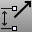 [ScaleDimstyle](dimensions-style.html#scaledimstyle) 
Scales all of the distances in a dimension scale at once.
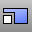 [ScaleNU](scalenu.html) 
Change the size of objects non-uniformly in three directions.
 [ScreenCaptureToClipboard](viewcapture.html#screencapturetoclipboard) 
Save an image of a viewport to the Clipboard including viewport edges, cursor image, and viewport menu.
 [ScreenCaptureToFile](viewcapture.html#screencapturetofile) 
Save an image of the viewport as a bitmap file including viewport edges, cursor image, and viewport menu.
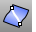 [Section](section.html) 
Create a planar curve or points from the intersection of a cutting plane through objects.
 [SelAll](selection-commands.html#selall) 
Select all objects.
 [SelBadObjects](selection-commands.html#selbadobjects) 
Select all objects that do not pass [Check](check.html).
 [SelBlockInstance](selection-commands.html#selblockinstance) 
Select all block instances.
 [SelBlockInstanceNamed](selection-commands.html#selblockinstancenamed) 
Select all block instances by name.
 [SelBoundary](selection-commands.html#selboundary) 
Select objects within an existing closed curve.
 [SelBox](selection-commands.html#selbox) 
Select objects inside, outside, or crossing a box-shaped volume.
 [SelBrush](selection-commands.html#selbrush) 
Drag the mouse like a brush stroke to select objects.
 [SelBrushPoints](selection-commands.html#selbrushpoints) 
Drag mouse like a brush stroke to select points and control points.
 [SelCaptives](selection-commands.html#selcaptives) 
Select captive objects of a specified cage controls.
 [SelChain](selection-commands.html#selchain) 
Select curve or surface edges that touch end-to-end.
 [SelChildren](selection-commands.html#selchildren) 
Select children of specified parents.
 [SelCircular](selection-commands.html#selcircular) 
Draw a circle to select objects.
 [SelClippingPlane](selection-commands.html#selclippingplane) 
Select all clipping planes.
 [SelClosedCrv](selection-commands.html#selclosedcrv) 
Select all closed curves.
 [SelClosedMesh](selection-commands.html#selclosedmesh) 
Select all closed mesh objects.
 [SelClosedPolysrf](selection-commands.html#selclosedpolysrf) 
Select all closed polysurfaces.
 [SelClosedSrf](selection-commands.html#selclosedsrf) 
Select all closed surfaces.
 [SelClosedSubD](subdfrommesh.html#selopensubd) &#160;(Work in Progress release only)
Select all Rhino SubD objects in the model that do not have a boundary and are not locked or hidden.
 [SelColor](selection-commands.html#selcolor) 
Select all objects of a specified color.
 [SelConnected](selection-commands.html#selconnected) 
Select adjacent control points.
 [SelConnectedMeshFaces](select-mesh-faces-commands.html#selmeshfacesbyarea) lass="Command_Description">Select mesh faces from the parent mesh object that are connected to a selected face.
 [SelControlPoint](selection-commands.html#selpt) 
Select all [control points](pointson.html).
 [SelControlPointRegion](selection-commands.html#selpt) 
Selects a range of [control points](pointson.html) on a curve or surface.
 [SelControls](selection-commands.html#selcontrols) 
Select all cage controls.
 [SelCrossing](selection-commands.html#selcrossing) 
Select with a crossing window.
 [SelCrv](selection-commands.html#selcrv) 
Select all curves.
 [SelDim](selection-commands.html#seldim) 
Select all dimensions.
 [SelDimStyle](selection-commands.html#seldimstyle) 
Select dimensions of a specified style.
 [SelDot](selection-commands.html#seldot) 
Select all annotation dots.
 [SelDup](selection-commands.html#seldup) 
Select geometrically identical objects.
 [SelDupAll](selection-commands.html#seldupall) 
Select all visible geometrically identical objects.
 [Select](selection-commands.html#select) 
Select objects.
 [SelectionFilter](selection-commands.html#selectionfilter) 
Restrict a selection mode to specified object types.
 [SelExtrusion](selection-commands.html#selextrusion) 
Select object by its object ID number.
 [SelFence](selection-commands.html#selfence) 
Select a using a crossing sketched polyline.
 [SelGroup](selection-commands.html#selgroup) 
Select a group by name.
 [SelHatch](selection-commands.html#selhatch) 
Select hatch objects.
 [SelID](selection-commands.html#selid) 
Select objects by object ID number.
 [SelLast](selection-commands.html#sellast) 
Select the last changed objects.
 [SelLayer](selection-commands.html#sellayer) 
Select all objects on a layer.
 [SetLayerLinetype](linetypes.html#setlayerlinetype) 
Specify a linetype for a specified layer.
 [SelLayerNumber](selection-commands.html#sellayernumber) 
Select objects by layer number.
 [SelLeader](selection-commands.html#selleader) 
Select all leaders.
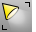 [SelLight](selection-commands.html#sellight) 
Select all lights.
 [SelLine](selection-commands.html#selline) 
Select all lines.
 [SelLinetype](selection-commands.html#sellinetype) 
Select objects with the specified linetype.
 [SelMappingWidget](selection-commands.html#selmappingwidget) 
Select all texture mapping widgets.
 [SelMaterialName](selection-commands.html#selmaterialname) 
Select objects with the same render material name.
 [SelMesh](selection-commands.html#selmesh) 
Select all mesh objects.
 [SelMeshFacesByArea](select-mesh-faces-commands.html#selmeshfacesbyarea) 
Select mesh faces from the parent mesh object that are within a specified range of area.
 [SelMeshFacesByAspectRatio](select-mesh-faces-commands.html#selmeshfacesbyaspectratio) 
Select mesh faces from the parent mesh object that are greater than the specified aspect ratio limit.
 [SelMeshFacesByDraftAngle](select-mesh-faces-commands.html#selmeshfacesbydraftangle) 
Separate mesh faces from the parent mesh object based on the angle of the faces to the view.
 [SelMeshFacesByEdgeLength](select-mesh-faces-commands.html#selmeshfacesbyedgelength) lass="Command_Description">Select mesh faces from the parent mesh object that have an edge length greater or less than a specified value.
 [SelNakedMeshEdgePt](selection-commands.html#selnakedmeshedgept) 
Select unwelded vertices on mesh edges.
 [SelName](selection-commands.html#selname) 
Select objects by name.
 [SelNamedViewWidget](selection-commands.html#selnamedviewwidget) 
Select all [Named View](namedview.html) widget objects.
 [SelNamedViewWidget](selection-commands.html#selnamedviewwidget) 
Select all [Named View](namedview.html) widget objects.
 [SelNone](selection-commands.html#selnone) 
Deselect all objects.
 [SelNonManifold](selection-commands.html#selnonmanifold) 
Select non-manifold objects.
 [SelObjectsWithHistory](selection-commands.html#selobjectswithhistory) 
Select objects that have history.
 [SelOpenCrv](selection-commands.html#selopencrv) 
Select all open curves.
 [SelOpenMesh](selection-commands.html#selopenmesh) 
Select all open mesh objects.
 [SelOpenPolysrf](selection-commands.html#selopenpolysrf) 
Select all open polysurfaces.
 [SelOpenSrf](selection-commands.html#selopensrf) 
Select all open surfaces.
 [SelOpenSubD&#160;](subdfrommesh.html#selopensubd) (Work in Progress release only)
Select all Rhino SubD objects in the model that have a boundary and are not locked or hidden.
 [SelParents](selection-commands.html#selparents) 
Select parents of specified children.
 [SelPlanarCrv](selection-commands.html#selplanarcrv) 
Select all planar curves.
 [SelPlanarSrf](selection-commands.html#selplanarsrf) 
Select all planar surfaces.
 [SelPolyline](selection-commands.html#selpolyline) 
Select all polylines.
 [SelPolysrf](selection-commands.html#selpolysrf) 
Select all polysurfaces.
 [SelPrev](selection-commands.html#selprev) 
Re-select the previous selection set.
 [SelPt](selection-commands.html#selpt) 
Select all [point](point.html) objects, [control points](pointson.html), [edit points](pointson.html#editpton), and [solid points](pointson.html#solidpton).
 [SelPtCloud](selection-commands.html#selptcloud) 
Select all point cloud objects.
 [SelRenderColor](selection-commands.html#selrendercolor) 
Select objects by their render color.
 [SelShortCrv](selection-commands.html#selshortcrv) 
Select all curves shorter than a specified length.
 [SelSmallSrf](selection-commands.html#selsmallsrf) 
Select all surfaces smaller than a specified area.
 [SelSrf](selection-commands.html#selsrf) 
Select all surfaces.
 [SelText](selection-commands.html#seltext) 
Select all text.
 [SelTrimmedSrf](selection-commands.html#seltrimmedsrf) 
Select all trimmed surfaces.
 [SelU](selection-commands.html#selu) 
Select all connected control points in the u&#160;direction.
 [SelUntrimmedSrf](selection-commands.html#seluntrimmedsrf) 
Select all untrimmed surfaces.
 [SelUV](selection-commands.html#seluv) 
Select connected control points in the u and v&#160;directions.
 [SelV](selection-commands.html#selv) 
Select all connected control points in v&#160;direction.
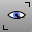 [SelVisible](selection-commands.html#selvisible) 
Select all surfaces or meshes that are in front of other objects with a crossing selection.
 [SelVolumeObject](selection-commands.html#selvolumeobject) 
Select objects enclosed by an extrusion object, surface, polysurface, or mesh.
 [SelVolumePipe](selection-commands.html#selvolumepipe) 
Select objects inside, outside, or crossing a pipe-shaped volume.
 [SelVolumeSphere](selection-commands.html#selvolumesphere) 
Select objects inside, outside, or crossing a spherical volume.
 [SelWindow](selection-commands.html#selwindow) 
Select with an enclosing window.
 [SendBackward](draworder.html#sendbackward) 
Send curves backward in draw order
 [SendToBack](draworder.html#sendtoback) 
Send curves to back of draw order
 [SetActiveViewport](setactiveviewport.html) 
Activate a named viewport.
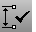 [SetCurrentDimstyle](dimensions-style.html#setcurrentdimstyle) 
Specify the current [dimensions style](dimensions-style.html).
 [SetCurrentRenderPlugIn](render.html#setcurrentrenderplugin) 
Specify a rendering plug-in.
 [SetDisplayMode](setdisplaymode.html) 
Specify a viewport display mode.
 [SetDocumentUserText](rhinoscripting.html#setdocumentusertext) 
Attach text information to the file.
 [SetFlythroughAnimation](animation.html#setflythroughanimation) 
Animate the camera and target movement along a path curve.
 [SetGroupName](group.html#setgroupname) 
Name a group.
 [SetIgesLayerLevelMap](iges-iges-import-export.html#setigeslayerlevelmap) 
Control the correspondence between Rhino layers and IGES levels.
 [SetLayerToObject](setlayertoobject.html) 
Set the current layer to match a specified object.
 [SetLinetype](linetypes.html#setlinetype) 
Specify a curve's linetype.
 [SetLinetypeScale](linetypes.html#setlinetypescale) 
Specify the global linetype scale from the command line.
 [SetMaximizedViewport](setmaximizedviewport.html) 
Maximize a named viewport inside the application window.
 [SetObjectDisplayMode](setobjectdisplaymode.html) 
Assign separate display attributes to objects, overriding viewport settings.
 [SetObjectName](setobjectname.html) 
Assign a name to an object.
 [SetOneDaySunAnimation](animation.html#setonedaysunanimation) 
Animate sun movement through a specified calendar day.
 [SetOrtho](ortho.html#setortho) 
Turn ortho mode on, off, or toggle the current state.
 [SetPathAnimation](animation.html#setpathanimation) 
Animate the camera and target movement along separate path curves.
 [SetPlanar](planar.html#setplanar) 
Turn Planar mode on, off, or toggle the current state.
 [SetPt](setpt.html) 
Move objects to a specified location in the x, y, and/or z&#160;directions.
 [SetRedrawOff](rhinoscripting.html#setredrawoff) 
Disable screen redraw, construction plane, and view changes during scripts.
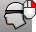 [SetRedrawOn](rhinoscripting.html#setredrawon) 
Enable screen redraw, construction plane, and view changes during scripts.
 [SetSeasonalSunAnimation](animation.html#setseasonalsunanimation) 
Animate sun movement through a specified week, month, or year.
 [SetSnap](snap.html#setsnap) 
Turn grid snap on, off, or toggle the current state.
 [SetSpotlightToView](setspotlighttoview.html) 
Match spotlight direction to the viewport camera direction.
 [SetSurfaceTangent](setsurfacetangent.html) 
Set the tangent direction of an untrimmed surface.
 [SetTurntableAnimation](animation.html#setturntableanimation) 
Animate camera rotation once around the current target point.
 [SetUserText](rhinoscripting.html#setusertext) 
Attach text information to an object.
 [SetView](setview.html) 
Change the view to a standard construction plane view.
 [SetViewToSpotlight](setviewtospotlight.html) 
Match the view to a spotlight direction.
 [SetWorkingFolder](setworkingfolder.html) 
Specify the default folder for saving and opening files.
 [SetZoomExtentsBorder](zoom.html#setzoomextentsborder) 
Set distance between objects and viewport edges for Zoom Extents.
 [Shade](shade.html) 
Temporarily shade the current viewport.
 [ShadeSelected](shade.html#shadeselected) 
Shade selected objects only.
 [Shear](shear.html) 
Skew objects parallel to one axis at an angle.
 [Shell](shell.html) 
Remove the selected surfaces from a polysurface, and then offset the remaining surfaces to create a solid with a specified thickness.
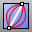 [ShortPath](shortpath.html) 
Create the shortest possible curve (geodesic) between two points on a surface.
 [Show](hide.html#show) 
Redisplay all hidden objects.
 [ShowDir](dir.html#showdir) 
Open the Direction Analysis control and turn on direction analysis for curves, surfaces, and polysurfaces.
 [ShowDirOff](dir.html#showdiroff) 
Close the Direction Analysis control, and turn off direction analysis.
 [ShowEdges](showedges.html) 
Highlight edges of surfaces and polysurfaces. Displays the Edge Analysis control.
 [ShowEdgesOff](showedges.html#showedgesoff) 
Turn off edge display.
 [ShowEnds](showends.html) 
Open the End Analysis control, and display the endpoints of curves.
 [ShowEndsOff](showends.html#showends) 
Close the End Analysis control, and turn off endpoints of curves.
 [ShowInDetail](detail.html#showindetail) 
Redisplay hidden objects in a detail view.
 [ShowLayersInDetail](detail.html#showlayersindetail) 
Redisplay hidden layers in a detail view.
 [ShowOsnap](object-snaps.html#showosnap) 
Turn the Osnap control on.
 [ShowPt](hide.html#showpt) 
Redisplay all hidden control points and edit points.
 [ShowRenderMesh](showrendermesh.html) 
Display the render mesh for selected objects.
 [ShowSelected](hide.html#showselected) 
Redisplay selected hidden objects.
 [ShowSelectedInDetail](detail.html#showselectedindetail) 
Redisplay selected hidden objects in a detail view.
 [ShowToolbar](toolbars.html#showtoolbar) 
Open a specified toolbar.
 [ShowZBuffer](showzbuffer.html) 
Create a grayscale z-buffer bitmap with the same dimensions as the viewport.
 [ShrinkTrimmedSrf](shrinktrimmedsrf.html) 
Contract the underlying untrimmed surface close to trimming boundaries.
 [ShrinkTrimmedSrfToEdge](shrinktrimmedsrf.html#shrinktrimmedsrftoedge) 
Contract the underlying untrimmed surface as close as possible to the trimming boundaries.
 [Silhouette](silhouette.html) 
Create outline curves from a surface or polysurface.
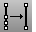 [SimplifyCrv](simplifycrv.html) 
Replace each curve segment that has the geometry of a line or an arc with a true line or arc.
 [Sketch](sketch.html) 
Drag the mouse to draw a curve.
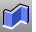 [Slab](slab.html) 
Offset a polyline, and extrude and cap the result to create a solid.
 [SmartTrack](modeling-aids-smarttrack.html) 
Turn on a system of temporary reference lines and points.
 [Smash](smash.html) 
Flatten a surface without restriction to single-directional curvature.
 [Smooth](smooth.html) 
Average the positions of curve and surface [control points](controlpoint.html) and mesh vertices in a specified region and evens out the spacing of selected control points in small increments to remove unwanted detail, and loops in curves and surfaces.
 [Snap](snap.html) 
Toggle the current snap mode state.
 [SnapSize](snap.html#snapsize) 
Specify the grid snap spacing.
 [SnapToLocked](object-snaps.html#snaptolocked) 
Allow snaps to work on locked objects and locked layers.
 [SoftEditCrv](softeditcrv.html) 
Move the surrounding curve area smoothly relative to the distance.
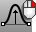 [SoftEditSrf](softeditsrf.html) 
Move the surrounding surface area smoothly relative to the distance.
 [SoftMove](softmove.html) 
Move objects relative to a center with falloff.
 [SolidPtOn](pointson.html#solidpton) 
Turn on pseudo control points for polysurfaces.
 [Sphere](sphere.html) 
Draw a solid sphere.
 [Spiral](spiral.html) 
Draw a spiral curve with options for number of turns, pitch, flat, vertical, and around a curve.
 [Split](split.html) 
Divide objects using other objects as cutters.
 [SplitDisjointMesh](splitdisjointmesh.html) 
Divide into separate objects meshes that do not connect, but are still one object.
 [SplitEdge](splitedge.html) 
Divide a surface edge.
 [SplitFace](splitface.html) 
Divide a planar polysurface face.
 [SplitMeshEdge](splitmeshedge.html) 
Divide a mesh edge.
 [SplitMeshWithCurve](splitmeshwithcurve.html) 
Divide a mesh with a curve.
 [SplitViewportHorizontal](viewport-arrangement.html#splitviewporthorizontal) 
Divide a viewport horizontally into two viewports.
 [SplitViewportVertical](viewport-arrangement.html#splitviewportvertical) 
Divide a viewport vertically into two viewports.
 [Splop](splop.html) 
Copy, rotate, scale, and wrap objects on a surface.
 [Spotlight](spotlight.html) 
Insert a light cone object.
 [Squish](squish.html) 
Flatten a non-developable (curved in two directions) 3-D mesh or NURBS surface into a flat 2-D pattern.
 [SquishBack](squish.html#squishback) 
Return curves and surfaces to the original [squished](squish.html) 3-D shape.
 [SquishInfo](squish.html#squishinfo) 
Provide information about the settings used to squish the object.
 [SrfControlPtGrid](srfcontrolptgrid.html) 
Draw a surface from a grid of points that represent surface control points.
 [SrfPt](srfpt.html) 
Draw a surface from three or four corner points.
 [SrfPtGrid](srfptgrid.html) 
Draw a surface from a grid of points that lie on the surface.
 [SrfSeam](srfseam.html) 
Change the location where the start and end edges meet on a closed surface.
 [STEPTree](step-stp-import-export.html#steptree) 
Browse the structure of a STEP file.
 [Stretch](stretch.html) 
Scale areas of an object in one direction.
 [SubCrv](subcrv.html) 
Shorten a curve to the new picked endpoints.
 [SubDFromMesh&#160;](subdfrommesh.html) 
Convert an ordinary mesh into a SubD object.
 [Sun](sun.html) 
Open the Sun panel.
 [SwapMeshEdge](swapmeshedge.html) 
Transpose the corners of mesh triangles.
 [SwapView](swapview.html) 
Exchange the views in two viewports with one another.
 [Sweep1](sweep1.html) 
Fit a surface through profile curves and one edge curve.
 [Sweep2](sweep2.html) 
Fit a surface through profile curves and two edge curves.
 [Symmetry](symmetry.html) 
Mirror a copy of a curve or surface with continuity.
 [SynchronizeCPlanes](synchronizecplanes.html) 
Update all viewports to standard views.
 [SynchronizeRenderColors](synchronizerendercolors.html) 
Change an object's material color to match its object or layer display color.
 [SynchronizeViews](synchronizeviews.html) 
Set the scale and center of all viewports to match the active viewport.
 [SystemInfo](systeminfo.html) 
Reports information about the computer hardware and operating system.

## T
 [Taper](taper.html) 
Deform objects toward or away from an axis.
 [DecimalPoint](decimalpoint.html) 
Checks to see whether numbers with decimal points are being correctly printed and read using a period as the decimal point. If the decimal point has been changed to a comma, the command changes the decimal point character back to a period.
 [Text](text.html) 
Create annotation text.
 [TextObject](textobject.html) 
Draw text-shaped curves, surfaces, or polysurfaces based on TrueType fonts.
 [TextProperties](text.html#textproperties) 
Set the font, bold, italic, height.
 [TextScale](text.html#textscale) 
Scale text in model and layout space.
 [TexturePalette](texturepalette.html) 
Open the Texture Editor.
 [ThicknessAnalysis](thicknessanalysis.html) 
Use false-color display to evaluate the thickness of a solid.
 [ThicknessAnalysisOff](thicknessanalysis.html#thicknessanalysisoff) 
Turn off thickness analysis display.
 [TiltView](tiltview.html) 
Rotate the view around the view axis.
 [ToggleFloatingViewport](new-viewport-arrangements.html#togglefloatingviewport) 
Toggle the viewport between docked and floating.
 [ToggleRenderMesh](showrendermesh.html#togglerendermesh) 
Toggle the display state of render meshes on an object.
 [ToggleRenderMesh](showrendermesh.html#togglerendermesh) 
Toggle the display state of render meshes on an object.
 [Toolbar](toolbars.html) 
Manage the toolbars and toolbar buttons.
 [ToolbarLock](toolbars.html#toolbarlock) 
Lock docked toolbars locations.
 [ToolbarReset](toolbars.html#toolbarreset) 
Restore toolbars to the default layout.
 [Torus](torus.html) 
Draw a torus (donut shape).
 [TriangulateMesh](triangulatemesh.html) 
Split each quadrangular mesh face into two triangles.
 [TriangulateNonPlanarQuads](triangulatenonplanarquads.html) 
Split each non-planar quadrangular mesh face into two triangles.
 [TriangulateRenderMeshes](triangulaterendermeshes.html) 
Split each quadrangular polygon render mesh face into two triangles.
 [Trim](trim.html) 
Cut and delete selected portions of an object at the intersection with another object.
 [TruncatedCone](truncatedcone.html) 
Draw a cone whose apex is truncated by a plane.
 [TruncatedPyramid](truncatedpyramid.html) 
Draw a pyramid whose apex is truncated by a plane.
 [Tube](tube.html) 
Draw a closed cylinder with a concentric cylindrical hole.
 [Turntable](turntable.html) 
Rotate a view around the target.
 [TweenCurves](tweencurves.html) 
Create curves between two open or closed input curves.
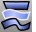 [TweenSurfaces](tweensurfaces.html) 
Create intermediate surfaces between two input surfaces.
 [Twist](twist.html) 
Deform objects by rotating portions around an axis.

## U
 [Undo](undo.html) 
Undo the last action.
 [UndoMultiple](undo.html#undomultiple) 
Display a list of recent commands to reverse.
 [UndoSelected](undo.html#undoselected) 
Reverse recent changes for a single object only.
 [UndoView](undoview.html) 
Undo the last view change.
 [Ungroup](group.html#ungroup) 
Remove the group status from objects.
 [UnifyMeshNormals](unifymeshnormals.html) 
Change the normal direction mesh faces so they all point in a consistent direction.
 [UnjoinEdge](joinedge.html#unjoinedge) 
Split polysurface edges.
 [Unisolate](hide.html#unisolate) 
Show objects previously hidden by the [Isolate](hide.html#isolate) command.
 [UnisolateLock](lock.html#unisolatelock) 
Unlock objects previously hidden by the [IsolateLock](lock.html#isolatelock) command.
 [Unlock](lock.html#unlock) 
Unlock all locked objects.
 [UnlockSelected](lock.html#unlockselected) 
Unlock selected locked objects.
 [UnpackTextures](packtextures.html#unpacktextures) 
Reset the texture coordinates.
 [UnrollSrf](unrollsrf.html) 
Flatten (develop) a surface or polysurface with curvature in one direction to a planar surface.
 [Untrim](trim.html#untrim) 
Remove trim curves from trimmed surfaces.
 [UntrimAll](trim.html#untrimall) 
Untrim all edges.
 [UntrimBorder](trim.html#untrimborder) 
Untrim surface border.
 [UntrimHoles](trim.html#untrimholes) 
Untrim interior holes.
 [Unweld](weld.html#unweld) 
Add creases to a smooth mesh by creating coincident vertices.
 [UnweldEdge](weld.html#unweldedge) 
Add creases to a smooth mesh by creating coincident vertices along selected edges.
 [Unwrap](texturemapping.html#unwrap) 
Project surface mapping texture coordinates and the texture of an object onto the world xy&#160;plane.
 [UseExtrusions](useextrusions.html) 
Specifies whether extrusion objects or polysurfaces are used when extruding straight&#8209;side objects.
 [UVEditor](texturemapping.html#uveditor) 
Project the texture coordinates of the selected object to a specified region of space.

## V
 [VariableBlendSrf](variableblendsrf.html) 
Create a blend surface between surface edges with varying radius values.
 [VariableChamferSrf](variablechamfersrf.html) 
Create a chamfer surface between surface edges with varying distance values.
 [VariableFilletSrf](variablefilletsrf.html) 
Create a round tangent surface between two surface edges with varying radius values.
 [VariableOffsetSrf](variableoffsetsrf.html) 
Copy a surface specified varying distances from the original surface.
 [ViewCaptureToClipboard](viewcapture.html#viewcapturetoclipboard) 
Save an image of the current view to the Clipboard.
 [ViewCaptureToFile](viewcapture.html#viewcapturetofile) 
Save an image of the current view to a file.
 [ViewFirstFrame](animation.html#viewfirstframe) 
Display the first animation frame.
 [ViewFrameNumber](animation.html#viewframenumber) 
Display the specified animation frame number.
 [ViewLastFrame](animation.html#viewlastframe) 
Display the last animation frame.
 [ViewNextFrame](animation.html#viewnextframe) 
Display the next animation frame.
 [ViewportProperties](viewport.html) 
Title, size, projection, camera and target, lens length, wallpaper.
 [ViewportProperties(Rhino 5)](viewportproperties.html) 
Title, size, projection, camera and target, lens length, wallpaper.
 [ViewportTabs](new-viewport-arrangements.html#viewporttabs) 
Display a tab control UI along the viewport edge.
 [ViewPreviousFrame](animation.html#viewpreviousframe) 
Display the previous animation frame.
 [Volume](volume.html) 
Report the volume of closed surfaces, polysurfaces, or meshes.
 [VolumeCentroid](volumecentroid.html) 
Report the coordinates of and place a point object at the volume centroid of surfaces and polysurfaces.
 [VolumeMoments](volumemoments.html) 
Report the volume moments of inertia of surfaces and polysurfaces.

## W
 [WalkAbout](walkabout.html) 
Toggle between WalkAbout and normal navigation modes.
 [WebBrowser](webbrowser.html) 
Opens the Web Browser panel.
 [Weight](weight.html) 
Edit the weight of a curve or surface control point.
 [Weld](weld.html) 
Remove creases from a mesh by merging coincident mesh vertices.
 [WeldEdge](weld.html#weldedge) 
Remove creases from a mesh by merging coincident mesh vertices along selected edges.
 [WeldVertices](weld.html#weldvertices) 
Remove creases from a mesh by merging all selected mesh vertices.
 [What](what.html) 
Report object properties details.
 [WireCut](wirecut.html) 
Trim a polysurface with a curve similar to cutting foam with a heated wire.
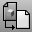 [Worksession](worksession.html) 
Manage a list of models that can be used as reference geometry.

## X, Y, Z
 [Zebra](zebra.html) 
Visually evaluate surface smoothness and continuity using a stripe map.
 [ZebraOff](zebra.html#zebraoff) 
Turn off zebra analysis.
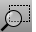 [Zoom](zoom.html) 
Move the viewport camera so the area defined by a window selection fills the viewport.
 [Zoom1To1Calibrate](zoom.html#zoom1to1calibrate) 
Calibrate the screen for the Zoom command, 1To1 option.
 [ZoomEnds](showends.html) 
Zoom to include all end display markers on selected curves.
 [ZoomLens](zoom.html#zoomlens) 
Adjust the lens length of the viewport camera in a perspective view.
 [ZoomNaked](zoomnaked.html) 
Zooms to include all naked edges on selected objects with naked edges.
 [ZoomNonManifold](zoomnonmanifold.html) 
Zooms to include all non-manifold edges on selected objects with [non-manifold](non-manifold-edges.html) edges.
&#160;
&#160;
Rhinoceros 6 © 2010-2015 Robert McNeel &amp; Associates.11-Nov-2015
 [Open topic with navigation](command-list.html) 

