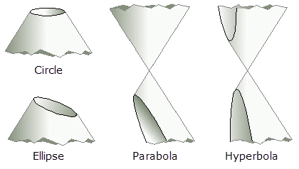
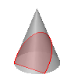
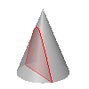
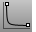

---
---

# Conic
{: #kanchor423}
{: #kanchor422}
{: #kanchor421}
{: #kanchor420}
{: #kanchor419}
{: #kanchor418}
{: #kanchor417}
 [Where can I find this command?](javascript:void(0);) Toolbars
 [Curve Drawing](curve-drawing-toolbar.html)  [Curve](curve-toolbar.html) 
Menus
Curve
Conic
The Conic command draws a conic section curve.

Steps
 [Pick](pick-location.html) thestart.Pick theend.Pick theapex.This location partially defines the plane for the conic.Pick a location for the conic to pass through to define its curvature.Or, type a the *rho* value (a number greater than 0 and less than 1), and press [Enter](enter-key.html) .Your browser does not support the video tag.Command-line options
Apex
Pick theapex("top" [control point](controlpoint.html) ).
Your browser does not support the video tag.{: #tangent}Tangent
Your browser does not support the video tag.Select a curve and then drag the tangent indicator to the desired location.
{: #perpendicular}Perpendicular
Your browser does not support the video tag.Select a curve and then drag the perpendicular indicator to the desired location.
Types of conics
Parabola
The intersection of a right circular cone and a plane that passes through the side of the cone and the base of the cone.
Rho value of 0.5.

Hyperbola
The intersection of a right circular cone and a plane perpendicular to the cone's base.
Rho values greater than 0.5 and less than 1.

See also
 [Hyperbola](hyperbola.html) 
Draw a hyperbolic curve from focus points, vertices, or coefficient.
 [Parabola](parabola.html) 
Draw a parabolic curve from focus and vertex or endpoint.
 [Draw lines and curves](sak-curve.html) 
&#160;
&#160;
Rhinoceros 6 © 2010-2015 Robert McNeel &amp; Associates.11-Nov-2015
 [Open topic with navigation](conic.html) 

