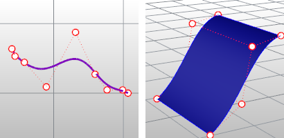
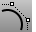

---
---

Control points
Control points determine the shape of a curve. Typically, each point of the curve is computed by taking a weighted sum of a number of control points. The weight of each point varies according to the governing parameter. For a curve of degree d, the weight of any control point is only nonzero in d+1 intervals of the parameter space. Within those intervals, the weight changes according to a polynomial function (basis functions) of degree d. At the boundaries of the intervals, the basis functions go smoothly to zero, the smoothness being determined by the degree of the polynomial.
Adding more control points allows better approximation to a given curve, although only a certain class of curves can be represented exactly with a finite number of control points. [NURBS](http://www.rhino3d.com/nurbs) curves also feature a scalar weight for each control point. This allows for more control over the shape of the curve without unduly raising the number of control points. In particular, it adds conic sections like circles and ellipses to the set of curves that can be represented exactly. The term rational in NURBS refers to these weights.
Three-dimensional control points are used abundantly in 3-D modeling, where they are used in the everyday meaning of the word point, a location in 3-D space.
To display curve and surface control points
Use the [PointsOn](pointson.html) command.
Curve control points (left) and surface control points (right).
See also
 [PointsOn](pointson.html) 
Display curve and surface control points.
 [Point editing.](sak-pointediting.html) 
 [Open topic with navigation](controlpoint.html) 

