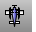
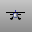
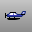

---
---

# CPlane View toolbar
{: #kanchor2314}
 [To open a toolbar](javascript:void(0);) Toolbars can be opened as a free-standing group or added to the current group.
To open a toolbar as a free-standing group
Click theOptionsicon in any toolbar group.On the menu, clickShow Toolbar, and then select the toolbar name from the list.To open a toolbar as a new tab in the current group
Click theOptionsicon in the toolbar group where you want to add the new tab.On the menu, clickShow or Hide Tabs, and then select the toolbar name from the list. [SetView, *CPlane Back* ](setview.html#cplaneback) 
Changes the view to the construction plane back view.
 [SetView, *CPlane Bottom* ](setview.html#cplanebottom) 
Changes the view to the construction plane bottom view.
 [SetView, *CPlane Front* ](setview.html#cplanefront) 
Changes the view to the construction plane front view.
 [SetView, *CPlane Left* ](setview.html#cplaneleft) 
Changes the view to the construction plane left view.
 [SetView, *CPlane Right* ](setview.html#cplaneright) 
Changes the view to the construction plane right view.
 [SetView, *CPlane Top* ](setview.html#cplanetop) 
Changes the view to the construction plane top view.
&#160;
&#160;
Rhinoceros 6 © 2010-2015 Robert McNeel &amp; Associates.11-Nov-2015
 [Open topic with navigation](cplane-view-toolbar.html) 

