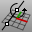
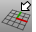
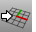
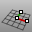
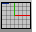

---
---

# CPlane
{: #kanchor232}
 [Where can I find this command?](javascript:void(0);) Toolbars
 [Standard](standard-toolbar.html)  [CPlanes](cplanes-toolbar.html) 
Menus
View
 [Viewport title](rhino-window.html#viewport-title-menu) 
Set CPlane
The CPlane command sets the origin and orientation of the construction plane in the active viewport.
Steps
 [Pick](pick-location.html) a new origin point or choose an option.Command-line options
{: #all}All
The construction planes in all viewports change so their origin is at the picked location.
{: #curve}Curve
The Curve option sets the construction plane perpendicular to a curve.
Curve steps
 [Select](select-objects.html) a curve to orient construction plane.Drag the construction plane's new x and y axes to a new location.Note
Use theCurveoption to quickly position your construction plane at various stations along a central rail curve as preparation for doing a one rail sweep, for example. Once your construction plane is positioned, you can use drawing tools to draw a cross-section curve in the 3 D location where it needs to be. This direct drawing method can be quicker and more convenient than drawing the curve on a world plane and then trying to move and rotate it into place in 3-D.The direction of the curve affects the direction of the axes. If the construction plane does not go the direction you want, flip the direction of the curve with the [Flip](flip.html) or [Dir](dir.html) commands.{: #elevation}Elevation
The Elevation option changes the elevation (z&#160;direction) of the construction plane.
Elevation steps
 [Pick](pick-location.html) a new elevation.OrType a distance to move the origin from its previous location.Note
Positive numbers move the construction plane up along the positive z&#160;axis.Negative numbers move the construction plane down.{: #next}Gumball
The Gumball option sets the construction plane to match the gumball orientation of the currently selected object.
{: #object}Object
The Object option sets the construction plane in the active viewport to an object.
Object steps
 [Select](select-objects.html) a curve, surface, or mesh.The origin and tangency of the new construction plane is based on the "midpoint" of the untrimmed version of the surface. In the case of a mesh, the plane goes to the center of the face and the face normal determines the construction plane z&#160;direction.{: #rotate}Rotate
The Rotate option rotates the construction plane.
Rotate steps
 [Pick](pick-location.html) thestartof the rotation axis.Pick theendof the rotation axis.Type theangleto rotate the construction plane.OrPick twopointsto specify the angle.{: #surface}Surface
The Surface option sets the construction plane to match a surface. The placement is constrained so that the construction plane is tangent to the surface.
Surface steps
 [Select](select-objects.html) a surface.Pick anoriginor press [Enter](enter-key.html) .Pick an x&#160;axis direction or press [Enter](enter-key.html) .Surface options
Flip
The Flip option reverses the [direction](dir.html#normaldirection).
IgnoreTrims
The IgnoreTrims option uses entire untrimmed underlying surface.
Through
The Through option moves the construction plane origin to a selected point.
Through steps
 [Pick](pick-location.html) a location to move the origin to.Through option
All
The All option resets all construction planes to the new origin.
{: #view}View
The View option sets the construction plane in the active viewport parallel to the view.
View steps
ClickViewor typeV.{: #world}World
The World option restores the specified default construction plane.
World steps
 [Specify](specifycommandlineoption.html) an option.World options
Back
Bottom
Front
Left
Right
Top
{: #threepoint}3Point
The 3Point option sets the construction plane in the active viewport by specifying points to establish the x, y, and z&#160;directions.
3Point steps
 [Pick](pick-location.html) a neworigin, or press [Enter](enter-key.html) .Pick thex&#160;axis.Pick they&#160;axis.3Point options
{: #vertical}Vertical
TheVerticaloption sets the construction plane perpendicular to the current construction plane.
{: #zaxis}ZAxis
TheZAxisoption sets the construction plane z&#160;axis direction.
{: #undo}Undo
The Undo option restores the previously used construction plane in the current viewport.
Undo steps
ClickUndoor typeU.Shortcut
 [Shift](shift-key.html) +Home
{: #redo}Redo
The Redo option restores the construction plane that was active before the Undo option was used.
Redo steps
ClickRedoor typeD.Shortcut
 [Shift](shift-key.html) +End

# CopyCPlaneToAll
{: #kanchor234}
{: #kanchor233}
{: #copycplanetoall}
 [Where can I find this command?](javascript:void(0);) Toolbars
 [Not on toolbars.](toolbarwhattodo.html) 
Menus
 [Not on menus.](menuwhattodo.html) 
The CopyCPlaneToAll command changes all viewports to have the same construction planes as the specified viewport.

# CopyCPlaneSettingsToAll
{: #kanchor237}
{: #kanchor236}
{: #kanchor235}
{: #copycplanesettingstoall}
 [Where can I find this command?](javascript:void(0);) Toolbars
 [Not on toolbars.](toolbarwhattodo.html) 
Menus
 [Not on menus.](menuwhattodo.html) 
The CopyCPlaneSettingsToAll command changes all viewports to have the same grid settings and snap spacing as the specified viewport.
See also
 [MPlane](mplane.html) 
Set up a relationship between a construction plane and an object.
 [NamedCPlane](namedcplane.html) 
Manage the named construction planes list.
 [Use construction planes](sak-cplanes.html) 
&#160;
&#160;
Rhinoceros 6 © 2010-2015 Robert McNeel &amp; Associates.11-Nov-2015
 [Open topic with navigation](cplane.html) 

