---
---

# CPlanes toolbar
{: #kanchor2315}
 [To open a toolbar](javascript:void(0);) Toolbars can be opened as a free-standing group or added to the current group.
To open a toolbar as a free-standing group
Click theOptionsicon in any toolbar group.On the menu, clickShow Toolbar, and then select the toolbar name from the list.To open a toolbar as a new tab in the current group
Click theOptionsicon in the toolbar group where you want to add the new tab.On the menu, clickShow or Hide Tabs, and then select the toolbar name from the list. [CPlane](cplane.html) 
Set the construction plane in the active viewport.
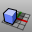 [CPlane, *Elevation* ](cplane.html#elevation) 
Set the construction plane in the active viewport by moving it up or down.
 [CPlane, *Object* ](cplane.html#object) 
Set the construction plane in the active viewport to an object.
 [CPlane, *Surface* ](cplane.html#surface) 
Set the construction plane in the active viewport to a surface.
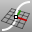 [CPlane, *Curve* ](cplane.html#curve) 
Set the construction plane in the active viewport perpendicular to a curve.
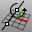 [CPlane, *Rotate* ](cplane.html#rotate) 
Rotate the construction plane in the active viewport.
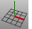 [CPlane, *Vertical* ](cplane.html#vertical) 
Set the construction plane in the active viewport vertical to the current CPlane.
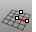 [CPlane, *3Point* ](cplane.html#threepoint) 
Set the construction plane in the active viewport by specifying three points.
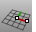 [CPlane, *XAxis* ](cplane.html#threepoint) 
Set the construction plane in the active viewport by specifying the x&#160;axis direction.
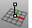 [CPlane, *ZAxis* ](cplane.html#zaxis) 
Set the construction plane in the active viewport by specifying the z&#160;axis direction.
 [Undo CPlane](cplane.html#undo) 
Set the construction plane in the active viewport to the previously used construction plane.
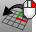 [Redo CPlane](cplane.html#next) 
Set the construction plane in the active viewport to the next construction plane.
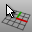 [NamedCPlane, *Select* ](namedcplane.html) 
Choose a named construction plane option.
 [NamedCPlane](namedcplane.html) 
Manage the named construction planes list.
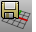 [NamedCPlane, *Save* ](namedcplane.html) 
Save a named construction plane.
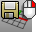 [NamedCPlane, *Restore* ](namedcplane.html) 
Restore a named construction plane.
 [NamedCPlane, *Import* ](namedcplane.html) 
Import named construction planes from a file.
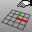 [Options,Modeling Aids Universal CPlanes](modeling-aids.html#universal-cplane) 
Link construction plane origins, angle, and up direction together.
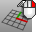 [Options, *Modeling Aids: Standard CPlanes* ](modeling-aids.html#standard-cplane) 
Construction planes in each viewport are independent of each other.
 [CPlane,View](cplane.html#view) 
Set the construction plane in the active viewport parallel to the view
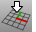 [CPlane, *World Top* ](cplane.html#world) 
Set the construction plane in the active viewport to the world top construction plane.
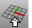 [CPlane, *World Bottom* ](cplane.html#world) 
Set the construction plane in the active viewport to the world bottom construction plane.
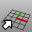 [CPlane, *World Front* ](cplane.html#world) 
Set the construction plane in the active viewport to the world front construction plane.
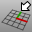 [CPlane, *World Back* ](cplane.html#world) 
Set the construction plane in the active viewport to the world back construction plane.
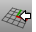 [CPlane, *World Right* ](cplane.html#world) 
Set the construction plane in the active viewport to the world right construction plane.
 [CPlane, *World Left* ](cplane.html#world) 
Set the construction plane in the active viewport to the world left construction plane.
 [MPlane](mplane.html) 
Set up a relationship between a construction plane and an object.
&#160;
&#160;
Rhinoceros 6 © 2010-2015 Robert McNeel &amp; Associates.11-Nov-2015
 [Open topic with navigation](cplanes-toolbar.html) 

