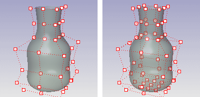

---
---

# CullControlPolygon
{: #kanchor494}
 [Where can I find this command?](javascript:void(0);) Toolbars
 [Point Edit](point-edit-toolbar.html) 
Menus
 [Not on menus.](menuwhattodo.html) 
The CullControlPolygon command turns off the display of surface [control points](controlpoint.html) or [mesh vertices](meshvertex.html) so that only points on the side of the surface that face the camera are displayed.
This can make it easier to edit surface control points.
For open surfaces, the normal direction of the surface will determine which points are visible to the camera.
Command-line options
Cull
Determines whether or not control points behind the object in the view display.
Control points culled (left) and displayed (right).
See also
 [Manage object visibility](sak-visibility.html) 
&#160;
&#160;
Rhinoceros 6 © 2010-2015 Robert McNeel &amp; Associates.11-Nov-2015
 [Open topic with navigation](cullcontrolpolygon.html) 

