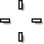
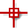
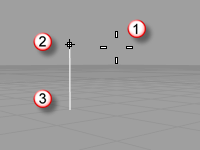
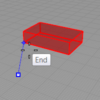

---
---

Cursor, marker, tracking line{: #kanchor3092}
When picking locations, Rhino's drawing cursor consists of two parts:

Cursor
The cursor is always black and white.

Marker
The marker takes on the color of the current layer.
If you are in a situation where the cursor is moving away from a specified point, such as when using [elevator mode](cursor-constraints.html#elevator-mode), a tracking line will appear.

Cursor (1), marker (2), tracking line (3).
If an [object snap](object-snaps.html) is on, the marker will snap to the snap point.

 [Open topic with navigation](cursor-tracking-line.html) 

