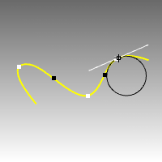
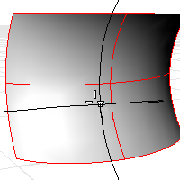

---
---

# Curvature
{: #kanchor500}
{: #kanchor499}
{: #kanchor498}
{: #kanchor497}
{: #kanchor496}
 [Where can I find this command?](javascript:void(0);) Toolbars
 [Analyze](analyze-toolbar.html) 
Menus
Analyze
Curvature Circle
The Curvature command evaluates the [curvature](http://en.wikipedia.org/wiki/Curvature) at a point on a curve or surface using a circle radius.

Steps
 [Select](select-objects.html) a curve.The curvature radius of the curve at the marker will display in the status bar, and a black circle of that radius will display tangent to the curve at the marker. A white line tangent to the curve will also display.White points mark the maximum curvature points in a portion on the curve where the curvature starts to decrease in both directions from the points.Black points mark the minimum curvature points where the curvature circle jumps from one side of the curve to the other side. The curvature at the black points is always 0. [Pick](pick-location.html) to mark the curvature with a circle, or press [Esc](esc-key.html) to end the command.To analyze surface curvature
 [Select](select-objects.html) a surface.As you move your cursor, two half-circles display and show you the minimum and maximum curvature at that point on the curve.Pick a point on the surface.The following surface evaluation information displays in the command area:
Surface curvature evaluation at parameter location3-D point3-D [normal](dir.html) Maximum and Minimum principal curvatureGaussian curvatureMean curvatureNote
Every location on a smooth curve has a circle that best approximates the curve at that location.The cursor automatically snaps to curve inflection points (where the sign of the curvature changes).Every location on a smooth surface has two such circles. The circle with a biggest radius is always orthogonal to the circle with a smallest radius.The principal curvatures are inverse of the radii of the arcs.The Gaussian curvature is positive when both half circles point the same way, negative when the circles point opposite ways, and zero if one of the half circles degenerates into a line.Command-line option
MarkCurvature
Places a point object and the curvature circle or half circles at the evaluated point on a curve.
Gives permanent feedback when the radius of curvature is infinite (curvature is zero, the curve is locally flat, for example at inflection points where the curve bulge changes from one side to the other) and cannot be evaluated. This does not automate finding the inflection points, but it makes it possible to mark them manually.

## Curve curvature
To understand Gaussian curvature of a point on a surface, you must first know what the curvature of curve is.
At any point on a curve in the plane, the line best approximating the curve that passes through this point is the tangent line. We can also find the best approximating circle that passes through this point and is tangent to the curve. The reciprocal of the radius of this circle is the *curvature* of the curve at this point.
The best approximating circle may lie either to the left of the curve, or to the right of the curve. If we care about this, then we establish a convention, such as giving the curvature positive sign if the circle lies to the left and negative sign if the circle lies to the right of the curve. This is known as *signed curvature*.
One generalization of curvature to surfaces is *normal section curvature*. Given a point on the surface and a direction lying in the tangent plane of the surface at that point, the normal section curvature is computed by intersecting the surface with the plane spanned by the point, the normal to the surface at that point, and the direction. The normal section curvature is the signed curvature of this curve at the point of interest.
If we look at all directions in the tangent plane to the surface at our point, and we compute the normal section curvature in all these directions, then there will be a maximum value and a minimum value.

## Surface curvature
Gaussian curvature
The *Gaussian* curvature of a surface at a point is the product of the principal curvatures at that point. The tangent plane of any point with positive Gaussian curvature touches the surface at a single point, whereas the tangent plane of any point with negative Gaussian curvature cuts the surface. Any point with zero mean curvature has negative or zero Gaussian curvature.
Principal curvatures
The *principal curvatures* of a surface at a point are the minimum and maximum of the normal curvatures at that point. (Normal curvatures are the curvatures of curves on the surface lying in planes including the tangent vector at the given point.) The principal curvatures are used to compute the Gaussian and Mean curvatures of the surface.
Mean curvature
The *Mean* curvature of a surface at a point is one half the sum of the principal curvatures at that point. Any point with zero mean curvature has negative or zero Gaussian curvature.
Surfaces with zero mean curvature everywhere are minimal surfaces. Surfaces with constant mean curvature everywhere are often referred to as constant mean curvature (CMC) surfaces.
CMC surfaces have the same mean curvature everywhere on the surface.
Physical processes which can be modeled by CMC surfaces include the formation of soap bubbles, both free and attached to objects. A soap bubble, unlike a simple soap film, encloses a volume and exists in an equilibrium where slightly greater pressure inside the bubble is balanced by the area-minimizing forces of the bubble itself.
Minimal surfaces are the subset of CMC surfaces where the curvature is zero everywhere.
Physical processes which can be modeled by minimal surfaces include the formation of soap films spanning fixed objects, such as wire loops. A soap film is not distorted by air pressure (which is equal on both sides) and is free to minimize its area. This contrasts with a soap bubble, which encloses a fixed quantity of air and has unequal pressures on its inside and outside.
See also
 [Analyze objects](sak-analysis.html) 
&#160;
&#160;
Rhinoceros 6 © 2010-2015 Robert McNeel &amp; Associates.11-Nov-2015
 [Open topic with navigation](curvature.html) 

