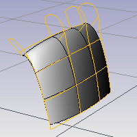
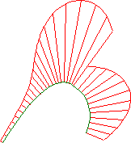
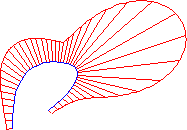
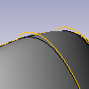
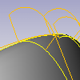
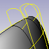
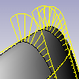

---
---

# CurvatureGraph
{: #kanchor516}
{: #kanchor515}
{: #kanchor514}
{: #kanchor513}
 [Where can I find this command?](javascript:void(0);) Toolbars
 [Analyze](analyze-toolbar.html)  [Surface Tools](surface-tools-toolbar.html) 
Menus
Analyze
Curve
Curvature Graph On
The CurvatureGraph command visually evaluates surface [curvature](http://en.wikipedia.org/wiki/Curvature) using a graph.

Steps
 [Select](select-objects.html) curves or surfaces.A graph showing curvature appears on the selected curves, and theCurvature Graphdialog box appears.Adjust the length, frequency, color, u and v [direction](curvesurfacedirection.html) display of the curvature indicators using the controls in theCurvature Graphdialog box.Even when other commands are started, the curvature graphs and theCurvature Graphdialog box persist until you turn them off.Curve Analysis
Tangent
Even though the curve spans are tangent to one another, the curvature graph suddenly changes from one value to a different value. The spans of a degree&#160;2 curve are G1, or tangent only. They are not [curvature continuous](continuity-descriptions.html).

Curvature Continuous
There are no jumps in the curvature graph. The curvature graph of the first span connects end-to-end with the curvature graph of the second span. This curve is curvature continuous (G2) across its spans because its curvature does not suddenly go from one value to another value. However, the curvature graph of the first span does not progress at the same rate as the graph of the second span. So even though the curvature stays the same, the rate of curvature suddenly changes.

To better grasp this concept, play with the [Curvature](curvature.html) command and observe the osculating circle as it travels along curves.
Note
On surfaces the curvature hairs only display at surface [isoparametric curves](isocurve.html). If the isoparametric curve display is turned off, curvature hairs display only at the surface boundary.At any location on a curve (except lines), there is a circle that most closely resembles the curve at that location. That is, it has the same tangent direction and the same rate of change of the tangent direction. The curvature displayed is a graph of (1/radius of that circle), but it is scaled by a factor set in the dialog box. If the graph changes smoothly, the curve is "smooth" or "fair." Jumps in the curvature graph indicate kinks or abrupt changes in the curve's derivatives.Curvature Graph
Display scale
Sets the size of the graph hairs. Remember that the scale of the changes can be greatly exaggerated. The changes in curvature may be no thicker than a coat of paint. ADisplay scalesetting of 100 means a 1:1 curvature scale.

Density
Sets the number of graph hairs.

Curve hair
To set the curve hair color
Click the color button to set the graph hair color for curves.Surface hair
To set the surface hair color
Click the color button to set the graph hair color for surfaces. **U** 
Displays surface hairs in the u&#160;direction only.

Color swatch sets the color for the hairs.
 **V** 
Displays surface hairs in the v&#160;direction only.

Color swatch sets the color for the hairs.
 **Add Objects** 
Turns on curvature graph analysis for additional selected objects.
 **Remove Objects** 
Turns off curvature graph analysis for selected objects.

# CurvatureGraphOff
{: #kanchor517}
{: #curvaturegraphoff}
 [Where can I find this command?](javascript:void(0);) Toolbars
 [Analyze](analyze-toolbar.html)  [Surface Tools](surface-tools-toolbar.html) 
Menus
Analyze
Curve
Curvature Graph Off
The CurvatureGraphOff command turns off curvature graph display.
See also
 [Analyze objects](sak-analysis.html) 
&#160;
&#160;
Rhinoceros 6 © 2010-2015 Robert McNeel &amp; Associates.11-Nov-2015
 [Open topic with navigation](curvaturegraph.html) 

