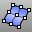

---
---

# Curve From Object toolbar
{: #kanchor2317}
 [To open a toolbar](javascript:void(0);) Toolbars can be opened as a free-standing group or added to the current group.
To open a toolbar as a free-standing group
Click theOptionsicon in any toolbar group.On the menu, clickShow Toolbar, and then select the toolbar name from the list.To open a toolbar as a new tab in the current group
Click theOptionsicon in the toolbar group where you want to add the new tab.On the menu, clickShow or Hide Tabs, and then select the toolbar name from the list.Blend,Perpendicular
Create a blend curve between two surface edges maintaining continuity.
 [Contour](contour.html) 
Create a spaced series of planar curves and points through objects.
 [CreateUVCrv](createuvcrv.html) 
Project a surface boundary and trim curves onto the world xy plane.
 [ApplyCrv](applycrv.html) 
Wrap a curve onto a surface.
 [DupBorder](dupborder.html) 
Create a curve or polyline that copies a surface, polysurface, or mesh border.
 [DupEdge](dupedge.html) 
Create a curve that copies a surface edge.
 [DupMeshEdge](dupmeshedge.html) 
Creates a polyline that duplicates the edge of a mesh.
 [DupFaceBorder](dupfaceborder.html) 
Create a curve that copies a polysurface face border.
 [ExtractIsocurve](extractisocurve.html) 
Duplicate surface [isoparametric curves](isocurve.html).
 [ExtractPt](extractpt.html) 
Duplicate curve control or edit points, surface control points, and mesh vertices.
 [ExtractWireframe](extractwireframe.html) 
Duplicate surface or polysurface edge and [isoparametric curves](isocurve.html).
 [Intersect](intersect.html) 
Create point objects or curves at the intersections of curves and surfaces.
 [Make2D](make2d.html) 
Project geometry to the construction plane.
 [MeshOutline](meshoutline.html) 
Create a polyline outline of mesh objects or surface render mesh.
 [PointCloudSection](pointcloudsection.html) 
Create a planar curve by intersecting a plane with a point cloud.
 [Project](project.html) 
Project curves/points toward a construction plane to intersect a surface.
 [Project,Loose](project.html#project-loose) 
Project curves/points toward a construction plane to intersect a surface using the Loose option.
 [Pull](pull.html) 
Pull curves/points in the surface normal direction to intersect a surface.
 [Section](section.html) 
Create a planar curve or points from the intersection of a cutting plane through objects.
 [ShortPath](shortpath.html) 
Create the shortest possible curve (geodesic) between two points on a surface.
 [Silhouette](silhouette.html) 
Create outline curves from a surface or polysurface.
&#160;
&#160;
Rhinoceros 6 © 2010-2015 Robert McNeel &amp; Associates.11-Nov-2015
 [Open topic with navigation](curve-from-object-toolbar.html) 

