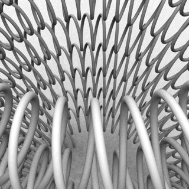
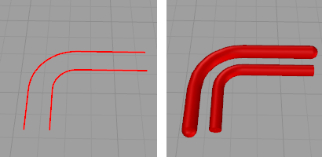

---
---

{: #kanchor2779}
# Curve piping
{: #kanchor2780}
 [Where can I find this command?](javascript:void(0);) Toolbars
 [Popup](popup-toolbar.html)  [Properties](properties-toolbar.html)  [Standard](standard-toolbar.html) 
Menus
Edit and Panels
Object Properties
Shortcut
F3
Curve piping constructs a mesh pipe display around a curve.

Steps
 [Select objects](selection-commands.html#select-object-basics) to apply curve piping to.In the **Properties** panel, click theCurve Pipingbutton.
Curves with curve piping in wireframe view (left) and shaded view (right).
Specify the curve piping properties.Note
 [Curve Piping](#) appears as a property for the curve.Pipes ends can be open or be capped.Curves inside [blocks](block.html) cannot be selected.
## Curve piping properties
Manages curve piping [properties](properties.html) for the selected objects.
On{: #on}
Switches the curve piping display on and off.
Settings
Radius
The measure from the curve to the surface of the mesh pipe.
Segments
The number of mesh faces that surround the curve. For example with three segments, the cross-section of the pipe looks like an equilateral triangle. The more segments there are, the rounder the pipe is.
Faceted
Toggles between a smoothly shaded pipe and a flat-shaded pipe. This setting only affects the normals of the pipe mesh.
CapType
Assigns one of the following cap types to both ends of the pipe.
None
Leaves pipe ends open.
Flat
Plugs the pipe ends with flat caps perpendicular to the curve at each end.
Flat, Extended
Extends the pipe by length of theRadiusvalue and plugs it with flat caps.
Dome
Plugs the pipe ends with spherical caps centered at the curve end points.
Accuracy Low / High
Changes the visual fidelity of the pipe along the curve. Higher value means that the center of the pipe is closer to the curve. By increasing the accuracy, the mesh will get more faces along the curve.
See also
 [Use materials and textures](sak-materialsandtextures.html) 
&#160;
&#160;
Rhinoceros 6 © 2010-2015 Robert McNeel &amp; Associates.11-Nov-2015
 [Open topic with navigation](curvepiping.html) 

